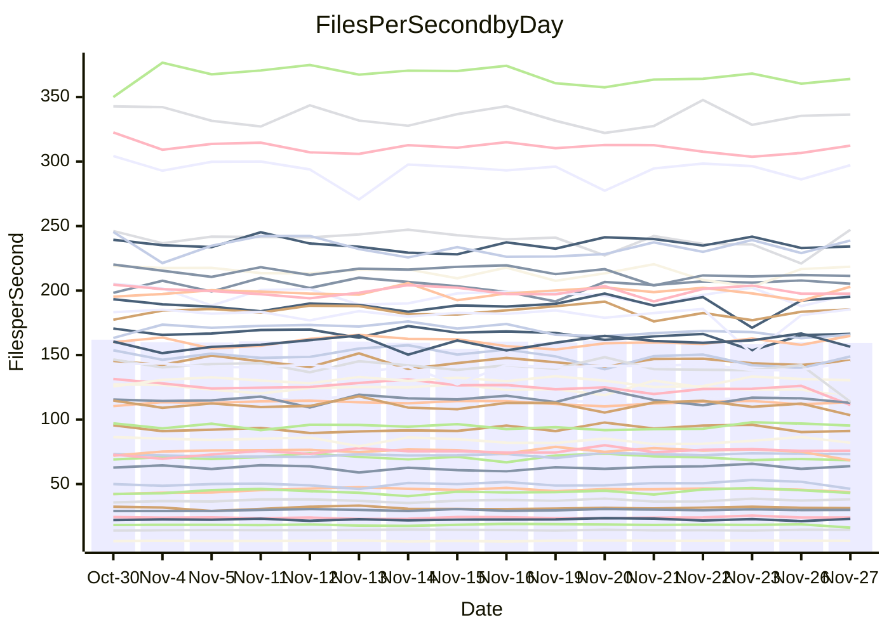

<!---
# This file is auto-generated. Do not edit.
# cspell:disable
--->
# Performance Report

## Daily Performance

## Time to Process Files

| Repository                                      | Elapsed | Min/Avg/Max           |    SD | SD Graph                |
| ----------------------------------------------- | ------: | :-------------------: | ----: | ----------------------- |
| AdaDoom3/AdaDoom3                    |    3.44 | 3.3 /   3.5 /   3.7   |  0.09 | `     ┣━┻━━●━━┻━┫     ` |
| alexiosc/megistos                    |    7.69 | 7.3 /   7.8 /   8.7   |  0.31 | `    ┣━━┻━●╋━━┻━━┫    ` |
| apollographql/apollo-server          |    2.78 | 2.6 /   2.7 /   3.2   |  0.12 | `     ┣━┻━━╋●━┻━┫     ` |
| aspnetboilerplate/aspnetboilerplate  |   10.46 | 10.3 /  10.7 /  11.8  |  0.36 | `    ┣━━┻●━╋━━┻━━┫    ` |
| aws-amplify/docs                     |   13.59 | 12.6 /  13.4 /  14.8  |  0.46 | `    ┣━━┻━━╋●━┻━━┫    ` |
| Azure/azure-rest-api-specs           |    9.90 | 9.6 /  10.2 /  11.2   |  0.41 | `    ┣━━┻●━╋━━┻━━┫    ` |
| bitjson/typescript-starter           |    1.23 | 1.0 /   1.1 /   1.1   |  0.03 | `      ┣━┻━╋━┻━┫     ●` |
| caddyserver/caddy                    |    4.21 | 3.4 /   3.8 /   4.0   |  0.11 | `     ┣━┻━━╋━━┻━┫    ●` |
| canada-ca/open-source-logiciel-libre |    1.16 | 1.1 /   1.2 /   1.3   |  0.05 | `     ┣━━┻●╋━┻━━┫     ` |
| chef/chef                            |    5.87 | 5.8 /   6.0 /   6.5   |  0.18 | `    ┣━━┻●━╋━━┻━━┫    ` |
| dart-lang/sdk                        |   68.90 | 64.2 /  67.5 /  72.3  |  2.03 | `   ┣━━┻━━━╋━●━┻━━┫   ` |
| django/django                        |   15.56 | 14.9 /  15.9 /  19.1  |  0.73 | `    ┣━━┻●━╋━━┻━━┫    ` |
| eslint/eslint                        |   10.70 | 10.5 /  11.1 /  12.2  |  0.40 | `    ┣━━●━━╋━━┻━━┫    ` |
| exonum/exonum                        |    3.73 | 3.4 /   3.7 /   4.0   |  0.13 | `     ┣━┻━━╋●━┻━┫     ` |
| flutter/samples                      |   21.10 | 16.0 /  17.0 /  19.0  |  0.58 | `       ┣┻━╋━┻┫      ●` |
| gitbucket/gitbucket                  |    3.64 | 3.5 /   3.7 /   3.9   |  0.10 | `     ┣━┻━━●━━┻━┫     ` |
| googleapis/google-cloud-cpp          |  144.75 | 142.0 / 150.6 / 209.7 | 11.48 | `  ┣━━━┻━●━╋━━━┻━━━┫  ` |
| graphql/express-graphql              |    1.13 | 1.1 /   1.2 /   1.4   |  0.07 | `     ┣━┻━●╋━━┻━┫     ` |
| graphql/graphql-js                   |    3.13 | 2.8 /   3.0 /   3.2   |  0.10 | `     ┣━┻━━╋━━┻●┫     ` |
| graphql/graphql-relay-js             |    1.16 | 1.1 /   1.2 /   1.2   |  0.04 | `     ┣━━┻●╋━┻━━┫     ` |
| graphql/graphql-spec                 |    1.31 | 1.3 /   1.3 /   1.4   |  0.03 | `     ┣━━●━╋━┻━━┫     ` |
| iluwatar/java-design-patterns        |   13.38 | 12.6 /  13.4 /  14.9  |  0.48 | `    ┣━━┻━━●━━┻━━┫    ` |
| ktaranov/sqlserver-kit               |    6.68 | 6.5 /   6.8 /   7.3   |  0.19 | `    ┣━━┻●━╋━━┻━━┫    ` |
| liriliri/licia                       |    4.27 | 4.1 /   4.3 /   4.6   |  0.12 | `     ┣━┻━●╋━━┻━┫     ` |
| MartinThoma/LaTeX-examples           |    7.13 | 6.8 /   7.1 /   7.9   |  0.24 | `    ┣━━┻━━●━━┻━━┫    ` |
| mdx-js/mdx                           |    2.06 | 1.9 /   2.0 /   2.1   |  0.06 | `     ┣━┻━━╋━━●━┫     ` |
| microsoft/TypeScript-Website         |    5.83 | 5.5 /   5.8 /   6.5   |  0.19 | `    ┣━━┻━━●━━┻━━┫    ` |
| MicrosoftDocs/PowerShell-Docs        |   26.19 | 22.9 /  24.3 /  26.2  |  0.76 | `    ┣━━┻━━╋━━┻━━┫ ●  ` |
| neovim/nvim-lspconfig                |    4.59 | 4.3 /   4.5 /   4.9   |  0.12 | `     ┣━┻━━╋━●┻━┫     ` |
| pagekit/pagekit                      |    3.61 | 3.5 /   3.7 /   4.3   |  0.15 | `     ┣━┻━●╋━━┻━┫     ` |
| php/php-src                          |   27.58 | 25.9 /  27.0 /  29.3  |  0.87 | `   ┣━━━┻━━╋━●┻━━━┫   ` |
| plasticrake/tplink-smarthome-api     |    1.42 | 1.3 /   1.4 /   1.5   |  0.05 | `     ┣━┻━━╋━●┻━┫     ` |
| prettier/prettier                    |    7.77 | 7.4 /   7.8 /   8.3   |  0.17 | `    ┣━━┻━━●━━┻━━┫    ` |
| pycontribs/jira                      |    1.71 | 1.5 /   1.6 /   1.7   |  0.07 | `     ┣━┻━━╋━━┻━●     ` |
| RustPython/RustPython                |    6.32 | 5.2 /   5.6 /   6.0   |  0.21 | `    ┣━━┻━━╋━━┻━━┫   ●` |
| shoelace-style/shoelace              |    3.01 | 2.9 /   3.0 /   3.2   |  0.09 | `     ┣━┻━●╋━━┻━┫     ` |
| slint-ui/slint                       |   13.86 | 13.4 /  13.9 /  15.0  |  0.37 | `    ┣━━┻━●╋━━┻━━┫    ` |
| SoftwareBrothers/admin-bro           |    2.65 | 2.5 /   2.6 /   2.9   |  0.07 | `     ┣━┻━━●━━┻━┫     ` |
| sveltejs/svelte                      |   22.16 | 20.8 /  22.0 /  22.9  |  0.49 | `    ┣━━┻━━╋●━┻━━┫    ` |
| TheAlgorithms/Python                 |    5.66 | 5.6 /   5.9 /   6.4   |  0.18 | `    ┣━━●━━╋━━┻━━┫    ` |
| twbs/bootstrap                       |    1.85 | 1.8 /   1.9 /   2.4   |  0.11 | `     ┣━┻━●╋━━┻━┫     ` |
| typescript-cheatsheets/react         |    1.39 | 1.3 /   1.4 /   1.6   |  0.06 | `     ┣━┻●━╋━━┻━┫     ` |
| typescript-eslint/typescript-eslint  |    4.34 | 4.2 /   4.4 /   4.7   |  0.12 | `     ┣━┻━●╋━━┻━┫     ` |
| vitest-dev/vitest                    |    9.98 | 9.2 /   9.8 /  10.9   |  0.40 | `    ┣━━┻━━╋●━┻━━┫    ` |
| w3c/aria-practices                   |    3.51 | 3.4 /   3.6 /   3.8   |  0.11 | `     ┣━┻●━╋━━┻━┫     ` |
| w3c/specberus                        |    2.07 | 2.0 /   2.1 /   2.2   |  0.06 | `     ┣━┻━●╋━━┻━┫     ` |
| webdeveric/webpack-assets-manifest   |    1.27 | 1.2 /   1.2 /   1.4   |  0.05 | `     ┣━━┻━╋━●━━┫     ` |
| webpack/webpack                      |    5.80 | 5.5 /   5.8 /   6.7   |  0.23 | `    ┣━━┻━━●━━┻━━┫    ` |
| wireapp/wire-desktop                 |    1.37 | 1.3 /   1.4 /   1.7   |  0.10 | `     ┣━┻●━╋━━┻━┫     ` |
| wireapp/wire-webapp                  |   10.81 | 10.6 /  11.2 /  12.6  |  0.52 | `    ┣━━┻●━╋━━┻━━┫    ` |

Note:
- Elapsed time is in seconds.

## Files per Second over Time

| Repository                                      | Files |    Sec |    Fps |     Rel | Trend Fps              |    N |
| ----------------------------------------------- | ----: | -----: | -----: | ------: | ---------------------- | ---: |
| AdaDoom3/AdaDoom3                    |   103 |   3.44 |  29.96 |   0.39% | `▇▆▅▇█▆▅▆▅▇▅▇▇▆▆▅▇▅▇▆` |   31 |
| alexiosc/megistos                    |   583 |   7.69 |  75.77 |   1.51% | `▄▇▆▅▇▇▆▆▆▆▅█▆▆▆█▇▆▇▆` |   31 |
| apollographql/apollo-server          |   253 |   2.78 |  91.15 |  -1.25% | `▃▆▆▇▇▅▇▆▆█▆█▇▇█▇█▅▇▆` |   31 |
| aspnetboilerplate/aspnetboilerplate  |  2286 |  10.46 | 218.50 |   2.29% | `█▇▇▅█▅▇▆▆▆▅▇██▆▆▅▇▇▇` |   31 |
| aws-amplify/docs                     |  2871 |  13.59 | 211.30 |  -1.15% | `▆▇▇██▆█▇▇▇▅▇▄▆▆▇▆▇▅▆` |   31 |
| Azure/azure-rest-api-specs           |  2365 |   9.90 | 238.84 |   2.37% | `█▆▅▆▇▇▅▃▇▄▇▆▇▆▇▅▇▇▄▇` |   31 |
| bitjson/typescript-starter           |    20 |   1.23 |  16.23 | -12.21% | `▆▅▄▆▇▆██▆▇█▇▅▆▆▇▆▇▇▁` |   31 |
| caddyserver/caddy                    |   288 |   4.21 |  68.36 | -10.39% | `▆▅▅▅▅▅▄▅▆▆█▅▆▆▄▆▅▃▆▂` |   31 |
| canada-ca/open-source-logiciel-libre |     7 |   1.16 |   6.04 |   0.72% | `▅▇▃▆▅▇▄▆▇▇█▇▆▇▆▇██▆▆` |   31 |
| chef/chef                            |  1191 |   5.87 | 202.97 |   2.37% | `█▆█▆▇▄▇▇▇█▇▇█▅▇▇▇▇▄█` |   31 |
| dart-lang/sdk                        | 10778 |  68.90 | 156.44 |  -1.83% | `▇█▄▅█▇▅▅▇▇▇▇▇▆▆▇▇██▆` |   31 |
| django/django                        |  2885 |  15.56 | 185.40 |   2.19% | `▅▇▆▆█▆▇▇▇▇▆▆▇▆▇█▃▇▆▇` |   31 |
| eslint/eslint                        |  2089 |  10.70 | 195.17 |   3.46% | `▇▇▆▆▆▇▆██▅▆█▆▇▇█▃▇██` |   31 |
| exonum/exonum                        |   421 |   3.73 | 112.98 |  -1.80% | `▃▇▆▆▆▆▇▄▆▅▆█▆▆▄▅▆▆▇▅` |   31 |
| flutter/samples                      |  2400 |  21.10 | 113.76 | -19.30% | `▆▇▇▅▇▆▇█▅▅▆█▇▆▇▅▆█▆ ` |   31 |
| gitbucket/gitbucket                  |   413 |   3.64 | 113.50 |   0.32% | `▇▇▆▅▇█▇▆▄▇▇▅▆▆▆▇▇▇▅▇` |   31 |
| googleapis/google-cloud-cpp          | 20955 | 144.75 | 144.77 |   3.61% | `█▇▇▂█▇█▇▇█▇██▇██▇▆██` |   31 |
| graphql/express-graphql              |    26 |   1.13 |  23.04 |   2.89% | `▆▇▆▅▆█▆▅█▆██▇▇▅▆▇█▂▇` |   31 |
| graphql/graphql-js                   |   368 |   3.13 | 117.58 |  -5.48% | `▄▆▆▇▇▇▆▇▄▇▆▅▇█▇▆▆▇▅▄` |   31 |
| graphql/graphql-relay-js             |    28 |   1.16 |  24.15 |   0.63% | `▆▄▅▆▇▇▆▄▄▇▆▅▆▆▇▅█▇▅▆` |   31 |
| graphql/graphql-spec                 |    19 |   1.31 |  14.56 |   1.95% | `▆▇██▇█▇▅▅▇▆█▆▇▇▆▆███` |   31 |
| iluwatar/java-design-patterns        |  1992 |  13.38 | 148.91 |   0.04% | `▇██▇▇▆▇▇▇▆▆▄▆▇▇▇▅▃▆▆` |   31 |
| ktaranov/sqlserver-kit               |   489 |   6.68 |  73.18 |   1.62% | `▅▇▇▇▆▇▇█▆▄▅█▇██▅█▇█▇` |   31 |
| liriliri/licia                       |  1437 |   4.27 | 336.44 |   0.50% | `█▆▆▆▇█▇▅▇▇▆▅▆▆██▆▇▆▇` |   31 |
| MartinThoma/LaTeX-examples           |  1409 |   7.13 | 197.55 |  -0.62% | `▄▇█▇██▇▇█▇▆██▄███▆█▇` |   31 |
| mdx-js/mdx                           |   141 |   2.06 |  68.52 |  -3.30% | `█▆▅▆▅█▄▆▇█▇██▆▆▇▅▇▄▅` |   31 |
| microsoft/TypeScript-Website         |   761 |   5.83 | 130.52 |  -0.01% | `▇▇▆▇▇▇▆▇▇▇█▆▄▆▅▅▇▆▇▇` |   31 |
| MicrosoftDocs/PowerShell-Docs        |  2708 |  26.19 | 103.40 |  -7.23% | `▄█▅▅▄▅▇▆▆▇▆▄▆▇█▇▆▆▇▄` |   31 |
| neovim/nvim-lspconfig                |   760 |   4.59 | 165.72 |  -2.32% | `█▇█▆▇▇█▇▆▅▆▆▆▆▇▆▆▇▄▆` |   31 |
| pagekit/pagekit                      |   741 |   3.61 | 205.36 |   1.22% | `▆███▇▇▇▃▇▇▆██▇█████▇` |   31 |
| php/php-src                          |  2262 |  27.58 |  82.01 |  -2.31% | `▇▅███▅▆▄▆▆▇▇▆▅▆▅▆█▇▆` |   31 |
| plasticrake/tplink-smarthome-api     |    62 |   1.42 |  43.78 |  -3.19% | `▇█▇▇▅▇█▅▆▇▆▇▆▇█▇▇▆▇▅` |   31 |
| prettier/prettier                    |  2426 |   7.77 | 312.34 |   0.44% | `█▇█▇█▇███▇▇███▆█▆▇▆█` |   31 |
| pycontribs/jira                      |    79 |   1.71 |  46.30 |  -7.29% | `▇▄▇▇▆▅▇▄▆█▃▅▆▇▆▆██▆▄` |   31 |
| RustPython/RustPython                |   703 |   6.32 | 111.29 | -11.14% | `▇▇█▇▇▇▇▅▆▇▇▆▅▅▆▆▆▇▆▃` |   31 |
| shoelace-style/shoelace              |   439 |   3.01 | 145.76 |   0.61% | `▆█▅▆▅▇▇▇▆▇▄▅▇▇▇▇▆▅▇▇` |   31 |
| slint-ui/slint                       |  2570 |  13.86 | 185.47 |   0.76% | `▇▇▆▅▆▇▇▇▆█▇█▄▆▇▆▅▆▇▇` |   31 |
| SoftwareBrothers/admin-bro           |   441 |   2.65 | 166.49 |  -0.15% | `█▆██▇▇▇█▇▆▆▆█▅▇▆▄▇▆▇` |   31 |
| sveltejs/svelte                      |  8068 |  22.16 | 364.10 |  -0.80% | `▇▆▇▆▆█▇▆▆▆▅▅▆▆▇▅▆▅▆▆` |   31 |
| TheAlgorithms/Python                 |  1399 |   5.66 | 247.14 |   3.26% | `█▇█▇▆█▇▆▇▇▇▅▇▇▆▆▆▄▄█` |   31 |
| twbs/bootstrap                       |   118 |   1.85 |  63.94 |   1.89% | `▇▅▇██▂▆▅▇██▆▆█▇▇█▇▆▇` |   31 |
| typescript-cheatsheets/react         |    53 |   1.39 |  38.15 |   2.73% | `█▆▄▆▆▆▆▄▆▆▇▇▅▆▃█▇▆▆▇` |   31 |
| typescript-eslint/typescript-eslint  |  1290 |   4.34 | 297.22 |   0.84% | `█▄██▆█▇▇▇▇█▅▆█▇█▇▆▆▇` |   31 |
| vitest-dev/vitest                    |  2338 |   9.98 | 234.17 |  -0.60% | `█▇▆▄▅█▇█▆▄████▆██▆▇▇` |   31 |
| w3c/aria-practices                   |   414 |   3.51 | 117.91 |   2.41% | `▆█▆█▆▇▇▇█▄▆▆▅▄█▇▇███` |   31 |
| w3c/specberus                        |   197 |   2.07 |  95.33 |   0.61% | `█▇▇█▇▇▆▇▇▅▇▅▄█▆▆█▇█▇` |   31 |
| webdeveric/webpack-assets-manifest   |    55 |   1.27 |  43.16 |  -2.63% | `▇▅▃█▆▅▆▆▄▆▇▇▄▅█▇█▇▇▅` |   31 |
| webpack/webpack                      |  1143 |   5.80 | 197.07 |   0.54% | `▇▆▆▇▇▇▇▆█▇▇▇▆▅▆██▆▅▇` |   31 |
| wireapp/wire-desktop                 |    43 |   1.37 |  31.36 |   0.65% | `▇█▆▅█▅▆▇▇▄▇▇▇▆▇▇▇▆█▇` |   31 |
| wireapp/wire-webapp                  |  1783 |  10.81 | 164.87 |   3.67% | `██▇▇▇█▆▇▇▃▅▇▆▇▅█▇▆▇█` |   31 |

## Data Throughput

| Repository                                      | Files |    Sec |     Kps |     Rel | Trend Kps              |    N |
| ----------------------------------------------- | ----: | -----: | ------: | ------: | ---------------------- | ---: |
| AdaDoom3/AdaDoom3                    |   103 |   3.44 |  636.81 |   0.39% | `▇▆▅▇█▆▅▆▅▇▅▇▇▆▆▅▇▅▇▆` |   31 |
| alexiosc/megistos                    |   583 |   7.69 |  595.38 |   1.51% | `▄▇▆▅▇▇▆▆▆▆▅█▆▆▆█▇▆▇▆` |   31 |
| apollographql/apollo-server          |   253 |   2.78 |  744.68 |  -1.25% | `▃▆▆▇▇▅▇▆▆█▆█▇▇█▇█▅▇▆` |   31 |
| aspnetboilerplate/aspnetboilerplate  |  2286 |  10.46 |  531.62 |   2.29% | `█▇▇▅█▅▇▆▆▆▅▇██▆▆▅▇▇▇` |   31 |
| aws-amplify/docs                     |  2871 |  13.59 |  737.44 |  -1.17% | `▆▇▇██▆█▇▇▇▅▇▄▆▆▇▆▇▅▆` |   31 |
| Azure/azure-rest-api-specs           |  2365 |   9.90 |  649.86 |   2.50% | `█▆▅▆▇▇▅▃▇▄▇▆▇▇▇▅▇▇▄▇` |   31 |
| bitjson/typescript-starter           |    20 |   1.23 |   64.91 | -12.21% | `▆▅▄▆▇▆██▆▇█▇▅▆▆▇▆▇▇▁` |   31 |
| caddyserver/caddy                    |   288 |   4.21 |  593.63 | -10.33% | `▆▅▅▅▅▅▄▅▆▆█▅▆▆▄▆▅▄▆▂` |   31 |
| canada-ca/open-source-logiciel-libre |     7 |   1.16 |   50.06 |   0.72% | `▅▇▃▆▅▇▄▆▇▇█▇▆▇▆▇██▆▆` |   31 |
| chef/chef                            |  1191 |   5.87 |  942.40 |   2.48% | `█▆█▆▇▄▆▇▇█▇▇█▅▇▇▇▇▄█` |   31 |
| dart-lang/sdk                        | 10778 |  68.90 | 1069.47 |  -1.69% | `▇▇▄▅█▇▅▅▇▇▇▇▇▆▆▇▇██▆` |   31 |
| django/django                        |  2885 |  15.56 | 1163.98 |   2.16% | `▅▇▆▆█▆▇▇▇▇▆▆▇▆▇█▃▇▆▇` |   31 |
| eslint/eslint                        |  2089 |  10.70 | 1324.45 |  -0.07% | `▇▇▇▇▇█▇▇▇▄▆▇▅▇▆▇▃▆▇▇` |   31 |
| exonum/exonum                        |   421 |   3.73 | 1080.70 |  -1.80% | `▃▇▆▆▆▆▇▄▆▅▆█▆▆▄▅▆▆▇▅` |   31 |
| flutter/samples                      |  2400 |  21.10 | 1015.20 | -19.30% | `▆▇▇▅▇▆▇█▅▅▆█▇▆▇▅▆█▆ ` |   31 |
| gitbucket/gitbucket                  |   413 |   3.64 |  515.82 |   0.32% | `▇▇▆▅▇█▇▆▄▇▇▅▆▆▆▇▇▇▅▇` |   31 |
| googleapis/google-cloud-cpp          | 20955 | 144.75 | 1179.42 |   3.74% | `█▇▇▂█▇█▇▇█▇██▇██▇▆██` |   31 |
| graphql/express-graphql              |    26 |   1.13 |  105.45 |   2.89% | `▆▇▆▅▆█▆▅█▆██▇▇▅▆▇█▂▇` |   31 |
| graphql/graphql-js                   |   368 |   3.13 |  682.50 |  -5.47% | `▄▆▆▇▇▇▆▇▄▇▆▅▇█▇▆▆▇▅▄` |   31 |
| graphql/graphql-relay-js             |    28 |   1.16 |   94.88 |   0.63% | `▆▄▅▆▇▇▆▄▄▇▆▅▆▆▇▅█▇▅▆` |   31 |
| graphql/graphql-spec                 |    19 |   1.31 |  485.73 |   1.95% | `▆▇██▇█▇▅▅▇▆█▆▇▇▆▆███` |   31 |
| iluwatar/java-design-patterns        |  1992 |  13.38 |  460.25 |   0.04% | `▇██▇▇▆▇▇▇▆▆▄▆▇▇▇▅▃▆▆` |   31 |
| ktaranov/sqlserver-kit               |   489 |   6.68 | 1108.24 |   1.62% | `▅▇▇▇▆▇▇█▆▄▅█▇██▅█▇█▇` |   31 |
| liriliri/licia                       |  1437 |   4.27 |  400.82 |   0.50% | `█▆▆▆▇█▇▅▇▇▆▅▆▆██▆▇▆▇` |   31 |
| MartinThoma/LaTeX-examples           |  1409 |   7.13 |  407.99 |  -0.62% | `▄▇█▇██▇▇█▇▆██▄███▆█▇` |   31 |
| mdx-js/mdx                           |   141 |   2.06 |  318.78 |  -3.30% | `█▆▅▆▅█▄▆▇█▇██▆▆▇▅▇▄▅` |   31 |
| microsoft/TypeScript-Website         |   761 |   5.83 |  902.85 |  -0.01% | `▇▇▆▇▇▇▆▇▇▇█▆▄▆▅▅▇▆▇▇` |   31 |
| MicrosoftDocs/PowerShell-Docs        |  2708 |  26.19 | 1064.76 |  -7.22% | `▄█▅▅▄▅▇▆▆▇▆▄▆▇█▇▆▆▇▄` |   31 |
| neovim/nvim-lspconfig                |   760 |   4.59 |  307.68 |   4.06% | `▆▅▆▄▅▅▅█▇▇▇▇▇▇█▇██▅▇` |   31 |
| pagekit/pagekit                      |   741 |   3.61 |  428.17 |   1.22% | `▆███▇▇▇▃▇▇▆██▇█████▇` |   31 |
| php/php-src                          |  2262 |  27.58 | 1437.85 |  -2.22% | `▇▅███▅▆▄▆▆▇▇▆▅▆▅▇█▇▆` |   31 |
| plasticrake/tplink-smarthome-api     |    62 |   1.42 |  236.55 |  -3.19% | `▇█▇▇▅▇█▅▆▇▆▇▆▇█▇▇▆▇▅` |   31 |
| prettier/prettier                    |  2426 |   7.77 |  433.10 |   0.32% | `█▇█▇█▇███▇▇███▆█▆▇▆█` |   31 |
| pycontribs/jira                      |    79 |   1.71 |  328.21 |  -7.29% | `▇▄▇▇▆▅▇▄▆█▃▅▆▇▆▆██▆▄` |   31 |
| RustPython/RustPython                |   703 |   6.32 | 1136.28 |   0.47% | `▄▄▄▄▄▄▄▆▇███▇▇█▇▇██▅` |   31 |
| shoelace-style/shoelace              |   439 |   3.01 |  704.24 |   0.61% | `▆█▅▆▅▇▇▇▆▇▄▅▇▇▇▇▆▅▇▇` |   31 |
| slint-ui/slint                       |  2570 |  13.86 | 1148.38 |   1.03% | `▇▇▆▅▆▇▇▇▆█▇█▄▆▇▆▅▆▇▇` |   31 |
| SoftwareBrothers/admin-bro           |   441 |   2.65 |  366.96 |  -0.15% | `█▆██▇▇▇█▇▆▆▆█▅▇▆▄▇▆▇` |   31 |
| sveltejs/svelte                      |  8068 |  22.16 |  242.80 |  -0.84% | `▇▆▇▆▆█▇▆▆▆▅▅▆▆▇▅▆▅▆▆` |   31 |
| TheAlgorithms/Python                 |  1399 |   5.66 |  628.55 |   3.26% | `█▇█▇▆█▇▆▇▇▇▅▇▇▆▆▆▄▄█` |   31 |
| twbs/bootstrap                       |   118 |   1.85 |  525.03 |   1.91% | `▇▅▇██▂▆▅▇██▆▆█▇▇█▇▆▇` |   31 |
| typescript-cheatsheets/react         |    53 |   1.39 |  282.18 |   2.73% | `█▆▄▆▆▆▆▄▆▆▇▇▅▆▃█▇▆▆▇` |   31 |
| typescript-eslint/typescript-eslint  |  1290 |   4.34 | 1534.73 |   1.01% | `█▄██▆█▇▇▇▇█▅▆█▇█▇▆▆█` |   31 |
| vitest-dev/vitest                    |  2338 |   9.98 |  503.10 |  -1.33% | `█▇▆▄▅█▇█▆▄████▆██▆▇▇` |   31 |
| w3c/aria-practices                   |   414 |   3.51 | 1099.31 |   2.41% | `▆█▆█▆▇▇▇█▄▆▆▅▄█▇▇███` |   31 |
| w3c/specberus                        |   197 |   2.07 |  301.46 |   0.61% | `█▇▇█▇▇▆▇▇▅▇▅▄█▆▆█▇█▇` |   31 |
| webdeveric/webpack-assets-manifest   |    55 |   1.27 |   99.65 |  -2.63% | `▇▅▃█▆▅▆▆▄▆▇▇▄▅█▇█▇▇▅` |   31 |
| webpack/webpack                      |  1143 |   5.80 |  900.02 |   0.76% | `▇▆▆▇▇▇▇▆██▇▇▆▆▆██▆▅▇` |   31 |
| wireapp/wire-desktop                 |    43 |   1.37 |  138.57 | -13.33% | `▇█▇▆█▆▇▃▄▂▃▃▃▃▃▄▄▃▄▃` |   31 |
| wireapp/wire-webapp                  |  1783 |  10.81 |  610.48 |   3.78% | `██▇▇▇█▆▇▇▃▅▇▆▇▅█▇▆▇█` |   31 |

