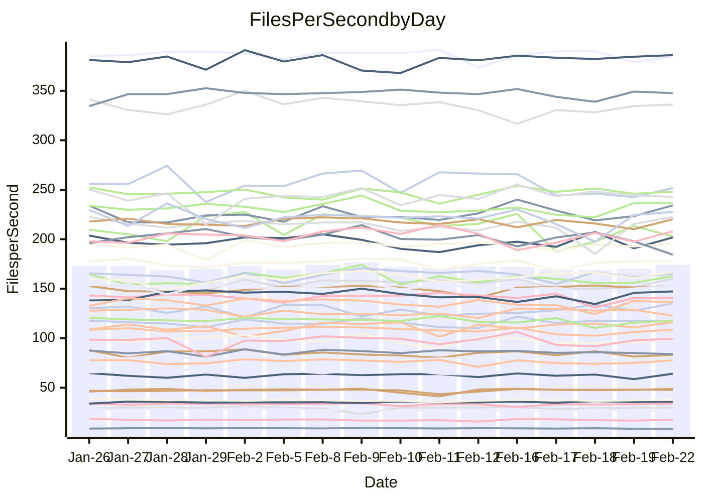

<!---
# This file is auto-generated. Do not edit.
# cspell:disable
--->
# Performance Report

## Daily Performance

## Time to Process Files

| Repository                                      | Elapsed | Min/Avg/Max           |   SD | SD Graph                |
| ----------------------------------------------- | ------: | :-------------------: | ---: | ----------------------- |
| AdaDoom3/AdaDoom3                    |    3.04 | 3.0 /   3.1 /   3.4   | 0.09 | `    ┣━━┻●━╋━━┻━━┫    ` |
| alexiosc/megistos                    |    7.20 | 6.8 /   7.3 /   8.2   | 0.23 | `    ┣━━┻●━╋━━┻━━┫    ` |
| apollographql/apollo-server          |    2.33 | 2.2 /   2.3 /   2.5   | 0.07 | `     ┣━┻━━●━━┻━┫     ` |
| aspnetboilerplate/aspnetboilerplate  |    9.95 | 9.3 /  10.0 /  11.3   | 0.43 | `    ┣━━┻━●╋━━┻━━┫    ` |
| aws-amplify/docs                     |   12.09 | 11.7 /  12.4 /  13.1  | 0.37 | `    ┣━━●━━╋━━┻━━┫    ` |
| Azure/azure-rest-api-specs           |    9.25 | 8.6 /   9.3 /  10.4   | 0.50 | `    ┣━━┻━●╋━━┻━━┫    ` |
| bitjson/typescript-starter           |    0.63 | 0.6 /   0.7 /   0.9   | 0.04 | `     ┣━●━━╋━━┻━┫     ` |
| caddyserver/caddy                    |    3.26 | 3.1 /   3.4 /   3.7   | 0.16 | `    ┣━━┻●━╋━━┻━━┫    ` |
| canada-ca/open-source-logiciel-libre |    0.79 | 0.7 /   0.8 /   1.0   | 0.05 | `     ┣━┻━━●━━┻━┫     ` |
| chef/chef                            |    5.93 | 5.3 /   5.8 /   8.2   | 0.54 | `    ┣━━┻━━╋●━┻━━┫    ` |
| dart-lang/sdk                        |   61.75 | 59.1 /  62.1 /  67.6  | 2.20 | `  ┣━━━┻━━●╋━━━┻━━━┫  ` |
| django/django                        |   14.56 | 14.2 /  14.7 /  15.8  | 0.36 | `    ┣━━┻━●╋━━┻━━┫    ` |
| eslint/eslint                        |   10.36 | 9.8 /  10.5 /  11.9   | 0.43 | `    ┣━━┻━●╋━━┻━━┫    ` |
| exonum/exonum                        |    3.13 | 3.0 /   3.3 /   3.7   | 0.15 | `    ┣━━●━━╋━━┻━━┫    ` |
| flutter/samples                      |   16.94 | 16.6 /  17.6 /  19.9  | 0.77 | `   ┣━━━●━━╋━━┻━━━┫   ` |
| gitbucket/gitbucket                  |    3.30 | 3.1 /   3.3 /   3.5   | 0.11 | `    ┣━━┻━━╋●━┻━━┫    ` |
| googleapis/google-cloud-cpp          |  131.68 | 125.8 / 131.1 / 140.4 | 3.95 | `  ┣━━━┻━━━╋●━━┻━━━┫  ` |
| graphql/express-graphql              |    0.73 | 0.7 /   0.7 /   0.8   | 0.02 | `     ┣━━┻●╋━┻━━┫     ` |
| graphql/graphql-js                   |    2.23 | 2.2 /   2.3 /   2.5   | 0.06 | `     ┣━┻●━╋━━┻━┫     ` |
| graphql/graphql-relay-js             |    0.74 | 0.7 /   0.8 /   0.8   | 0.02 | `     ┣━━●━╋━┻━━┫     ` |
| graphql/graphql-spec                 |    0.86 | 0.8 /   0.9 /   1.1   | 0.06 | `     ┣━┻━●╋━━┻━┫     ` |
| iluwatar/java-design-patterns        |   11.91 | 10.9 /  12.0 /  13.6  | 0.57 | `   ┣━━━┻━━●━━┻━━━┫   ` |
| ktaranov/sqlserver-kit               |    6.32 | 6.1 /   6.4 /   7.0   | 0.23 | `    ┣━━┻●━╋━━┻━━┫    ` |
| liriliri/licia                       |    3.62 | 3.5 /   3.7 /   3.9   | 0.09 | `    ┣━━●━━╋━━┻━━┫    ` |
| MartinThoma/LaTeX-examples           |    6.27 | 6.3 /   6.6 /   7.6   | 0.25 | `    ┣━●┻━━╋━━┻━━┫    ` |
| mdx-js/mdx                           |    1.58 | 1.6 /   1.7 /   1.9   | 0.08 | `     ┣━●━━╋━━┻━┫     ` |
| microsoft/TypeScript-Website         |    5.71 | 5.0 /   5.4 /   5.9   | 0.21 | `    ┣━━┻━━╋━━┻━●┫    ` |
| MicrosoftDocs/PowerShell-Docs        |   23.57 | 22.5 /  24.4 /  28.9  | 1.26 | `   ┣━━┻━●━╋━━━┻━━┫   ` |
| neovim/nvim-lspconfig                |    3.18 | 3.1 /   3.3 /   3.7   | 0.11 | `    ┣━━┻●━╋━━┻━━┫    ` |
| pagekit/pagekit                      |    3.40 | 3.3 /   3.4 /   3.7   | 0.10 | `    ┣━━┻━●╋━━┻━━┫    ` |
| php/php-src                          |   23.08 | 21.1 /  22.9 /  26.5  | 1.37 | `   ┣━━┻━━━╋●━━┻━━┫   ` |
| plasticrake/tplink-smarthome-api     |    0.91 | 0.9 /   0.9 /   1.1   | 0.04 | `     ┣━┻●━╋━━┻━┫     ` |
| prettier/prettier                    |    6.67 | 6.2 /   6.6 /   7.2   | 0.21 | `    ┣━━┻━━╋●━┻━━┫    ` |
| pycontribs/jira                      |    1.24 | 1.2 /   1.3 /   1.5   | 0.06 | `     ┣━┻●━╋━━┻━┫     ` |
| RustPython/RustPython                |    4.22 | 4.1 /   4.3 /   4.8   | 0.16 | `    ┣━━┻●━╋━━┻━━┫    ` |
| shoelace-style/shoelace              |    2.46 | 2.4 /   2.5 /   2.8   | 0.08 | `    ┣━━┻━●╋━━┻━━┫    ` |
| slint-ui/slint                       |    9.74 | 9.2 /  10.0 /  13.1   | 0.71 | `   ┣━━━┻━●╋━━┻━━━┫   ` |
| SoftwareBrothers/admin-bro           |    2.38 | 2.1 /   2.2 /   2.4   | 0.08 | `     ┣━┻━━╋━━┻━┫ ●   ` |
| sveltejs/svelte                      |   18.41 | 18.4 /  18.9 /  20.1  | 0.38 | `   ┣━━●┻━━╋━━┻━━━┫   ` |
| TheAlgorithms/Python                 |    5.53 | 5.3 /   5.6 /   6.1   | 0.18 | `    ┣━━┻━●╋━━┻━━┫    ` |
| twbs/bootstrap                       |    1.23 | 1.1 /   1.2 /   1.5   | 0.08 | `     ┣━┻━━●━━┻━┫     ` |
| typescript-cheatsheets/react         |    1.12 | 1.1 /   1.1 /   1.3   | 0.04 | `     ┣━┻━●╋━━┻━┫     ` |
| typescript-eslint/typescript-eslint  |    3.74 | 3.6 /   3.7 /   3.8   | 0.06 | `    ┣━━┻━━╋━●┻━━┫    ` |
| vitest-dev/vitest                    |    7.89 | 7.7 /   8.2 /   9.2   | 0.32 | `    ┣━━●━━╋━━┻━━┫    ` |
| w3c/aria-practices                   |    3.02 | 2.9 /   3.0 /   3.3   | 0.09 | `    ┣━━┻━━╋●━┻━━┫    ` |
| w3c/specberus                        |    1.68 | 1.6 /   1.7 /   1.8   | 0.05 | `     ┣━┻━●╋━━┻━┫     ` |
| webdeveric/webpack-assets-manifest   |    0.70 | 0.7 /   0.7 /   0.8   | 0.04 | `     ┣━┻━━●━━┻━┫     ` |
| webpack/webpack                      |    4.93 | 4.6 /   4.9 /   5.5   | 0.21 | `    ┣━━┻━━●━━┻━━┫    ` |
| wireapp/wire-desktop                 |    0.88 | 0.9 /   0.9 /   1.1   | 0.06 | `     ┣━┻━●╋━━┻━┫     ` |
| wireapp/wire-webapp                  |    8.64 | 8.3 /   8.8 /  10.0   | 0.32 | `    ┣━━┻━●╋━━┻━━┫    ` |

Note:
- Elapsed time is in seconds.

## Files per Second over Time

| Repository                                      | Files |    Sec |    Fps |    Rel | Trend Fps              |    N |
| ----------------------------------------------- | ----: | -----: | -----: | -----: | ---------------------- | ---: |
| AdaDoom3/AdaDoom3                    |   103 |   3.04 |  33.91 |  2.23% | `██▄▅█▇▇▇▄▇█▆▇▆▇▇██▇█` |   31 |
| alexiosc/megistos                    |   583 |   7.20 |  80.94 |  1.74% | `▇██▆▇██▇██▇██▇▇▆▄▇██` |   31 |
| apollographql/apollo-server          |   250 |   2.33 | 107.44 | -0.62% | `█▆▇▇▇▆▇▅█▄▆▆▅▅▅█▇▅▇▆` |   33 |
| aspnetboilerplate/aspnetboilerplate  |  2246 |   9.95 | 225.81 |  0.69% | `▇▆▆▆▅▆▇▆█▇▆▆▅▆▃▇▇▆█▆` |   31 |
| aws-amplify/docs                     |  2867 |  12.09 | 237.05 |  2.58% | `█▅▆▇▅▆▆▆▆▆▅▄▅▆█▇▆▇▇▇` |   33 |
| Azure/azure-rest-api-specs           |  2373 |   9.25 | 256.55 |  0.88% | `█▆▃▇███▇█▅▅▅▅▄▅▅▅▅▅▇` |   33 |
| bitjson/typescript-starter           |    20 |   0.63 |  31.50 |  7.09% | `▅▂▆█▇▇▆█▇▄▇▇▇▇▆▇▇▇▆█` |   31 |
| caddyserver/caddy                    |   279 |   3.26 |  85.58 |  2.57% | `▇▇▇▆█▃▇███▇▅█▅▇▇▄█▆█` |   33 |
| canada-ca/open-source-logiciel-libre |     7 |   0.79 |   8.91 |  0.38% | `██▇▇▇▅█▆▇▆▆▆▇█▇▄█▂▅▇` |   31 |
| chef/chef                            |  1204 |   5.93 | 202.89 | -3.37% | `██▇█▆█▇▇█▂▇▆▆▇█▅▆▇▆▆` |   32 |
| dart-lang/sdk                        | 10108 |  61.75 | 163.69 |  0.64% | `███▆▇▇█▇▇▅▄▅▇▆▅▆▇▇▇▇` |   33 |
| django/django                        |  2833 |  14.56 | 194.63 |  0.83% | `█▇█▇█████▅▆██▇▇█▆███` |   33 |
| eslint/eslint                        |  2058 |  10.36 | 198.69 |  1.37% | `▇▆▅▆▇▃▅▇▇▆▆▆█▅▆▆▅▇█▇` |   33 |
| exonum/exonum                        |   421 |   3.13 | 134.46 |  4.35% | `█▅▆▇▆▅█▃▆▅▇▇█▇▇▅▇▅██` |   31 |
| flutter/samples                      |  2684 |  16.94 | 158.48 |  3.22% | `▇▇▇▇██▇▇█▅▅█▆▇▆▇█▃██` |   32 |
| gitbucket/gitbucket                  |   412 |   3.30 | 124.92 | -1.39% | `▆█▅▅▇▅▆▄█▇██▇▇█▇▇█▅▆` |   33 |
| googleapis/google-cloud-cpp          | 19818 | 131.68 | 150.50 | -0.45% | `█▇▆▆▇▇▇▇▆▇▆█▅▅▇▅███▇` |   33 |
| graphql/express-graphql              |    26 |   0.73 |  35.60 |  0.64% | `▇▆▇█▇▅▅█▇▅▆▇██▇▆▇▅█▇` |   31 |
| graphql/graphql-js                   |   343 |   2.23 | 153.62 |  2.44% | `▇█▇▇▆▆▅▄▇▆▇█▇█▇▆▇▇▇█` |   32 |
| graphql/graphql-relay-js             |    28 |   0.74 |  38.03 |  2.04% | `▇▆▆▆▄▆▆▆▇█▇▇▆▇▇█▇▆▇▇` |   31 |
| graphql/graphql-spec                 |    15 |   0.86 |  17.54 |  1.30% | `▆▄█▆▇▆▇▂████▇█▇▄▄█▇▇` |   32 |
| iluwatar/java-design-patterns        |  1917 |  11.91 | 160.95 |  0.93% | `▇█▆▃▆▆▇▄▆▆▆▆▅▅▆▆▆▃▇▆` |   31 |
| ktaranov/sqlserver-kit               |   489 |   6.32 |  77.41 |  1.86% | `▇▇▇▆█▆▅▃▇▇▅▅▅▆▆▆▇▄▇▇` |   31 |
| liriliri/licia                       |  1434 |   3.62 | 395.95 |  2.93% | `▆▆▅▇▆▇▆▄▆█▄▆▆▅▅▆▄▅▅▇` |   31 |
| MartinThoma/LaTeX-examples           |  1409 |   6.27 | 224.86 |  5.33% | `█▇▇▅▇▆▇▅▇▅▇▇▃▇▇▇▇▇▇█` |   31 |
| mdx-js/mdx                           |   141 |   1.58 |  89.50 |  4.73% | `▇▇▇▆▇▇█▆▇▇▅█▇▆█▇▇▄▄█` |   31 |
| microsoft/TypeScript-Website         |   760 |   5.71 | 133.10 | -6.06% | `▆▇▇▅█▆▆▆▆▅▇█▄▄▆▇▅▆▇▄` |   33 |
| MicrosoftDocs/PowerShell-Docs        |  2709 |  23.57 | 114.94 |  3.30% | `▇▇▆█▆▂▆▇▆▇▆▇▇▇▇▇▆▄▇▇` |   33 |
| neovim/nvim-lspconfig                |   379 |   3.18 | 119.08 |  3.09% | `█▆█▆▅▆▇▃█▇▇▆▇▆▇▇█▇▆▇` |   33 |
| pagekit/pagekit                      |   741 |   3.40 | 218.20 |  0.49% | `█▇▅█▆▇▇▇▆▇▇▇▇▄▇▅▇▆█▇` |   31 |
| php/php-src                          |  2221 |  23.08 |  96.22 | -0.98% | `█▅▅▇▃▆▇█▇▆▆▄▆▃▇█▅▅█▆` |   33 |
| plasticrake/tplink-smarthome-api     |    62 |   0.91 |  68.03 |  2.44% | `▇█▇██▃▇▃█▆▆▇▇▆▇▇▆▇▇▇` |   31 |
| prettier/prettier                    |  2197 |   6.67 | 329.31 | -1.54% | `▆▆▆▆▅█▅▇▄▃▇▇▅▆▆▆▅▆▇▆` |   33 |
| pycontribs/jira                      |    80 |   1.24 |  64.65 |  4.14% | `█▇██▇█▆▇██▆▆▇▆▃▆▇▄██` |   31 |
| RustPython/RustPython                |   622 |   4.22 | 147.42 |  2.57% | `█▇▆▆▅▆▆▆▅▇█▃▄▆▇█▆█▇▇` |   33 |
| shoelace-style/shoelace              |   438 |   2.46 | 177.93 |  1.31% | `▇█▇█▇▅▆▇▇▃▇▆▇▇█▆▇█▇▇` |   31 |
| slint-ui/slint                       |  2058 |   9.74 | 211.27 |  4.69% | `█▇▇▇███▆▅▇▅▆▇▇▇▂▇█▇█` |   33 |
| SoftwareBrothers/admin-bro           |   441 |   2.38 | 184.92 | -7.97% | `▇█▅▇▇▅▇▆▅▇▆▅▇▅▅▆▆▆▃▄` |   31 |
| sveltejs/svelte                      |  7215 |  18.41 | 391.91 |  2.95% | `▆▇▅▄▇▇▇▇▇█▇▇▇▇█▇▇▇▇█` |   33 |
| TheAlgorithms/Python                 |  1369 |   5.53 | 247.75 |  0.83% | `▇▇▇▆▇▄▅██▆█▆▇▇█▅▇▇▇▇` |   33 |
| twbs/bootstrap                       |   120 |   1.23 |  97.37 | -0.14% | `▇▆█▆▆▅▇▆█▅▆▄▅▇▇▇▇▃▇▆` |   33 |
| typescript-cheatsheets/react         |    53 |   1.12 |  47.49 |  0.60% | `▇▇▆▇▃▆▆▇█▇▇▇▇▇▇█▇▇▇▇` |   31 |
| typescript-eslint/typescript-eslint  |  1282 |   3.74 | 343.10 | -1.21% | `▇▇██▇█▆██▇▇▆▆▇▇▇█▇█▇` |   33 |
| vitest-dev/vitest                    |  1978 |   7.89 | 250.56 |  3.46% | `█▇▇▃▆█▆▇█▇▆▇▇▇▇▆▇▇▆█` |   33 |
| w3c/aria-practices                   |   405 |   3.02 | 134.09 | -1.60% | `██▆▇▇▅██▇▅▇█▄██▇▇▇█▇` |   31 |
| w3c/specberus                        |   200 |   1.68 | 119.10 |  0.83% | `▇▅▆▇██▆▆▆▆▇█▄█▆▄▅▅▆▇` |   33 |
| webdeveric/webpack-assets-manifest   |    19 |   0.70 |  27.11 | -1.11% | `▆▇▇▄▇▇█▅▆▆▇▃▇▇▇▄▄▆▇▆` |   31 |
| webpack/webpack                      |  1096 |   4.93 | 222.13 |  0.05% | `▇▅▇▇▆▇▇▆█▅█▄▃▇▇▆▇▇█▇` |   32 |
| wireapp/wire-desktop                 |    43 |   0.88 |  48.92 |  3.32% | `█▇█▂▄▄█▇█▆██▇▆█▇▇███` |   33 |
| wireapp/wire-webapp                  |  1443 |   8.64 | 166.98 |  3.82% | `▇▇▆▇▅▅▆▆▆█▇▆▇▃▆▇█▆▇▇` |   33 |

## Data Throughput

| Repository                                      | Files |    Sec |     Kps |    Rel | Trend Kps              |    N |
| ----------------------------------------------- | ----: | -----: | ------: | -----: | ---------------------- | ---: |
| AdaDoom3/AdaDoom3                    |   103 |   3.04 |  720.64 |  2.23% | `██▄▅█▇▇▇▄▇█▆▇▆▇▇██▇█` |   31 |
| alexiosc/megistos                    |   583 |   7.20 |  636.03 |  1.74% | `▇██▆▇██▇██▇██▇▇▆▄▇██` |   31 |
| apollographql/apollo-server          |   250 |   2.33 |  860.42 | -0.61% | `█▆▇▇▇▆▇▅█▄▆▆▅▅▅█▇▅▇▆` |   33 |
| aspnetboilerplate/aspnetboilerplate  |  2246 |   9.95 |  531.34 |  0.69% | `▇▆▆▆▅▆▇▆█▇▆▆▅▆▃▇▇▆█▆` |   31 |
| aws-amplify/docs                     |  2867 |  12.09 |  817.55 |  2.74% | `█▅▆▇▅▆▆▆▆▆▅▅▅▇█▇▆▇▇▇` |   33 |
| Azure/azure-rest-api-specs           |  2373 |   9.25 |  737.75 |  1.20% | `█▆▃▇███▇█▅▅▅▅▄▅▆▅▅▆▇` |   33 |
| bitjson/typescript-starter           |    20 |   0.63 |  125.99 |  7.09% | `▅▂▆█▇▇▆█▇▄▇▇▇▇▆▇▇▇▆█` |   31 |
| caddyserver/caddy                    |   279 |   3.26 |  719.93 |  3.14% | `▇▇▇▅▇▃▇███▇▅█▅▇▇▄█▆█` |   33 |
| canada-ca/open-source-logiciel-libre |     7 |   0.79 |   73.84 |  0.38% | `██▇▇▇▅█▆▇▆▆▆▇█▇▄█▂▅▇` |   31 |
| chef/chef                            |  1204 |   5.93 |  932.20 | -3.37% | `██▇█▆█▇▇█▂▇▆▆▇█▅▆▇▆▆` |   32 |
| dart-lang/sdk                        | 10108 |  61.75 | 1150.76 |  0.34% | `███▆▇▇█▇▇▅▅▅▇▆▅▆▇▇▇▇` |   33 |
| django/django                        |  2833 |  14.56 | 1200.00 |  0.74% | `█▇█▇█████▅▆██▇▇█▆███` |   33 |
| eslint/eslint                        |  2058 |  10.36 | 1616.17 |  1.01% | `▇▆▅▇▇▃▆▇▇▆▆▅█▅▆▆▅▇█▇` |   33 |
| exonum/exonum                        |   421 |   3.13 | 1286.11 |  4.35% | `█▅▆▇▆▅█▃▆▅▇▇█▇▇▅▇▅██` |   31 |
| flutter/samples                      |  2684 |  16.94 | 1298.43 |  4.01% | `▇▇▇▇▇▇▇▇▇▅▅█▆▇▆▇█▃██` |   32 |
| gitbucket/gitbucket                  |   412 |   3.30 |  564.85 | -1.39% | `▆█▅▅▇▅▆▄█▇██▇▇█▇▇█▅▆` |   33 |
| googleapis/google-cloud-cpp          | 19818 | 131.68 | 1181.07 | -0.30% | `█▇▆▆▇▇▇▇▆▇▆█▅▅▇▅███▇` |   33 |
| graphql/express-graphql              |    26 |   0.73 |  162.95 |  0.64% | `▇▆▇█▇▅▅█▇▅▆▇██▇▆▇▅█▇` |   31 |
| graphql/graphql-js                   |   343 |   2.23 |  863.51 |  2.24% | `▇█▇▇▆▆▅▄▇▆▇█▇█▇▆▇▇▇█` |   32 |
| graphql/graphql-relay-js             |    28 |   0.74 |  149.39 |  2.04% | `▇▆▆▆▄▆▆▆▇█▇▇▆▇▇█▇▆▇▇` |   31 |
| graphql/graphql-spec                 |    15 |   0.86 |  646.51 |  1.38% | `▆▄█▆▇▆▇▂████▇█▇▄▄█▇▇` |   32 |
| iluwatar/java-design-patterns        |  1917 |  11.91 |  493.52 |  0.93% | `▇█▆▃▆▆▇▄▆▆▆▆▅▅▆▆▆▃▇▆` |   31 |
| ktaranov/sqlserver-kit               |   489 |   6.32 | 1171.08 |  1.86% | `▇▇▇▆█▆▅▃▇▇▅▅▅▆▆▆▇▄▇▇` |   31 |
| liriliri/licia                       |  1434 |   3.62 |  469.12 |  2.93% | `▆▆▅▇▆▇▆▄▆█▄▆▆▅▅▆▄▅▅▇` |   31 |
| MartinThoma/LaTeX-examples           |  1409 |   6.27 |  464.40 |  5.33% | `█▇▇▅▇▆▇▅▇▅▇▇▃▇▇▇▇▇▇█` |   31 |
| mdx-js/mdx                           |   141 |   1.58 |  415.11 |  4.79% | `▇▇▇▆▇▇█▆▇▇▅█▇▆█▇▇▄▄█` |   31 |
| microsoft/TypeScript-Website         |   760 |   5.71 |  917.50 | -5.86% | `▆▇▇▅█▆▆▆▆▅▇█▄▄▆▇▅▆▇▄` |   33 |
| MicrosoftDocs/PowerShell-Docs        |  2709 |  23.57 | 1178.47 |  3.29% | `▇▇▆█▆▂▆▇▆▇▆▇▇▇▇▇▆▄▇▇` |   33 |
| neovim/nvim-lspconfig                |   379 |   3.18 |  312.93 |  3.20% | `█▆█▆▅▆▇▃█▇▇▆▇▆▇▇█▇▆▇` |   33 |
| pagekit/pagekit                      |   741 |   3.40 |  454.94 |  0.49% | `█▇▅█▆▇▇▇▆▇▇▇▇▄▇▅▇▆█▇` |   31 |
| php/php-src                          |  2221 |  23.08 | 1418.49 | -0.57% | `█▅▅▇▃▆▇▇▇▆▆▄▆▄▇█▅▆█▆` |   33 |
| plasticrake/tplink-smarthome-api     |    62 |   0.91 |  367.56 |  2.44% | `▇█▇██▃▇▃█▆▆▇▇▆▇▇▆▇▇▇` |   31 |
| prettier/prettier                    |  2197 |   6.67 |  467.21 | -1.34% | `▆▆▆▆▅█▅▇▄▃▇▇▅▆▆▆▅▆▇▆` |   33 |
| pycontribs/jira                      |    80 |   1.24 |  445.26 |  4.14% | `█▇██▇█▆▇██▆▆▇▆▃▆▇▄██` |   31 |
| RustPython/RustPython                |   622 |   4.22 | 1093.12 |  2.58% | `█▇▆▆▅▆▆▆▅▇█▃▄▆▇█▆█▇▇` |   33 |
| shoelace-style/shoelace              |   438 |   2.46 |  857.58 |  1.39% | `▇█▇█▇▅▆▇▇▃▇▆▇▇█▆▇█▇▇` |   31 |
| slint-ui/slint                       |  2058 |   9.74 | 1080.80 |  3.82% | `█▇▇▇███▆▅▇▅▆▇▇▇▂▇▇▇▇` |   33 |
| SoftwareBrothers/admin-bro           |   441 |   2.38 |  407.59 | -7.97% | `▇█▅▇▇▅▇▆▅▇▆▅▇▅▅▆▆▆▃▄` |   31 |
| sveltejs/svelte                      |  7215 |  18.41 |  260.08 |  2.95% | `▆▇▅▄▇▇▇▇▇█▇▇▇▇█▇▇▇▇█` |   33 |
| TheAlgorithms/Python                 |  1369 |   5.53 |  629.41 |  0.83% | `▇▇▇▆▇▄▅██▆█▆▇▇█▅▇▇▇▇` |   33 |
| twbs/bootstrap                       |   120 |   1.23 |  781.40 | -0.14% | `▇▆█▆▆▅▇▆█▅▆▄▅▇▇▇▇▃▇▆` |   33 |
| typescript-cheatsheets/react         |    53 |   1.12 |  347.67 |  0.60% | `▇▇▆▇▃▆▆▇█▇▇▇▇▇▇█▇▇▇▇` |   31 |
| typescript-eslint/typescript-eslint  |  1282 |   3.74 | 1688.22 | -0.91% | `▇▇██▇█▆██▇▇▆▆█▇▇███▇` |   33 |
| vitest-dev/vitest                    |  1978 |   7.89 |  524.69 |  3.61% | `█▇▇▃▆█▆▇█▇▆▇▇▇█▆▇▇▆█` |   33 |
| w3c/aria-practices                   |   405 |   3.02 | 1245.25 | -1.60% | `██▆▇▇▅██▇▅▇█▄██▇▇▇█▇` |   31 |
| w3c/specberus                        |   200 |   1.68 |  379.93 |  0.83% | `▇▅▆▇██▆▆▆▆▇█▄█▆▄▅▅▆▇` |   33 |
| webdeveric/webpack-assets-manifest   |    19 |   0.70 |  145.56 | -1.11% | `▆▇▇▄▇▇█▅▆▆▇▃▇▇▇▄▄▆▇▆` |   31 |
| webpack/webpack                      |  1096 |   4.93 |  979.54 |  0.01% | `▇▆▇▇▆▇▇▆█▅█▄▃▇▇▆▇▇█▇` |   32 |
| wireapp/wire-desktop                 |    43 |   0.88 |  216.14 |  3.32% | `█▇█▂▄▄█▇█▆██▇▆█▇▇███` |   33 |
| wireapp/wire-webapp                  |  1443 |   8.64 |  654.84 |  2.49% | `█▇▇▇▆▆▆▆▇█▇▆▇▃▆▇█▆▇▇` |   33 |

