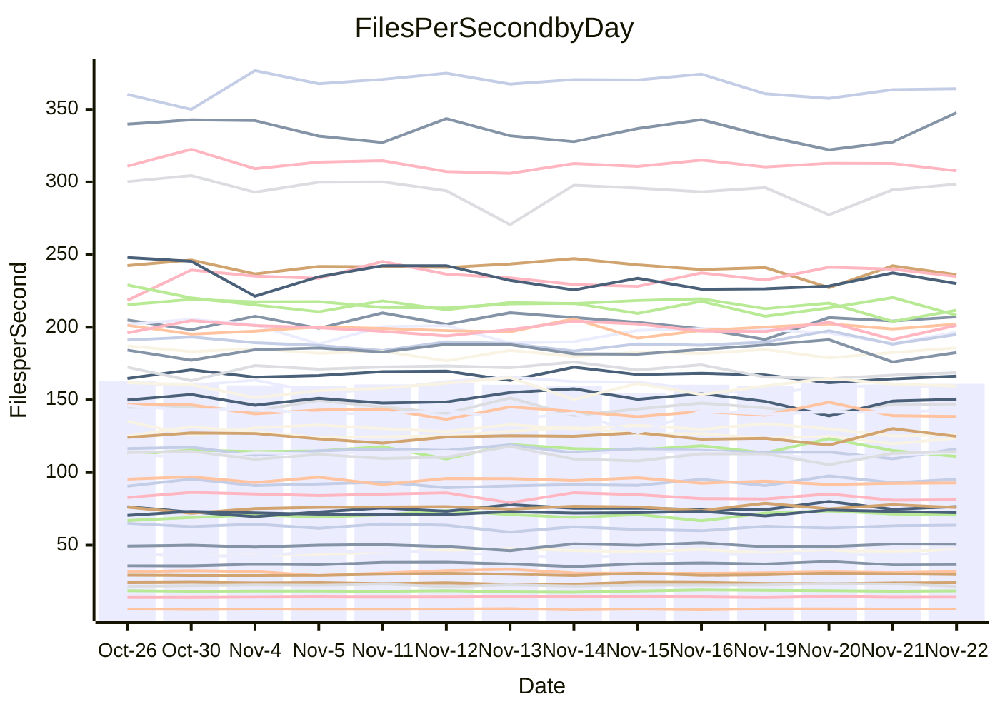

<!---
# This file is auto-generated. Do not edit.
# cspell:disable
--->
# Performance Report

## Daily Performance

## Time to Process Files

| Repository                                      | Elapsed | Min/Avg/Max           |    SD | SD Graph                |
| ----------------------------------------------- | ------: | :-------------------: | ----: | ----------------------- |
| AdaDoom3/AdaDoom3                    |    3.49 | 3.3 /   3.5 /   3.7   |  0.09 | `     ┣━┻━━╋●━┻━┫     ` |
| alexiosc/megistos                    |    7.39 | 7.3 /   7.8 /   8.7   |  0.32 | `    ┣━●┻━━╋━━┻━━┫    ` |
| apollographql/apollo-server          |    2.69 | 2.6 /   2.8 /   3.2   |  0.12 | `     ┣━┻━●╋━━┻━┫     ` |
| aspnetboilerplate/aspnetboilerplate  |   11.08 | 10.3 /  10.7 /  11.8  |  0.34 | `    ┣━━┻━━╋━━●━━┫    ` |
| aws-amplify/docs                     |   13.42 | 12.4 /  13.3 /  14.8  |  0.53 | `    ┣━━┻━━●━━┻━━┫    ` |
| Azure/azure-rest-api-specs           |   10.68 | 9.6 /  10.1 /  11.2   |  0.39 | `    ┣━━┻━━╋━━┻●━┫    ` |
| bitjson/typescript-starter           |    1.07 | 1.0 /   1.1 /   1.1   |  0.03 | `     ┣━━┻●╋━┻━━┫     ` |
| caddyserver/caddy                    |    3.71 | 3.4 /   3.8 /   4.0   |  0.11 | `     ┣━┻●━╋━━┻━┫     ` |
| canada-ca/open-source-logiciel-libre |    1.14 | 1.1 /   1.2 /   1.3   |  0.04 | `     ┣━━●━╋━┻━━┫     ` |
| chef/chef                            |    5.91 | 5.7 /   6.0 /   6.4   |  0.16 | `    ┣━━┻━●╋━━┻━━┫    ` |
| dart-lang/sdk                        |   66.86 | 63.7 /  67.6 /  72.3  |  2.07 | `   ┣━━┻━━●╋━━━┻━━┫   ` |
| django/django                        |   15.16 | 14.9 /  15.8 /  17.2  |  0.47 | `    ┣━●┻━━╋━━┻━━┫    ` |
| eslint/eslint                        |   10.54 | 10.6 /  11.1 /  11.8  |  0.34 | `    ┣●━┻━━╋━━┻━━┫    ` |
| exonum/exonum                        |    3.74 | 3.4 /   3.7 /   4.0   |  0.13 | `     ┣━┻━━╋●━┻━┫     ` |
| flutter/samples                      |   17.69 | 16.0 /  17.0 /  19.0  |  0.60 | `    ┣━━┻━━╋━━┻●━┫    ` |
| gitbucket/gitbucket                  |    3.59 | 3.5 /   3.7 /   3.9   |  0.10 | `     ┣━┻●━╋━━┻━┫     ` |
| googleapis/google-cloud-cpp          |  146.30 | 139.9 / 149.8 / 209.7 | 11.75 | `  ┣━━━┻━━●╋━━━┻━━━┫  ` |
| graphql/express-graphql              |    1.15 | 1.1 /   1.2 /   1.3   |  0.05 | `     ┣━━┻━●━┻━━┫     ` |
| graphql/graphql-js                   |    2.96 | 2.8 /   3.0 /   3.2   |  0.11 | `     ┣━┻━━●━━┻━┫     ` |
| graphql/graphql-relay-js             |    1.18 | 1.1 /   1.2 /   1.2   |  0.03 | `     ┣━━┻━╋●┻━━┫     ` |
| graphql/graphql-spec                 |    1.36 | 1.3 /   1.3 /   1.4   |  0.03 | `     ┣━━┻━╋━●━━┫     ` |
| iluwatar/java-design-patterns        |   13.30 | 12.6 /  13.3 /  14.4  |  0.40 | `    ┣━━┻━━●━━┻━━┫    ` |
| ktaranov/sqlserver-kit               |    7.01 | 6.5 /   6.8 /   7.3   |  0.19 | `    ┣━━┻━━╋━━●━━┫    ` |
| liriliri/licia                       |    4.12 | 4.1 /   4.3 /   4.6   |  0.12 | `     ┣●┻━━╋━━┻━┫     ` |
| MartinThoma/LaTeX-examples           |    7.02 | 6.8 /   7.1 /   7.9   |  0.26 | `    ┣━━┻━●╋━━┻━━┫    ` |
| mdx-js/mdx                           |    1.96 | 1.9 /   2.0 /   2.2   |  0.07 | `     ┣━┻━●╋━━┻━┫     ` |
| microsoft/TypeScript-Website         |    6.06 | 5.5 /   5.8 /   6.5   |  0.19 | `    ┣━━┻━━╋━━●━━┫    ` |
| MicrosoftDocs/PowerShell-Docs        |   23.98 | 22.9 /  24.3 /  26.2  |  0.81 | `    ┣━━┻━●╋━━┻━━┫    ` |
| neovim/nvim-lspconfig                |    4.55 | 4.3 /   4.5 /   4.7   |  0.10 | `     ┣━┻━━╋━━●━┫     ` |
| pagekit/pagekit                      |    3.59 | 3.5 /   3.7 /   4.3   |  0.15 | `     ┣━┻━●╋━━┻━┫     ` |
| php/php-src                          |   27.95 | 25.9 /  27.1 /  29.3  |  0.88 | `   ┣━━━┻━━╋━━●━━━┫   ` |
| plasticrake/tplink-smarthome-api     |    1.35 | 1.3 /   1.4 /   1.5   |  0.05 | `     ┣━┻━●╋━━┻━┫     ` |
| prettier/prettier                    |    7.73 | 7.2 /   7.8 /   8.3   |  0.18 | `    ┣━━┻━━●━━┻━━┫    ` |
| pycontribs/jira                      |    1.56 | 1.5 /   1.6 /   1.7   |  0.07 | `     ┣━┻━●╋━━┻━┫     ` |
| RustPython/RustPython                |    5.72 | 5.2 /   5.6 /   6.0   |  0.23 | `    ┣━━┻━━╋━●┻━━┫    ` |
| shoelace-style/shoelace              |    2.96 | 2.9 /   3.0 /   3.2   |  0.09 | `     ┣━┻●━╋━━┻━┫     ` |
| slint-ui/slint                       |   14.31 | 13.3 /  13.9 /  15.0  |  0.38 | `    ┣━━┻━━╋━━●━━┫    ` |
| SoftwareBrothers/admin-bro           |    2.68 | 2.5 /   2.6 /   2.8   |  0.06 | `     ┣━┻━━╋━●┻━┫     ` |
| sveltejs/svelte                      |   22.78 | 20.8 /  21.9 /  22.9  |  0.48 | `    ┣━━┻━━╋━━┻━━●    ` |
| TheAlgorithms/Python                 |    5.94 | 5.6 /   5.8 /   6.2   |  0.13 | `    ┣━━┻━━╋━━●━━┫    ` |
| twbs/bootstrap                       |    1.87 | 1.8 /   1.9 /   2.4   |  0.11 | `     ┣━┻━━●━━┻━┫     ` |
| typescript-cheatsheets/react         |    1.34 | 1.3 /   1.4 /   1.6   |  0.06 | `     ┣●┻━━╋━━┻━┫     ` |
| typescript-eslint/typescript-eslint  |    4.30 | 4.2 /   4.4 /   4.7   |  0.12 | `     ┣━┻━●╋━━┻━┫     ` |
| vitest-dev/vitest                    |    9.71 | 9.2 /   9.9 /  10.9   |  0.45 | `    ┣━━┻━●╋━━┻━━┫    ` |
| w3c/aria-practices                   |    3.60 | 3.4 /   3.6 /   3.8   |  0.10 | `     ┣━┻━━●━━┻━┫     ` |
| w3c/specberus                        |    2.11 | 2.0 /   2.1 /   2.2   |  0.06 | `     ┣━┻━━╋●━┻━┫     ` |
| webdeveric/webpack-assets-manifest   |    1.21 | 1.2 /   1.2 /   1.4   |  0.05 | `     ┣━━●━╋━┻━━┫     ` |
| webpack/webpack                      |    5.58 | 5.5 /   5.8 /   6.7   |  0.23 | `    ┣━━●━━╋━━┻━━┫    ` |
| wireapp/wire-desktop                 |    1.34 | 1.3 /   1.5 /   1.7   |  0.09 | `     ┣━●━━╋━━┻━┫     ` |
| wireapp/wire-webapp                  |   10.80 | 10.6 /  11.2 /  12.6  |  0.52 | `    ┣━━┻●━╋━━┻━━┫    ` |

Note:
- Elapsed time is in seconds.

## Files per Second over Time

| Repository                                      | Files |    Sec |    Fps |    Rel | Trend Fps              |    N |
| ----------------------------------------------- | ----: | -----: | -----: | -----: | ---------------------- | ---: |
| AdaDoom3/AdaDoom3                    |   103 |   3.49 |  29.48 | -1.06% | `▇▄▇▆▇▆▅▇█▆▅▆▅▇▅▇▇▆▆▅` |   30 |
| alexiosc/megistos                    |   583 |   7.39 |  78.92 |  5.89% | `▇▆▆▆▄▇▆▅▇▇▆▆▆▆▅█▆▆▆█` |   30 |
| apollographql/apollo-server          |   253 |   2.69 |  94.14 |  2.24% | `▇▆▇▇▃▆▆▇▇▅▇▆▆█▆█▇▇█▇` |   30 |
| aspnetboilerplate/aspnetboilerplate  |  2286 |  11.08 | 206.41 | -3.63% | `▇▆▄██▇▇▅█▅▇▆▆▆▅▇██▆▆` |   30 |
| aws-amplify/docs                     |  2871 |  13.42 | 213.99 | -0.69% | `█▅▆▆▆▇▇██▆█▇▇▇▅▇▄▆▆▇` |   30 |
| Azure/azure-rest-api-specs           |  2365 |  10.68 | 221.41 | -5.88% | `███▇█▆▅▆▇▇▅▃▇▄▇▆▇▆▇▅` |   30 |
| bitjson/typescript-starter           |    20 |   1.07 |  18.61 |  0.74% | `▅▇▇▇▆▅▄▆▇▆██▆▇█▇▅▆▆▇` |   30 |
| caddyserver/caddy                    |   288 |   3.71 |  77.64 |  1.77% | `▅▅▆▄▆▅▅▅▅▅▄▅▆▆█▅▆▆▄▆` |   30 |
| canada-ca/open-source-logiciel-libre |     7 |   1.14 |   6.12 |  2.34% | `▄▇▆█▅▇▃▆▅▇▄▆▇▇█▇▆▇▆▇` |   30 |
| chef/chef                            |  1191 |   5.91 | 201.62 |  1.37% | `█▆▅▇█▆█▆▇▄▆▇▇█▇▇█▅▇▇` |   30 |
| dart-lang/sdk                        | 10778 |  66.86 | 161.21 |  1.41% | `▇▆▇▇▇█▄▆█▇▅▅▇▇███▆▆▇` |   30 |
| django/django                        |  2885 |  15.16 | 190.34 |  4.15% | `▇▇▆▆▄▇▆▆█▅▆▇▇▇▅▆▇▆▆█` |   30 |
| eslint/eslint                        |  2089 |  10.54 | 198.17 |  4.90% | `▇▄▅█▆▆▅▆▆▇▆██▄▆█▅▇▇█` |   30 |
| exonum/exonum                        |   421 |   3.74 | 112.57 | -1.84% | `▇▆▆▄▃▇▆▆▆▆▇▄▆▅▆█▆▆▄▅` |   30 |
| flutter/samples                      |  2400 |  17.69 | 135.64 | -4.30% | `█▆▇▃▆▇▇▅▇▆▇█▅▅▆█▇▆▇▅` |   30 |
| gitbucket/gitbucket                  |   413 |   3.59 | 115.07 |  1.77% | `█▆█▆▇▇▆▅▇█▇▆▄▇▇▅▆▆▆▇` |   30 |
| googleapis/google-cloud-cpp          | 20955 | 146.30 | 143.23 |  2.03% | `██▇██▇▇▂█▇█▇▇█▇██▇██` |   30 |
| graphql/express-graphql              |    26 |   1.15 |  22.51 |  0.56% | `█▆▃▄▅▆▅▄▅▇▅▃▇▅▇▇▇▆▃▅` |   30 |
| graphql/graphql-js                   |   368 |   2.96 | 124.18 | -0.26% | `▄▇▇▇▄▆▆▇▇▇▆▇▄▇▆▅▇█▇▆` |   30 |
| graphql/graphql-relay-js             |    28 |   1.18 |  23.63 | -1.42% | `▆▆▇▇▆▅▅▇██▇▅▄█▇▆▆▇█▆` |   30 |
| graphql/graphql-spec                 |    19 |   1.36 |  13.92 | -2.34% | `▆▇█▅▆▇██▇█▇▅▅▇▆█▆▇▇▆` |   30 |
| iluwatar/java-design-patterns        |  1992 |  13.30 | 149.77 |  0.02% | `▆▆▅▆▇██▇▇▆▇▇▇▆▆▄▆▇▇▆` |   30 |
| ktaranov/sqlserver-kit               |   489 |   7.01 |  69.73 | -2.86% | `▅▆█▆▅▇▇▇▆▇▇█▆▄▅█▇██▅` |   30 |
| liriliri/licia                       |  1437 |   4.12 | 348.71 |  4.10% | `█▆▇██▆▆▆▇█▇▅▇▇▆▅▆▆██` |   30 |
| MartinThoma/LaTeX-examples           |  1409 |   7.02 | 200.77 |  1.22% | `▆▆█▆▃▇█▇▇█▆▇▇▆▅▇▇▄▇▇` |   30 |
| mdx-js/mdx                           |   141 |   1.96 |  71.87 |  1.79% | `▇▆███▇▆▇▅█▅▆▇█▇██▆▆▇` |   30 |
| microsoft/TypeScript-Website         |   761 |   6.06 | 125.66 | -4.09% | `▆▇█▃▇▇▆▇▇▇▆▇▇▇█▆▄▆▅▅` |   30 |
| MicrosoftDocs/PowerShell-Docs        |  2708 |  23.98 | 112.94 |  1.17% | `▅▆█▆▄█▅▅▄▅▇▆▆▇▆▄▆▇█▇` |   30 |
| neovim/nvim-lspconfig                |   760 |   4.55 | 166.91 | -2.13% | `▇█▇▇█▇█▆▇▇█▆▅▅▆▅▆▆▇▆` |   30 |
| pagekit/pagekit                      |   741 |   3.59 | 206.32 |  1.87% | `▇█▇▇▆█▇▇▇▆▆▃▇▆▅▇█▆▇▇` |   30 |
| php/php-src                          |  2262 |  27.95 |  80.92 | -3.42% | `▇▇██▇▅███▅▆▄▆▆▇▇▆▅▆▅` |   30 |
| plasticrake/tplink-smarthome-api     |    62 |   1.35 |  45.87 |  1.85% | `█▆▇▇▇█▇▇▅▇█▅▆▇▆▇▆▇█▇` |   30 |
| prettier/prettier                    |  2426 |   7.73 | 313.74 |  0.75% | `███▄▇▆▇▇█▇██▇▇▇▇█▇▆█` |   30 |
| pycontribs/jira                      |    79 |   1.56 |  50.65 |  2.05% | `▇▅▅▅▇▄▇▇▆▅▇▄▆█▃▅▆▇▆▆` |   30 |
| RustPython/RustPython                |   703 |   5.72 | 122.85 | -1.94% | `▇▄▆▇▇▇█▇▇▇▇▅▆▇▇▆▅▅▆▆` |   30 |
| shoelace-style/shoelace              |   439 |   2.96 | 148.12 |  2.17% | `▆▆▄▆▆█▅▆▅▇▇▇▆▇▄▅▇▇▇▇` |   30 |
| slint-ui/slint                       |  2570 |  14.31 | 179.62 | -2.64% | `▆▇█▇▇▇▆▅▆▇▇▇▆█▇█▄▆▇▆` |   30 |
| SoftwareBrothers/admin-bro           |   441 |   2.68 | 164.57 | -1.55% | `▆▇█▇█▆██▇▇▇█▇▆▆▅█▄▇▆` |   30 |
| sveltejs/svelte                      |  8068 |  22.78 | 354.20 | -3.54% | `▇█▇▇▇▆▇▆▆█▇▆▆▆▅▅▆▆▇▅` |   30 |
| TheAlgorithms/Python                 |  1399 |   5.94 | 235.62 | -2.28% | `▆█▅██▇█▇▆█▆▆▆▇▇▄▇▇▆▆` |   30 |
| twbs/bootstrap                       |   118 |   1.87 |  63.15 |  0.35% | `█▇▇█▇▅▇██▂▆▅▇██▆▆█▇▇` |   30 |
| typescript-cheatsheets/react         |    53 |   1.34 |  39.45 |  6.97% | `▆▇▆▇█▆▄▆▆▆▆▄▆▆▇▇▅▆▃█` |   30 |
| typescript-eslint/typescript-eslint  |  1290 |   4.30 | 299.70 |  1.38% | `█▇▆▆█▄▇▇▆▇▆▇▇▇▇▅▆▇▇▇` |   30 |
| vitest-dev/vitest                    |  2338 |   9.71 | 240.66 |  2.99% | `▇█▆▆▇▆▆▄▅▇▇▇▆▄▇▇▇▇▆▇` |   30 |
| w3c/aria-practices                   |   414 |   3.60 | 114.94 | -0.02% | `█▅▇▇▅█▆█▆▆▆▇█▄▆▆▅▄▇▆` |   30 |
| w3c/specberus                        |   197 |   2.11 |  93.44 | -1.23% | `▇▅▇▇█▇▇█▇▇▆█▇▅▇▆▄█▆▆` |   30 |
| webdeveric/webpack-assets-manifest   |    55 |   1.21 |  45.33 |  2.67% | `▆█▅▆▇▅▃█▅▄▅▆▄▅▆▆▄▅▇▇` |   30 |
| webpack/webpack                      |  1143 |   5.58 | 205.00 |  4.25% | `█▇▇█▇▆▆▇▇▇▇▆▇▇▇▇▆▅▅█` |   30 |
| wireapp/wire-desktop                 |    43 |   1.34 |  32.14 |  3.31% | `▆▆▇█▇█▆▅█▅▆▇▇▄▇▇▇▆▇▇` |   30 |
| wireapp/wire-webapp                  |  1783 |  10.80 | 165.04 |  3.78% | `▄▇█▅██▇▇▇█▆▇▇▃▅▇▆▇▅█` |   30 |

## Data Throughput

| Repository                                      | Files |    Sec |     Kps |     Rel | Trend Kps              |    N |
| ----------------------------------------------- | ----: | -----: | ------: | ------: | ---------------------- | ---: |
| AdaDoom3/AdaDoom3                    |   103 |   3.49 |  626.47 |  -1.06% | `▇▄▇▆▇▆▅▇█▆▅▆▅▇▅▇▇▆▆▅` |   30 |
| alexiosc/megistos                    |   583 |   7.39 |  620.13 |   5.89% | `▇▆▆▆▄▇▆▅▇▇▆▆▆▆▅█▆▆▆█` |   30 |
| apollographql/apollo-server          |   253 |   2.69 |  769.14 |   2.40% | `▇▆▇▇▃▆▆▇▇▅▇▆▆█▆█▇▇█▇` |   30 |
| aspnetboilerplate/aspnetboilerplate  |  2286 |  11.08 |  502.20 |  -3.63% | `▇▆▄██▇▇▅█▅▇▆▆▆▅▇██▆▆` |   30 |
| aws-amplify/docs                     |  2871 |  13.42 |  746.85 |  -0.71% | `█▅▆▆▆▇▇██▆█▇▇▇▅▇▄▆▆▇` |   30 |
| Azure/azure-rest-api-specs           |  2365 |  10.68 |  602.44 |  -5.61% | `███▇█▆▅▆▇▇▅▃▇▄▇▆▇▇▇▅` |   30 |
| bitjson/typescript-starter           |    20 |   1.07 |   74.46 |   0.74% | `▅▇▇▇▆▅▄▆▇▆██▆▇█▇▅▆▆▇` |   30 |
| caddyserver/caddy                    |   288 |   3.71 |  674.21 |   1.86% | `▅▅▆▄▆▅▅▅▅▅▄▅▆▆█▅▆▆▄▆` |   30 |
| canada-ca/open-source-logiciel-libre |     7 |   1.14 |   50.69 |   2.34% | `▄▇▆█▅▇▃▆▅▇▄▆▇▇█▇▆▇▆▇` |   30 |
| chef/chef                            |  1191 |   5.91 |  936.14 |   1.52% | `█▆▅▇█▆█▆▇▄▆▇▇█▇▇█▅▇▇` |   30 |
| dart-lang/sdk                        | 10778 |  66.86 | 1102.06 |   1.59% | `▇▆▇▇▇█▅▆█▇▅▅▇▇███▆▆▇` |   30 |
| django/django                        |  2885 |  15.16 | 1195.04 |   4.11% | `▇▇▆▆▄▇▆▆█▅▆▇▇▇▅▆▇▆▆█` |   30 |
| eslint/eslint                        |  2089 |  10.54 | 1344.75 |   0.63% | `▇▅▆█▇▇▆▆▆▇▇▆▆▃▅▆▄▆▅▇` |   30 |
| exonum/exonum                        |   421 |   3.74 | 1076.82 |  -1.84% | `▇▆▆▄▃▇▆▆▆▆▇▄▆▅▆█▆▆▄▅` |   30 |
| flutter/samples                      |  2400 |  17.69 | 1210.37 |  -4.30% | `█▆▇▃▆▇▇▅▇▆▇█▅▅▆█▇▆▇▅` |   30 |
| gitbucket/gitbucket                  |   413 |   3.59 |  522.98 |   1.77% | `█▆█▆▇▇▆▅▇█▇▆▄▇▇▅▆▆▆▇` |   30 |
| googleapis/google-cloud-cpp          | 20955 | 146.30 | 1166.88 |   2.18% | `██▇██▇▇▂█▇█▇▇█▇██▇██` |   30 |
| graphql/express-graphql              |    26 |   1.15 |  103.04 |   0.56% | `█▆▃▄▅▆▅▄▅▇▅▃▇▅▇▇▇▆▃▅` |   30 |
| graphql/graphql-js                   |   368 |   2.96 |  720.76 |  -0.21% | `▄▇▇▇▄▆▆▇▇▇▆▇▄▇▆▅▇█▇▆` |   30 |
| graphql/graphql-relay-js             |    28 |   1.18 |   92.84 |  -1.42% | `▆▆▇▇▆▅▅▇██▇▅▄█▇▆▆▇█▆` |   30 |
| graphql/graphql-spec                 |    19 |   1.36 |  464.48 |  -2.34% | `▆▇█▅▆▇██▇█▇▅▅▇▆█▆▇▇▆` |   30 |
| iluwatar/java-design-patterns        |  1992 |  13.30 |  462.91 |   0.02% | `▆▆▅▆▇██▇▇▆▇▇▇▆▆▄▆▇▇▆` |   30 |
| ktaranov/sqlserver-kit               |   489 |   7.01 | 1055.96 |  -2.86% | `▅▆█▆▅▇▇▇▆▇▇█▆▄▅█▇██▅` |   30 |
| liriliri/licia                       |  1437 |   4.12 |  415.44 |   4.10% | `█▆▇██▆▆▆▇█▇▅▇▇▆▅▆▆██` |   30 |
| MartinThoma/LaTeX-examples           |  1409 |   7.02 |  414.65 |   1.22% | `▆▆█▆▃▇█▇▇█▆▇▇▆▅▇▇▄▇▇` |   30 |
| mdx-js/mdx                           |   141 |   1.96 |  334.39 |   1.79% | `▇▆███▇▆▇▅█▅▆▇█▇██▆▆▇` |   30 |
| microsoft/TypeScript-Website         |   761 |   6.06 |  869.23 |  -4.08% | `▆▇█▃▇▇▆▇▇▇▆▇▇▇█▆▄▆▅▅` |   30 |
| MicrosoftDocs/PowerShell-Docs        |  2708 |  23.98 | 1162.99 |   1.18% | `▅▆█▆▄█▅▅▄▅▇▆▆▇▆▄▆▇█▇` |   30 |
| neovim/nvim-lspconfig                |   760 |   4.55 |  309.87 |   5.61% | `▅▆▅▅▆▅▆▄▅▅▅█▇▇▇▇▇▇█▇` |   30 |
| pagekit/pagekit                      |   741 |   3.59 |  430.19 |   1.87% | `▇█▇▇▆█▇▇▇▆▆▃▇▆▅▇█▆▇▇` |   30 |
| php/php-src                          |  2262 |  27.95 | 1418.71 |  -3.29% | `▇▇██▇▅███▅▆▄▆▆▇▇▆▅▆▅` |   30 |
| plasticrake/tplink-smarthome-api     |    62 |   1.35 |  247.87 |   1.85% | `█▆▇▇▇█▇▇▅▇█▅▆▇▆▇▆▇█▇` |   30 |
| prettier/prettier                    |  2426 |   7.73 |  435.04 |   0.53% | `███▄▇▆▇▇█▇██▇▇▆▇█▇▆▇` |   30 |
| pycontribs/jira                      |    79 |   1.56 |  359.02 |   2.05% | `▇▅▅▅▇▄▇▇▆▅▇▄▆█▃▅▆▇▆▆` |   30 |
| RustPython/RustPython                |   703 |   5.72 | 1254.39 |  14.26% | `▄▃▃▄▄▄▅▄▄▄▄▇████▇▇█▇` |   30 |
| shoelace-style/shoelace              |   439 |   2.96 |  715.64 |   2.17% | `▆▆▄▆▆█▅▆▅▇▇▇▆▇▄▅▇▇▇▇` |   30 |
| slint-ui/slint                       |  2570 |  14.31 | 1112.17 |  -2.32% | `▆▇█▇▇▇▆▅▆▇▇▇▆█▇█▄▆▇▆` |   30 |
| SoftwareBrothers/admin-bro           |   441 |   2.68 |  362.72 |  -1.55% | `▆▇█▇█▆██▇▇▇█▇▆▆▅█▄▇▆` |   30 |
| sveltejs/svelte                      |  8068 |  22.78 |  236.19 |  -3.59% | `▇█▇▇▇▆▇▆▆█▇▆▆▆▅▅▆▆▇▅` |   30 |
| TheAlgorithms/Python                 |  1399 |   5.94 |  599.25 |  -2.28% | `▆█▅██▇█▇▆█▆▆▆▇▇▄▇▇▆▆` |   30 |
| twbs/bootstrap                       |   118 |   1.87 |  518.62 |   0.39% | `█▇▇█▇▅▇██▂▆▅▇██▆▆█▇▇` |   30 |
| typescript-cheatsheets/react         |    53 |   1.34 |  291.75 |   6.97% | `▆▇▆▇█▆▄▆▆▆▆▄▆▆▇▇▅▆▃█` |   30 |
| typescript-eslint/typescript-eslint  |  1290 |   4.30 | 1547.50 |   1.59% | `█▇▆▆█▄▇▇▆▇▆▇▇▇▇▅▆█▇▇` |   30 |
| vitest-dev/vitest                    |  2338 |   9.71 |  517.04 |   1.75% | `▆█▆▅▇▆▅▃▅▇▆▇▅▃▇▇▇▇▅▇` |   30 |
| w3c/aria-practices                   |   414 |   3.60 | 1071.69 |  -0.02% | `█▅▇▇▅█▆█▆▆▆▇█▄▆▆▅▄▇▆` |   30 |
| w3c/specberus                        |   197 |   2.11 |  295.51 |  -1.23% | `▇▅▇▇█▇▇█▇▇▆█▇▅▇▆▄█▆▆` |   30 |
| webdeveric/webpack-assets-manifest   |    55 |   1.21 |  104.67 |   2.67% | `▆█▅▆▇▅▃█▅▄▅▆▄▅▆▆▄▅▇▇` |   30 |
| webpack/webpack                      |  1143 |   5.58 |  936.22 |   4.53% | `█▇▇█▇▆▆▇▇▇▇▆▇▇▇▇▆▅▅█` |   30 |
| wireapp/wire-desktop                 |    43 |   1.34 |  142.03 | -13.47% | `▆▇██▇█▇▆█▆▇▃▄▂▃▃▃▃▃▄` |   30 |
| wireapp/wire-webapp                  |  1783 |  10.80 |  611.09 |   3.93% | `▄▇█▅██▇▇▇█▆▇▇▃▅▇▆▇▅█` |   30 |

