<!---
# This file is auto-generated. Do not edit.
# cspell:disable
--->
# Performance Report

## Daily Performance

```mermaid
xychart-beta
    title Files Per Second by Day
    y-axis Files per Second
    x-axis Date [Mar-10, Mar-11, Mar-12, Mar-14, Mar-16, Mar-17, Mar-18, Mar-19, Mar-20, Mar-23, Mar-24, Mar-25, Mar-26, Mar-29, Mar-30, Apr-1, Apr-2, Apr-4, Apr-7, Apr-8, Apr-9]
    bar [166.90, 170.28, 167.96, 170.77, 172.49, 163.12, 168.74, 165.10, 169.90, 170.54, 170.15, 169.46, 168.97, 169.16, 165.19, 167.12, 170.37, 169.84, 169.20, 170.31, 166.27]
    line [153.68, 151.29, 150.86, 151.00, 150.98, 147.76, 147.05, 142.11, 146.32, 150.21, 153.16, 149.16, 149.10, 141.11, 141.56, 145.52, 151.04, 149.76, 147.19, 149.14, 146.94]
    line [30.67, 29.03, 29.26, 28.24, 29.28, 0.00, 30.17, 28.97, 29.71, 29.66, 30.27, 30.92, 29.47, 28.68, 29.57, 28.57, 29.71, 29.80, 29.09, 30.39, 28.82]
    line [100.38, 105.62, 108.06, 108.63, 109.77, 0.00, 109.48, 106.75, 103.62, 105.75, 102.75, 105.38, 105.40, 108.89, 108.97, 105.55, 109.02, 109.07, 108.93, 102.51, 106.98]
    line [76.26, 77.15, 71.76, 77.49, 80.92, 0.00, 79.48, 76.04, 73.72, 80.38, 80.74, 79.45, 78.90, 77.54, 81.64, 79.42, 77.99, 80.60, 77.45, 79.26, 78.59]
    line [9.19, 8.82, 8.78, 8.85, 9.10, 0.00, 9.23, 9.18, 9.17, 9.01, 9.07, 9.18, 8.85, 8.88, 8.98, 8.86, 9.02, 8.96, 9.04, 7.54, 9.19]
    line [225.18, 226.33, 225.86, 218.26, 223.17, 0.00, 221.50, 222.32, 220.99, 231.13, 215.37, 218.33, 220.26, 228.02, 226.94, 217.16, 217.42, 227.00, 219.19, 223.64, 221.83]
    line [33.62, 33.19, 33.27, 32.31, 33.08, 0.00, 32.27, 31.92, 32.59, 32.86, 32.52, 33.58, 32.45, 33.01, 32.72, 32.66, 33.55, 32.53, 32.45, 32.84, 31.03]
    line [221.35, 212.75, 199.22, 215.68, 216.63, 0.00, 210.43, 194.84, 215.80, 209.89, 198.80, 198.73, 211.72, 221.65, 200.22, 211.45, 214.10, 213.54, 214.82, 216.50, 216.97]
    line [85.99, 80.85, 82.96, 80.12, 83.75, 0.00, 84.19, 77.00, 76.28, 80.89, 84.46, 87.70, 74.07, 80.80, 84.33, 78.70, 84.38, 79.63, 81.82, 77.99, 81.50]
    line [235.19, 230.19, 227.52, 236.26, 231.32, 0.00, 238.26, 229.07, 224.09, 230.48, 205.55, 231.40, 224.85, 237.49, 223.66, 231.23, 235.01, 220.71, 230.14, 228.37, 226.53]
    line [268.99, 255.45, 256.91, 258.23, 279.40, 263.00, 252.47, 255.67, 256.43, 250.90, 249.83, 254.84, 250.99, 267.50, 272.96, 257.38, 260.99, 254.08, 252.77, 256.08, 266.31]
    line [157.06, 163.43, 155.76, 162.12, 164.69, 146.57, 161.90, 162.39, 165.69, 157.58, 159.05, 160.24, 163.39, 166.67, 150.69, 158.40, 157.33, 163.45, 164.03, 166.16, 160.66]
    line [131.12, 129.21, 133.16, 123.46, 118.56, 0.00, 113.21, 123.62, 133.59, 125.56, 130.85, 117.33, 124.90, 126.70, 118.28, 118.73, 131.77, 121.36, 115.15, 130.27, 129.70]
    line [196.04, 194.47, 189.79, 190.73, 198.77, 0.00, 192.18, 194.92, 190.41, 196.34, 187.06, 199.37, 194.10, 194.60, 197.36, 195.73, 192.93, 191.61, 192.83, 195.35, 194.59]
    line [37.24, 37.69, 35.74, 37.96, 37.35, 0.00, 35.28, 37.21, 37.12, 36.04, 37.43, 37.77, 35.49, 38.47, 34.67, 37.33, 36.38, 33.48, 34.77, 37.91, 37.41]
    line [175.32, 190.22, 185.25, 190.86, 181.70, 189.94, 188.37, 178.85, 193.91, 191.22, 186.88, 188.85, 185.59, 189.39, 193.26, 187.15, 184.74, 187.37, 186.23, 190.68, 147.53]
    line [121.58, 127.36, 124.48, 124.29, 128.83, 0.00, 127.06, 126.56, 126.58, 127.48, 128.55, 123.13, 128.34, 129.63, 124.04, 124.98, 128.23, 124.77, 127.89, 127.66, 125.67]
    line [155.73, 147.60, 143.40, 150.52, 151.12, 0.00, 145.52, 146.20, 143.76, 151.81, 155.42, 148.92, 148.41, 153.58, 150.94, 143.07, 143.33, 149.63, 148.24, 150.53, 145.81]
    line [17.16, 17.19, 17.39, 17.59, 17.80, 0.00, 18.15, 17.78, 17.85, 17.67, 18.65, 17.61, 17.35, 16.76, 17.72, 17.35, 17.65, 17.28, 17.60, 16.96, 17.77]
    line [36.33, 35.73, 35.13, 35.70, 35.19, 0.00, 33.61, 34.93, 33.86, 35.93, 34.39, 35.01, 35.05, 34.45, 35.12, 35.58, 36.26, 35.35, 33.46, 33.90, 35.56]
    line [78.07, 77.77, 75.81, 76.50, 76.10, 0.00, 75.83, 75.87, 78.58, 77.74, 71.68, 76.76, 74.86, 76.49, 79.15, 75.48, 79.12, 77.09, 74.93, 76.78, 77.18]
    line [394.91, 378.59, 380.73, 378.04, 384.33, 0.00, 389.20, 373.57, 386.80, 387.88, 376.31, 372.07, 383.78, 387.22, 383.71, 379.46, 361.04, 377.52, 372.77, 388.59, 381.59]
    line [161.51, 151.54, 150.87, 163.76, 156.32, 0.00, 160.16, 156.51, 161.04, 158.05, 161.01, 161.14, 161.02, 161.23, 161.25, 154.49, 160.21, 159.01, 159.81, 159.07, 154.86]
    line [143.12, 148.41, 142.99, 157.82, 153.98, 0.00, 153.38, 140.65, 152.55, 155.16, 153.53, 151.77, 149.23, 157.46, 155.25, 144.83, 152.27, 154.71, 148.18, 156.04, 147.10]
    line [87.51, 84.24, 87.90, 85.86, 89.44, 0.00, 85.10, 86.52, 88.59, 87.54, 88.99, 86.43, 87.49, 88.18, 89.80, 85.13, 86.10, 87.57, 86.19, 87.38, 86.67]
    line [209.48, 205.50, 209.94, 197.73, 195.52, 0.00, 213.68, 211.47, 210.97, 213.69, 202.35, 210.95, 211.66, 216.55, 215.27, 211.34, 210.95, 214.71, 213.10, 213.49, 213.15]
    line [117.85, 111.69, 113.35, 117.08, 116.33, 113.67, 102.23, 107.14, 116.81, 113.12, 111.02, 111.29, 113.14, 115.11, 113.41, 110.41, 110.44, 115.08, 114.00, 113.95, 110.13]
    line [203.06, 214.04, 216.20, 208.89, 219.08, 0.00, 221.58, 220.59, 220.21, 221.85, 221.92, 208.33, 219.80, 213.72, 203.24, 214.01, 219.35, 211.25, 222.14, 222.81, 213.62]
    line [131.48, 140.53, 137.19, 141.47, 140.41, 0.00, 148.35, 141.37, 142.88, 143.59, 140.02, 140.41, 141.17, 142.23, 143.51, 141.89, 144.85, 135.75, 140.12, 141.93, 144.71]
    line [113.49, 117.14, 111.13, 113.02, 119.58, 0.00, 119.14, 108.97, 119.41, 115.10, 113.74, 110.71, 115.58, 119.01, 118.83, 116.74, 109.55, 112.13, 116.38, 109.02, 116.94]
    line [60.32, 62.74, 61.81, 62.24, 64.17, 0.00, 63.86, 59.37, 61.48, 63.14, 64.40, 63.55, 62.46, 63.93, 62.91, 63.90, 62.22, 64.11, 62.38, 62.53, 61.32]
    line [64.38, 66.76, 65.74, 67.01, 67.20, 0.00, 65.95, 67.09, 69.51, 67.29, 67.85, 66.26, 65.71, 66.97, 59.95, 64.70, 68.07, 62.75, 56.53, 64.20, 68.55]
    line [95.28, 99.47, 100.53, 102.92, 100.79, 0.00, 95.35, 97.73, 102.58, 98.57, 96.12, 102.27, 101.01, 101.78, 96.16, 99.80, 97.07, 97.79, 98.91, 96.86, 98.48]
    line [99.01, 98.81, 93.34, 95.04, 100.22, 91.09, 98.60, 95.36, 93.78, 99.68, 85.33, 95.39, 95.28, 93.74, 88.41, 97.83, 99.26, 98.35, 94.04, 92.16, 96.89]
    line [197.11, 203.57, 201.55, 197.62, 197.66, 0.00, 200.62, 197.25, 196.16, 202.64, 191.91, 205.03, 200.51, 203.16, 199.89, 196.17, 195.60, 198.67, 195.49, 190.29, 196.88]
    line [173.38, 172.10, 172.10, 157.32, 178.31, 0.00, 177.48, 172.38, 174.63, 177.02, 167.95, 176.21, 170.25, 176.92, 156.03, 170.40, 177.72, 173.91, 177.92, 179.08, 173.27]
    line [332.14, 332.99, 332.76, 338.71, 338.07, 0.00, 322.72, 334.31, 360.31, 338.88, 336.90, 337.64, 342.52, 344.39, 323.05, 332.32, 329.96, 332.43, 330.30, 334.01, 330.67]
    line [143.67, 144.98, 145.39, 136.20, 146.18, 0.00, 130.60, 143.42, 144.65, 147.15, 147.33, 145.61, 148.28, 144.08, 145.60, 137.08, 138.21, 138.98, 136.61, 140.82, 136.34]
    line [124.24, 119.01, 120.80, 119.53, 126.22, 0.00, 107.61, 116.83, 113.55, 119.52, 121.31, 121.15, 119.07, 117.19, 121.84, 113.82, 117.71, 115.26, 119.06, 114.45, 115.00]
    line [243.03, 240.56, 233.05, 248.73, 246.58, 0.00, 248.89, 244.31, 235.38, 249.28, 243.38, 245.38, 244.71, 244.86, 246.31, 247.68, 259.43, 240.39, 235.37, 241.80, 223.67]
    line [341.47, 324.21, 336.76, 329.86, 335.24, 0.00, 334.53, 329.89, 320.96, 338.59, 333.75, 333.80, 334.21, 340.82, 328.95, 338.30, 340.61, 333.96, 339.43, 331.60, 337.56]
    line [48.14, 46.80, 45.64, 45.75, 45.73, 0.00, 48.37, 46.89, 48.64, 46.98, 46.43, 46.81, 47.74, 46.04, 47.27, 46.31, 47.51, 45.90, 45.44, 47.98, 45.98]
    line [136.83, 137.71, 137.11, 128.08, 140.27, 0.00, 133.28, 137.53, 135.54, 135.53, 138.70, 135.08, 132.05, 139.13, 137.14, 134.77, 129.03, 132.92, 133.01, 131.94, 136.24]
    line [28.15, 27.59, 27.57, 27.33, 27.63, 0.00, 28.59, 27.43, 25.96, 27.86, 27.78, 28.31, 28.02, 26.46, 28.25, 22.36, 22.51, 22.71, 22.07, 22.74, 22.43]
    line [161.38, 162.34, 157.75, 166.14, 167.79, 164.95, 163.61, 159.90, 164.93, 161.22, 158.27, 163.28, 162.97, 167.80, 151.35, 162.59, 164.62, 163.01, 168.55, 162.80, 164.30]
    line [50.01, 45.26, 45.18, 46.06, 49.62, 0.00, 50.27, 48.83, 48.45, 48.40, 48.37, 48.20, 48.90, 49.50, 48.70, 48.07, 49.72, 48.96, 48.45, 48.17, 47.87]
    line [183.39, 190.63, 194.30, 197.18, 199.38, 0.00, 185.28, 185.85, 193.63, 189.34, 190.88, 193.34, 184.57, 195.49, 178.54, 190.68, 196.99, 187.71, 198.59, 197.91, 153.08]
    line [230.76, 233.02, 245.37, 247.15, 244.31, 242.54, 248.89, 238.89, 256.76, 241.27, 245.83, 239.85, 239.34, 241.08, 234.18, 235.67, 236.41, 224.18, 237.10, 241.63, 230.62]
    line [371.77, 375.43, 375.30, 373.84, 387.17, 380.46, 388.00, 377.16, 375.23, 378.95, 373.61, 378.51, 353.84, 382.13, 383.17, 373.36, 381.11, 371.41, 375.01, 366.15, 382.62]
    line [220.97, 216.10, 215.46, 210.23, 227.83, 0.00, 208.12, 204.21, 216.18, 225.66, 213.93, 214.05, 215.63, 222.67, 213.80, 214.66, 227.86, 215.51, 213.60, 219.74, 229.98]
```

## Time to Process Files

| Repository                                      | Elapsed | Min/Avg/Max           |   SD | SD Graph                |
| ----------------------------------------------- | ------: | :-------------------: | ---: | ----------------------- |
| AdaDoom3/AdaDoom3                    |    3.32 | 3.0 /   3.1 /   3.4   | 0.07 | `     ┣━┻━━╋━━┻━┫ ●   ` |
| alexiosc/megistos                    |    7.42 | 7.1 /   7.5 /   8.4   | 0.29 | `    ┣━━┻━━●━━┻━━┫    ` |
| apollographql/apollo-server          |    2.34 | 2.2 /   2.4 /   2.6   | 0.09 | `     ┣━┻━━●━━┻━┫     ` |
| aspnetboilerplate/aspnetboilerplate  |   10.17 | 9.7 /  10.1 /  12.1   | 0.42 | `    ┣━━┻━━●━━┻━━┫    ` |
| aws-amplify/docs                     |   12.66 | 11.9 /  12.6 /  14.1  | 0.48 | `    ┣━━┻━━╋●━┻━━┫    ` |
| Azure/azure-rest-api-specs           |    9.09 | 8.7 /   9.4 /  10.6   | 0.38 | `    ┣━━●━━╋━━┻━━┫    ` |
| bitjson/typescript-starter           |    0.69 | 0.6 /   0.7 /   0.8   | 0.03 | `     ┣━━┻━╋●┻━━┫     ` |
| caddyserver/caddy                    |    3.47 | 3.1 /   3.5 /   4.1   | 0.22 | `    ┣━━┻━●╋━━┻━━┫    ` |
| canada-ca/open-source-logiciel-libre |    0.76 | 0.7 /   0.8 /   1.0   | 0.04 | `     ┣━━●━╋━┻━━┫     ` |
| chef/chef                            |    5.55 | 5.3 /   5.8 /   6.7   | 0.30 | `    ┣━━┻●━╋━━┻━━┫    ` |
| dart-lang/sdk                        |   64.35 | 60.6 /  63.8 /  69.7  | 2.25 | `  ┣━━━┻━━━╋●━━┻━━━┫  ` |
| django/django                        |   19.20 | 14.5 /  15.1 /  16.8  | 0.45 | `        ┣┻╋┻┫       ●` |
| eslint/eslint                        |   10.59 | 9.9 /  10.6 /  11.7   | 0.34 | `    ┣━━┻━━●━━┻━━┫    ` |
| exonum/exonum                        |    3.25 | 3.1 /   3.4 /   3.9   | 0.20 | `    ┣━━┻●━╋━━┻━━┫    ` |
| flutter/samples                      |   18.35 | 17.0 /  18.2 /  21.2  | 0.92 | `   ┣━━━┻━━╋●━┻━━━┫   ` |
| gitbucket/gitbucket                  |    3.28 | 3.1 /   3.3 /   3.6   | 0.09 | `     ┣━┻━━●━━┻━┫     ` |
| googleapis/google-cloud-cpp          |  134.87 | 126.2 / 133.9 / 162.7 | 6.27 | `  ┣━━━┻━━━╋●━━┻━━━┫  ` |
| graphql/express-graphql              |    0.73 | 0.7 /   0.7 /   0.9   | 0.03 | `     ┣━━┻●╋━┻━━┫     ` |
| graphql/graphql-js                   |    2.36 | 2.2 /   2.3 /   2.6   | 0.07 | `     ┣━┻━━╋●━┻━┫     ` |
| graphql/graphql-relay-js             |    0.75 | 0.7 /   0.8 /   0.9   | 0.04 | `     ┣━┻━●╋━━┻━┫     ` |
| graphql/graphql-spec                 |    0.84 | 0.8 /   0.9 /   1.0   | 0.03 | `     ┣━━┻●╋━┻━━┫     ` |
| iluwatar/java-design-patterns        |   12.70 | 11.7 /  12.3 /  13.4  | 0.36 | `    ┣━━┻━━╋━━┻●━┫    ` |
| ktaranov/sqlserver-kit               |    6.34 | 6.1 /   6.4 /   7.2   | 0.21 | `    ┣━━┻━●╋━━┻━━┫    ` |
| liriliri/licia                       |    3.77 | 3.6 /   3.8 /   4.0   | 0.09 | `    ┣━━┻━●╋━━┻━━┫    ` |
| MartinThoma/LaTeX-examples           |    6.61 | 6.4 /   6.7 /   7.4   | 0.24 | `    ┣━━┻━●╋━━┻━━┫    ` |
| mdx-js/mdx                           |    1.63 | 1.6 /   1.6 /   1.8   | 0.05 | `     ┣━┻━━●━━┻━┫     ` |
| microsoft/TypeScript-Website         |    5.27 | 5.1 /   5.4 /   5.8   | 0.15 | `    ┣━━●━━╋━━┻━━┫    ` |
| MicrosoftDocs/PowerShell-Docs        |   24.57 | 22.0 /  24.1 /  29.0  | 1.26 | `   ┣━━━┻━━╋●━┻━━━┫   ` |
| neovim/nvim-lspconfig                |    3.31 | 3.1 /   3.3 /   3.7   | 0.14 | `    ┣━━┻━●╋━━┻━━┫    ` |
| pagekit/pagekit                      |    3.47 | 3.3 /   3.4 /   3.7   | 0.11 | `    ┣━━┻━━╋●━┻━━┫    ` |
| php/php-src                          |   22.93 | 21.3 /  23.3 /  26.5  | 1.25 | `   ┣━━━┻━●╋━━┻━━━┫   ` |
| plasticrake/tplink-smarthome-api     |    0.90 | 0.9 /   1.0 /   1.1   | 0.06 | `     ┣━┻●━╋━━┻━┫     ` |
| prettier/prettier                    |    6.76 | 6.2 /   6.7 /   7.0   | 0.16 | `    ┣━━┻━━╋━●┻━━┫    ` |
| pycontribs/jira                      |    1.29 | 1.2 /   1.3 /   1.4   | 0.04 | `     ┣━┻━━╋●━┻━┫     ` |
| RustPython/RustPython                |    4.92 | 4.2 /   4.6 /   5.3   | 0.25 | `    ┣━━┻━━╋━━┻●━┫    ` |
| shoelace-style/shoelace              |    2.53 | 2.4 /   2.5 /   3.2   | 0.13 | `    ┣━━┻━━●━━┻━━┫    ` |
| slint-ui/slint                       |   13.93 | 10.2 /  11.0 /  12.7  | 0.51 | `      ┣━┻━╋━┻━┫     ●` |
| SoftwareBrothers/admin-bro           |    2.24 | 2.1 /   2.2 /   2.4   | 0.07 | `     ┣━┻━━╋●━┻━┫     ` |
| sveltejs/svelte                      |   19.04 | 18.7 /  19.4 /  21.0  | 0.43 | `    ┣━━●━━╋━━┻━━┫    ` |
| TheAlgorithms/Python                 |    6.13 | 5.3 /   5.6 /   6.4   | 0.19 | `    ┣━━┻━━╋━━┻━━┫ ●  ` |
| twbs/bootstrap                       |    1.22 | 1.2 /   1.2 /   1.3   | 0.04 | `     ┣━┻━━●━━┻━┫     ` |
| typescript-cheatsheets/react         |    1.15 | 1.1 /   1.1 /   1.3   | 0.04 | `     ┣━┻━━╋●━┻━┫     ` |
| typescript-eslint/typescript-eslint  |    3.76 | 3.6 /   3.8 /   4.7   | 0.16 | `    ┣━━┻━●╋━━┻━━┫    ` |
| vitest-dev/vitest                    |    8.93 | 7.8 /   8.5 /  10.0   | 0.36 | `    ┣━━┻━━╋━━┻●━┫    ` |
| w3c/aria-practices                   |    2.97 | 2.9 /   3.0 /   3.2   | 0.09 | `     ┣━┻━●╋━━┻━┫     ` |
| w3c/specberus                        |    1.77 | 1.6 /   1.7 /   2.0   | 0.07 | `     ┣━┻━━╋●━┻━┫     ` |
| webdeveric/webpack-assets-manifest   |    0.58 | 0.6 /   0.6 /   0.7   | 0.06 | `     ┣━●━━╋━━┻━┫     ` |
| webpack/webpack                      |    4.78 | 4.8 /   5.1 /   5.5   | 0.19 | `    ┣●━┻━━╋━━┻━━┫    ` |
| wireapp/wire-desktop                 |    0.90 | 0.9 /   0.9 /   1.1   | 0.04 | `     ┣━┻━━●━━┻━┫     ` |
| wireapp/wire-webapp                  |    9.96 | 8.9 /   9.6 /  10.4   | 0.38 | `    ┣━━┻━━╋━━●━━┫    ` |

Note:
- Elapsed time is in seconds.

## Files per Second over Time

| Repository                                      | Files |    Sec |    Fps |     Rel | Trend Fps              |    N |
| ----------------------------------------------- | ----: | -----: | -----: | ------: | ---------------------- | ---: |
| AdaDoom3/AdaDoom3                    |   103 |   3.32 |  31.03 |  -5.22% | `▆█▇▇▇▇▆█▇▆█▆█▇▇▆▇▆█▅` |   42 |
| alexiosc/megistos                    |   583 |   7.42 |  78.59 |   0.50% | `▇▆▇█▇▇▇▇█▆▇██▇█▆▅█▇▇` |   42 |
| apollographql/apollo-server          |   250 |   2.34 | 106.98 |   0.47% | `▇▇█▇▇▆▇▅▆█▇▇██▇█▇▇▄▇` |   43 |
| aspnetboilerplate/aspnetboilerplate  |  2255 |  10.17 | 221.83 |  -0.27% | `▆█▇▇█▇▆█▆▃▆▇█▇▆▇▇▇▇▇` |   43 |
| aws-amplify/docs                     |  2869 |  12.66 | 226.53 |  -1.01% | `█▇▆▇▇▆▇▇▇▇▇▆▃▇▆▆▇▆▆▆` |   44 |
| Azure/azure-rest-api-specs           |  2421 |   9.09 | 266.31 |   3.69% | `▇██▆▇█▇▇▃▇▆▇▅▆▄▇▆▅▇▇` |   45 |
| bitjson/typescript-starter           |    20 |   0.69 |  28.82 |  -1.77% | `▆▇▄▇▃▅▄▇█▅▇▇▇▇▇▆▆█▇▆` |   42 |
| caddyserver/caddy                    |   283 |   3.47 |  81.50 |   1.11% | `▄▅█▇█▅▇▅▅▄▇▆▅▇▅█▇▆▅▆` |   43 |
| canada-ca/open-source-logiciel-libre |     7 |   0.76 |   9.19 |   3.14% | `▇▇▇▇▇▆▇▇█▇▇▇█▇▇▇█▃▄█` |   42 |
| chef/chef                            |  1204 |   5.55 | 216.97 |   3.41% | `▆█▅▇▅▇▇▆▅▆▆▇▆▆▇▇▆▆▇▇` |   44 |
| dart-lang/sdk                        | 10339 |  64.35 | 160.66 |  -0.19% | `██▄▄▇▆▇▆▆▆▇█▇▇█▆███▇` |   45 |
| django/django                        |  2833 |  19.20 | 147.53 | -21.17% | `█▆█▇▇▆▇▆▇▆▇▆▇▇▇▆▅▇▇ ` |   45 |
| eslint/eslint                        |  2060 |  10.59 | 194.59 |   0.29% | `▆▆▇▆▇▅█▇▅▆▆▅▆▅▆▆▇▆▇▆` |   44 |
| exonum/exonum                        |   421 |   3.25 | 129.70 |   4.78% | `▇▇▆▅█▅▄▃▅▅█▅▆▅▄▃▅█▇▇` |   42 |
| flutter/samples                      |  2699 |  18.35 | 147.10 |  -1.87% | `███▆▇▃▇▇▄▇▇▇██▆▅▆█▇▆` |   44 |
| gitbucket/gitbucket                  |   412 |   3.28 | 125.67 |  -0.59% | `█▇▆▅▇▇▅▇▇▇▄▇█▇▆██▇▇▇` |   44 |
| googleapis/google-cloud-cpp          | 19817 | 134.87 | 146.94 |  -0.81% | `▇▅▆▆▇▇▇█▄▇█▇▆▇▇▆▇▇▇▇` |   46 |
| graphql/express-graphql              |    26 |   0.73 |  35.56 |   1.35% | `▇▅█▇▇██▇▇▇█▇▇▇▃█▇▄█▇` |   42 |
| graphql/graphql-js                   |   344 |   2.36 | 145.81 |  -1.53% | `██▇█▆▆▅▆▄▆█▇▇▆█▇▇▇█▆` |   43 |
| graphql/graphql-relay-js             |    28 |   0.75 |  37.41 |   2.13% | `▇██▅▇▆▇▇▇▇▆▃▃▇▃▅█▆█▇` |   42 |
| graphql/graphql-spec                 |    15 |   0.84 |  17.77 |   1.66% | `▄▇▇▆▆█▇▆▇▇▇▆▇▇█▇▆▃█▇` |   43 |
| iluwatar/java-design-patterns        |  1967 |  12.70 | 154.86 |  -1.91% | `███▇▄▅▇▇▇█▇▇█▇▇█▇▆█▆` |   44 |
| ktaranov/sqlserver-kit               |   489 |   6.34 |  77.18 |   1.04% | `▇▇██▆▆▇▅██▇▇█▃▇▇██▆▇` |   43 |
| liriliri/licia                       |  1437 |   3.77 | 381.59 |   0.44% | `▇██▇██▇▆▆█▅█▄█▆▅███▇` |   42 |
| MartinThoma/LaTeX-examples           |  1409 |   6.61 | 213.15 |   1.28% | `█▇█▇▄▇██▇▇▇█▆█▇█▇▇▇▇` |   42 |
| mdx-js/mdx                           |   141 |   1.63 |  86.67 |   0.02% | `▇████▄▄█▆▇█▇▇▇▆▆█▇▇▇` |   43 |
| microsoft/TypeScript-Website         |   763 |   5.27 | 144.71 |   2.74% | `▇███▅▆██▇█▄▅▇▆▇▆▇█▆█` |   44 |
| MicrosoftDocs/PowerShell-Docs        |  2706 |  24.57 | 110.13 |  -2.04% | `▇▇▆▇▇▅▃▆▆▆▆▆▇▇▄█▆▇▆▆` |   45 |
| neovim/nvim-lspconfig                |   387 |   3.31 | 116.94 |   2.16% | `█▇█▆█▇█▇▇▅▃▇▇▆▇▇▇▄▅▇` |   44 |
| pagekit/pagekit                      |   741 |   3.47 | 213.62 |  -1.15% | `▇▇▆▅▅█▆▆▇▆▇▅▇▅██▇█▇▆` |   42 |
| php/php-src                          |  2222 |  22.93 |  96.89 |   1.28% | `▆▅▄█▄▇▇▇▇▇▆▆█▆▃▇▆▃▇▆` |   45 |
| plasticrake/tplink-smarthome-api     |    62 |   0.90 |  68.55 |   5.15% | `▇█▇▅▄▆▇█▇▇█▆█▃▃▃▅█▅█` |   42 |
| prettier/prettier                    |  2235 |   6.76 | 330.67 |  -1.28% | `█▇▅▆▆▇▅▇▆▆▆▅▇▇▇▄▅▆▆▆` |   44 |
| pycontribs/jira                      |    79 |   1.29 |  61.32 |  -2.25% | `▇█▇███▇▆█▇█▇█▆▇█▆▇▇▆` |   44 |
| RustPython/RustPython                |   671 |   4.92 | 136.34 |  -3.94% | `▇██▆▆▇▆▆▆▆▇▆▆▆▆▃█▆▇▆` |   44 |
| shoelace-style/shoelace              |   439 |   2.53 | 173.27 |   0.29% | `▇▇▇▄▆▇▆▆▆▇▇▆▅█▇▇▇▇▇▇` |   42 |
| slint-ui/slint                       |  2132 |  13.93 | 153.08 | -20.01% | `▇▇▅▇▇▆▆▅▆▇█▅▅▇▇▇█▇█▁` |   44 |
| SoftwareBrothers/admin-bro           |   441 |   2.24 | 196.88 |  -0.92% | `▇██▇▇█▇▄▇█▇█▇▆▇▇▅▄▇▇` |   42 |
| sveltejs/svelte                      |  7285 |  19.04 | 382.62 |   2.03% | `█▇█▇▇▇▇█▆█▇▆▇▇▇▇▇▅▇█` |   45 |
| TheAlgorithms/Python                 |  1372 |   6.13 | 223.67 |  -8.19% | `▇▆▇▇▇▆▇▇▇█▆▆▅▃▇▅▆▆▆▄` |   44 |
| twbs/bootstrap                       |   120 |   1.22 |  98.48 |  -0.67% | `█▇▅▅█▅▇▇█▆▅▅▇▆▆█▅▄▆▆` |   44 |
| typescript-cheatsheets/react         |    53 |   1.15 |  45.98 |  -1.45% | `▇▆▅▆▃▆▆▇▆▇▆▆▇▃▅▅▆▅█▅` |   42 |
| typescript-eslint/typescript-eslint  |  1268 |   3.76 | 337.56 |   1.00% | `██▇████████▇▇▇███▇▇█` |   44 |
| vitest-dev/vitest                    |  2059 |   8.93 | 230.62 |  -3.38% | `██▇█▆▇▇█▇▇▇▃▇█▇▆███▆` |   45 |
| w3c/aria-practices                   |   405 |   2.97 | 136.24 |   0.86% | `█▇▇█▅▆▆▇▇▅▅▇▇▄▇█▆▆▅▇` |   44 |
| w3c/specberus                        |   204 |   1.77 | 115.00 |  -2.39% | `▇▅██▆▃▇▅▇▆▇█▄▇▇▇█▆▆▆` |   43 |
| webdeveric/webpack-assets-manifest   |    13 |   0.58 |  22.43 | -12.63% | `▇▆█▃▃▄▄▃▃▃▄▃▄▃▃▃▂▄▄▃` |   43 |
| webpack/webpack                      |  1099 |   4.78 | 229.98 |   6.68% | `▆█▆▅▅▅█▇▄██▅▅▅▅▇▅▇▆█` |   44 |
| wireapp/wire-desktop                 |    43 |   0.90 |  47.87 |  -0.47% | `█▇▇▇▇█▇▇▆██▇█▇▇█▆▇▇▇` |   44 |
| wireapp/wire-webapp                  |  1637 |   9.96 | 164.30 |   0.89% | `▇█▄▅▇▄▇█▆▇█▅▆▇██▇▆▇▇` |   45 |

## Data Throughput

| Repository                                      | Files |    Sec |     Kps |     Rel | Trend Kps              |    N |
| ----------------------------------------------- | ----: | -----: | ------: | ------: | ---------------------- | ---: |
| AdaDoom3/AdaDoom3                    |   103 |   3.32 |  659.50 |  -5.22% | `▆█▇▇▇▇▆█▇▆█▆█▇▇▆▇▆█▅` |   42 |
| alexiosc/megistos                    |   583 |   7.42 |  617.49 |   0.50% | `▇▆▇█▇▇▇▇█▆▇██▇█▆▅█▇▇` |   42 |
| apollographql/apollo-server          |   250 |   2.34 |  856.72 |   0.47% | `▇▇█▇▇▆▇▅▆█▇▇██▇█▇▇▄▇` |   43 |
| aspnetboilerplate/aspnetboilerplate  |  2255 |  10.17 |  522.17 |  -0.26% | `▆█▇▇█▇▆█▆▃▆▇█▇▆▇▇▇▇▇` |   43 |
| aws-amplify/docs                     |  2869 |  12.66 |  783.50 |  -0.94% | `█▇▆▇▇▆▇▇▇▇▇▆▃▇▆▆▇▆▆▆` |   44 |
| Azure/azure-rest-api-specs           |  2421 |   9.09 |  762.51 |   4.10% | `▇██▆▇█▇▇▃▇▆▇▅▆▄▇▆▅▇▇` |   45 |
| bitjson/typescript-starter           |    20 |   0.69 |  115.29 |  -1.77% | `▆▇▄▇▃▅▄▇█▅▇▇▇▇▇▆▆█▇▆` |   42 |
| caddyserver/caddy                    |   283 |   3.47 |  694.59 |   1.18% | `▄▅█▇█▅▇▅▅▄▇▆▅▇▅█▇▆▅▆` |   43 |
| canada-ca/open-source-logiciel-libre |     7 |   0.76 |   76.12 |   3.14% | `▇▇▇▇▇▆▇▇█▇▇▇█▇▇▇█▃▄█` |   42 |
| chef/chef                            |  1204 |   5.55 |  997.97 |   3.45% | `▆█▅▇▅▇▇▆▅▆▆▇▆▆▇▇▆▆▇▇` |   44 |
| dart-lang/sdk                        | 10339 |  64.35 | 1113.12 |  -0.72% | `██▄▄▇▆▇▆▆▆▇█▇▇█▆███▆` |   45 |
| django/django                        |  2833 |  19.20 |  914.23 | -21.05% | `█▆█▇▇▆▇▆▇▆▇▆▇▇▇▆▅▇█ ` |   45 |
| eslint/eslint                        |  2060 |  10.59 | 1383.56 |  -5.71% | `▆▆▆▆▇▅█▇▄▆▅▅▆▄▅▆▆▆▇▆` |   44 |
| exonum/exonum                        |   421 |   3.25 | 1240.58 |   4.78% | `▇▇▆▅█▅▄▃▅▅█▅▆▅▄▃▅█▇▇` |   42 |
| flutter/samples                      |  2699 |  18.35 | 1199.68 |  -1.40% | `███▆▇▃▇▇▄▇▇▇██▆▅▆██▆` |   44 |
| gitbucket/gitbucket                  |   412 |   3.28 |  568.28 |  -0.59% | `█▇▆▅▇▇▅▇▇▇▄▇█▇▆██▇▇▇` |   44 |
| googleapis/google-cloud-cpp          | 19817 | 134.87 | 1163.24 |  -0.61% | `▇▅▆▇▇▇▇█▄▇█▇▆▇▇▆▇▇▇▇` |   46 |
| graphql/express-graphql              |    26 |   0.73 |  162.76 |   1.35% | `▇▅█▇▇██▇▇▇█▇▇▇▃█▇▄█▇` |   42 |
| graphql/graphql-js                   |   344 |   2.36 |  821.87 |  -1.45% | `██▇█▆▆▅▆▄▆█▇▇▆█▇▇▇█▆` |   43 |
| graphql/graphql-relay-js             |    28 |   0.75 |  146.98 |   2.13% | `▇██▅▇▆▇▇▇▇▆▃▃▇▃▅█▆█▇` |   42 |
| graphql/graphql-spec                 |    15 |   0.84 |  656.24 |   1.66% | `▄▇▇▆▆█▇▆▇▇▇▆▇▇█▇▆▃█▇` |   43 |
| iluwatar/java-design-patterns        |  1967 |  12.70 |  477.49 |  -1.64% | `███▇▄▅▇▇▇█▇▇█▇▇█▇▆█▆` |   44 |
| ktaranov/sqlserver-kit               |   489 |   6.34 | 1167.90 |   1.06% | `▇▇██▆▆▇▅██▇▇█▃▇▇██▆▇` |   43 |
| liriliri/licia                       |  1437 |   3.77 |  454.62 |   0.69% | `▇█▇▇██▇▆▆█▅█▄█▆▅███▇` |   42 |
| MartinThoma/LaTeX-examples           |  1409 |   6.61 |  440.23 |   1.28% | `█▇█▇▄▇██▇▇▇█▆█▇█▇▇▇▇` |   42 |
| mdx-js/mdx                           |   141 |   1.63 |  402.61 |  -0.12% | `▇████▄▄█▆▇█▇▇▇▆▆█▇▇▇` |   43 |
| microsoft/TypeScript-Website         |   763 |   5.27 |  997.81 |   2.74% | `▇███▅▆██▇█▄▅▇▆▇▆▇█▆█` |   44 |
| MicrosoftDocs/PowerShell-Docs        |  2706 |  24.57 | 1131.17 |  -2.01% | `▇▇▆▇▇▅▃▆▆▆▆▆▇▇▄█▆▇▆▆` |   45 |
| neovim/nvim-lspconfig                |   387 |   3.31 |  308.82 |   2.70% | `█▇█▆█▇█▇▆▅▃▇▇▆▇▇▇▅▆▇` |   44 |
| pagekit/pagekit                      |   741 |   3.47 |  445.40 |  -1.15% | `▇▇▆▅▅█▆▆▇▆▇▅▇▅██▇█▇▆` |   42 |
| php/php-src                          |  2222 |  22.93 | 1432.18 |   1.39% | `▆▅▄█▄▇▇▇▇▇▆▆█▆▃▇▆▃▇▆` |   45 |
| plasticrake/tplink-smarthome-api     |    62 |   0.90 |  370.38 |   5.15% | `▇█▇▅▄▆▇█▇▇█▆█▃▃▃▅█▅█` |   42 |
| prettier/prettier                    |  2235 |   6.76 |  465.45 |  -1.33% | `█▇▅▆▆▇▅▇▆▆▆▅▇▇▇▄▅▆▆▆` |   44 |
| pycontribs/jira                      |    79 |   1.29 |  430.77 |  -0.80% | `▇▇▇███▇▆█▇█▇█▆▇█▆▇▇▆` |   44 |
| RustPython/RustPython                |   671 |   4.92 | 1040.12 |  -2.34% | `▆█▇▆▆▇▆▆▆▆▇▆▆▆▆▃█▇▇▆` |   44 |
| shoelace-style/shoelace              |   439 |   2.53 |  837.12 |   0.34% | `▇▇▇▄▆▇▆▆▆▇▇▆▅█▇▇▇▇▇▇` |   42 |
| slint-ui/slint                       |  2132 |  13.93 |  966.95 | -20.00% | `▇▇▅▇▇▆▆▅▆▇▇▅▅▇▇▇█▇█▁` |   44 |
| SoftwareBrothers/admin-bro           |   441 |   2.24 |  433.94 |  -0.92% | `▇██▇▇█▇▄▇█▇█▇▆▇▇▅▄▇▇` |   42 |
| sveltejs/svelte                      |  7285 |  19.04 |  253.99 |   2.00% | `█▇█▇▇▇▇█▆█▇▆▇▇▇▇▇▅▇█` |   45 |
| TheAlgorithms/Python                 |  1372 |   6.13 |  568.46 |  -8.16% | `▇▆▇▇▇▆▇▇▇█▆▆▅▃▇▅▆▆▆▄` |   44 |
| twbs/bootstrap                       |   120 |   1.22 |  791.93 |  -0.58% | `█▇▅▅█▅▇▇█▆▅▅▇▆▆█▅▄▇▆` |   44 |
| typescript-cheatsheets/react         |    53 |   1.15 |  336.62 |  -1.45% | `▇▆▅▆▃▆▆▇▆▇▆▆▇▃▅▅▆▅█▅` |   42 |
| typescript-eslint/typescript-eslint  |  1268 |   3.76 | 1717.07 |   1.39% | `██▇████████▇▇▇███▇▇█` |   44 |
| vitest-dev/vitest                    |  2059 |   8.93 |  496.98 |  -1.12% | `▇▇▆█▆▇▇█▇▇▇▃▇█▇▆███▆` |   45 |
| w3c/aria-practices                   |   405 |   2.97 | 1265.14 |   0.86% | `█▇▇█▅▆▆▇▇▅▅▇▇▄▇█▆▆▅▇` |   44 |
| w3c/specberus                        |   204 |   1.77 |  361.35 |  -2.32% | `▇▅██▆▃▇▅▇▆▇█▄▇▇▇█▆▆▆` |   43 |
| webdeveric/webpack-assets-manifest   |    13 |   0.58 |   32.78 | -68.85% | `█▇█▁▁▁▁▁▁▁▁▁▁▁▁▁▁▁▁▁` |   43 |
| webpack/webpack                      |  1099 |   4.78 | 1023.09 |   7.11% | `▆▇▆▅▅▅█▇▄██▄▅▅▅▇▅▇▆█` |   44 |
| wireapp/wire-desktop                 |    43 |   0.90 |  211.50 |  -0.47% | `█▇▇▇▇█▇▇▆██▇█▇▇█▆▇▇▇` |   44 |
| wireapp/wire-webapp                  |  1637 |   9.96 |  613.53 |  -0.41% | `▇█▄▅▇▄▇█▆▇█▅▆▇▇█▇▅▇▇` |   45 |

