<!---
# This file is auto-generated. Do not edit.
# cspell:disable
--->
# Performance Report

## Daily Performance

```mermaid
xychart-beta
    title Files Per Second by Day
    y-axis Files per Second
    x-axis Date [Apr-14, Apr-15, Apr-16, Apr-17, Apr-18, Apr-19, Apr-20, Apr-21, Apr-22, Apr-23, Apr-26, Apr-27, Apr-28, Apr-29, May-1, May-2, May-3, May-4, May-5, May-6, May-7, May-8, May-12, May-13]
    bar [169.33, 169.62, 167.60, 169.74, 169.68, 169.99, 171.82, 172.90, 171.57, 166.24, 169.01, 170.16, 167.72, 168.26, 170.38, 169.01, 170.05, 171.31, 172.25, 168.76, 168.77, 167.13, 166.34, 172.19]
    line [79.00, 81.10, 76.32, 82.35, 77.98, 81.12, 80.27, 85.76, 75.92, 80.78, 78.25, 82.40, 76.38, 78.02, 72.12, 80.73, 81.56, 78.72, 82.39, 74.80, 84.51, 74.07, 79.58, 78.43]
    line [178.30, 177.73, 180.34, 180.24, 181.16, 179.47, 175.83, 182.94, 176.49, 173.56, 177.31, 180.43, 188.88, 190.75, 193.82, 191.55, 190.04, 189.74, 188.33, 189.19, 188.21, 191.59, 179.93, 194.66]
    line [86.26, 85.93, 88.01, 87.47, 86.56, 87.65, 86.60, 0.00, 87.93, 86.07, 89.56, 85.94, 83.19, 85.07, 85.64, 86.50, 81.12, 88.42, 84.35, 87.89, 85.94, 85.35, 82.11, 85.57]
    line [215.07, 208.81, 218.55, 206.19, 208.58, 221.30, 221.28, 195.47, 221.02, 208.16, 215.76, 214.38, 202.09, 208.91, 219.25, 211.42, 207.33, 223.10, 201.06, 212.88, 218.82, 217.59, 205.57, 220.26]
    line [141.29, 138.52, 140.48, 140.76, 140.21, 141.88, 140.61, 142.82, 137.75, 137.71, 134.50, 144.52, 138.50, 142.73, 142.58, 141.74, 139.12, 142.98, 140.71, 141.26, 137.69, 141.28, 143.08, 139.04]
    line [121.49, 124.08, 125.35, 129.58, 129.31, 126.67, 127.87, 0.00, 122.89, 120.53, 127.62, 125.93, 128.76, 126.48, 126.12, 120.58, 126.57, 124.39, 128.28, 123.01, 125.83, 124.94, 124.68, 121.17]
    line [148.49, 150.16, 149.84, 151.62, 149.82, 147.39, 150.27, 0.00, 147.88, 143.90, 145.46, 153.88, 143.81, 147.85, 151.13, 149.15, 148.97, 151.07, 153.63, 148.86, 150.06, 152.60, 147.69, 147.02]
    line [338.50, 333.53, 327.92, 339.69, 338.54, 337.09, 336.49, 339.90, 331.90, 326.60, 326.89, 337.11, 325.09, 333.51, 337.53, 336.18, 334.66, 333.07, 330.78, 324.57, 319.53, 330.60, 334.33, 332.82]
    line [103.95, 107.46, 107.98, 108.91, 107.43, 108.61, 110.08, 0.00, 110.33, 106.34, 107.51, 106.82, 102.05, 108.57, 108.98, 105.49, 105.90, 105.47, 109.94, 105.06, 105.36, 103.03, 108.06, 108.54]
    line [247.02, 250.63, 247.99, 249.17, 253.74, 253.49, 250.95, 246.49, 244.52, 245.72, 249.53, 246.35, 243.55, 244.05, 251.97, 248.55, 245.13, 249.84, 259.47, 252.93, 247.93, 229.85, 256.31, 245.89]
    line [148.45, 154.18, 145.25, 151.93, 153.78, 155.38, 157.43, 155.84, 151.73, 150.49, 156.46, 147.81, 149.46, 151.58, 147.82, 149.77, 153.96, 153.88, 158.20, 149.58, 150.37, 151.41, 148.91, 151.04]
    line [118.40, 118.37, 116.05, 123.88, 119.49, 121.74, 116.48, 120.61, 122.50, 116.03, 121.63, 117.57, 115.16, 117.71, 109.46, 120.11, 122.11, 121.82, 131.63, 130.15, 127.70, 119.16, 125.90, 125.82]
    line [192.92, 186.07, 185.77, 196.44, 190.62, 188.38, 197.27, 191.85, 192.30, 188.84, 190.27, 195.78, 182.52, 195.47, 196.70, 190.41, 194.88, 192.14, 191.15, 184.78, 188.37, 180.73, 189.93, 194.03]
    line [340.53, 332.27, 335.32, 337.55, 341.08, 333.28, 342.44, 335.31, 327.64, 337.12, 337.38, 342.40, 337.39, 338.82, 338.54, 338.13, 347.37, 334.59, 337.26, 333.23, 330.51, 316.32, 340.62, 334.56]
    line [150.49, 156.51, 145.27, 158.44, 147.46, 154.06, 155.44, 160.39, 156.53, 154.14, 156.31, 156.21, 156.28, 149.14, 155.19, 158.71, 159.29, 155.74, 156.77, 151.80, 157.52, 149.72, 154.32, 150.31]
    line [242.10, 239.18, 228.11, 235.38, 245.98, 246.76, 242.90, 234.99, 242.37, 239.31, 237.17, 238.51, 240.92, 243.57, 233.28, 229.57, 233.64, 243.55, 249.38, 245.40, 243.67, 240.25, 242.94, 244.80]
    line [98.24, 97.95, 94.18, 94.73, 96.19, 101.04, 101.25, 21.60, 54.07, 86.67, 88.50, 84.93, 88.85, 87.16, 89.19, 81.96, 89.10, 82.29, 89.33, 87.86, 88.80, 87.73, 86.71, 84.47]
    line [186.25, 190.23, 184.91, 191.69, 177.23, 189.25, 187.34, 190.75, 186.70, 182.89, 189.73, 192.45, 181.80, 185.66, 187.70, 177.84, 183.57, 189.30, 186.49, 189.50, 191.09, 193.75, 184.57, 179.69]
    line [145.14, 143.84, 144.20, 144.52, 139.00, 143.78, 144.53, 136.95, 137.17, 141.60, 138.78, 140.13, 136.72, 143.22, 138.30, 135.10, 140.53, 145.72, 140.66, 143.38, 141.69, 142.26, 139.20, 144.62]
    line [224.21, 229.57, 224.99, 233.81, 228.85, 235.57, 231.39, 223.58, 218.87, 214.06, 233.07, 227.94, 226.06, 222.41, 228.73, 232.92, 224.51, 227.70, 232.93, 226.46, 225.43, 231.26, 225.21, 225.16]
    line [191.86, 190.39, 197.86, 198.53, 194.94, 194.83, 194.98, 181.85, 192.31, 196.87, 194.18, 188.58, 197.42, 188.78, 199.80, 198.62, 182.61, 194.34, 196.11, 194.71, 183.16, 188.24, 195.81, 199.38]
    line [113.57, 114.05, 114.46, 113.36, 110.56, 109.84, 116.20, 117.60, 114.81, 115.13, 112.07, 115.89, 105.71, 114.28, 114.99, 114.25, 117.78, 117.04, 115.86, 113.71, 118.02, 115.63, 115.50, 113.50]
    line [254.20, 253.24, 261.07, 260.83, 260.89, 253.32, 254.79, 261.54, 255.02, 257.43, 268.34, 260.98, 261.96, 251.80, 236.87, 261.43, 249.40, 258.94, 259.40, 261.01, 258.08, 266.61, 268.20, 264.65]
    line [220.37, 222.63, 214.45, 219.40, 210.16, 226.83, 210.62, 211.00, 209.91, 211.94, 214.01, 216.12, 219.03, 213.99, 217.74, 207.96, 223.53, 219.50, 216.40, 207.90, 202.74, 200.36, 218.54, 215.87]
    line [95.04, 95.17, 95.45, 95.51, 99.80, 94.01, 98.29, 95.98, 98.39, 97.61, 97.80, 98.14, 98.79, 94.90, 95.85, 92.03, 98.95, 93.32, 86.35, 92.49, 96.24, 86.60, 91.17, 98.66]
    line [48.77, 47.68, 47.69, 48.50, 48.03, 49.42, 49.32, 46.59, 48.05, 47.43, 46.81, 46.39, 46.77, 46.87, 47.22, 48.49, 47.46, 47.88, 48.28, 46.64, 43.98, 47.22, 47.37, 46.30]
    line [359.97, 375.35, 369.72, 368.89, 380.64, 373.25, 373.99, 373.98, 376.67, 368.51, 322.56, 379.15, 370.19, 379.79, 365.55, 379.36, 378.80, 375.67, 374.39, 375.98, 374.25, 373.94, 382.33, 383.40]
    line [157.11, 162.19, 160.72, 162.22, 163.33, 167.29, 165.80, 161.26, 163.43, 155.81, 166.82, 167.06, 164.95, 160.71, 167.49, 163.15, 163.16, 162.83, 172.90, 167.13, 164.53, 161.22, 166.91, 166.88]
    line [162.85, 163.21, 157.56, 158.15, 163.19, 164.04, 162.46, 157.73, 161.64, 158.56, 163.17, 162.49, 147.86, 158.64, 158.76, 162.55, 166.05, 166.53, 166.66, 167.25, 163.16, 162.00, 164.14, 168.22]
    line [148.30, 147.19, 146.95, 147.95, 146.79, 147.09, 150.33, 149.26, 149.39, 142.38, 146.96, 147.34, 146.66, 146.46, 150.91, 147.43, 145.71, 148.91, 149.51, 144.70, 144.28, 144.31, 146.80, 151.99]
    line [8.79, 8.86, 9.07, 9.04, 8.87, 8.76, 9.19, 0.00, 8.87, 8.91, 9.11, 9.06, 9.11, 8.79, 9.00, 8.99, 8.88, 9.78, 11.13, 10.60, 11.02, 9.75, 10.31, 10.27]
    line [37.77, 37.41, 38.03, 37.53, 36.12, 37.89, 38.88, 0.00, 38.42, 35.42, 38.72, 37.36, 36.85, 37.16, 37.23, 37.33, 37.90, 37.24, 37.02, 37.71, 34.42, 36.40, 36.66, 37.79]
    line [29.17, 29.16, 30.32, 29.23, 29.37, 29.90, 29.82, 0.00, 28.87, 28.89, 29.69, 29.35, 26.00, 29.94, 28.66, 29.87, 29.89, 29.90, 30.63, 29.61, 30.78, 29.56, 26.75, 29.76]
    line [17.21, 17.42, 17.60, 17.08, 17.31, 17.56, 17.31, 17.48, 17.24, 16.92, 17.80, 17.29, 17.00, 17.03, 17.60, 17.41, 17.38, 17.67, 17.14, 17.24, 15.74, 16.24, 16.32, 16.77]
    line [33.95, 35.11, 35.60, 35.68, 35.27, 35.45, 35.29, 0.00, 36.03, 35.32, 35.34, 37.17, 36.51, 35.39, 35.94, 31.83, 34.32, 35.63, 35.19, 33.85, 35.17, 32.43, 35.78, 32.88]
    line [383.05, 379.79, 379.24, 389.97, 387.83, 386.24, 368.53, 0.00, 376.50, 377.40, 383.08, 384.18, 364.78, 379.69, 389.95, 376.34, 383.36, 382.91, 364.75, 378.73, 377.82, 374.56, 379.30, 373.05]
    line [71.52, 79.38, 78.34, 80.66, 81.07, 81.90, 79.63, 0.00, 77.56, 76.15, 80.49, 75.89, 81.68, 74.20, 81.33, 74.27, 79.01, 79.45, 78.07, 77.48, 79.46, 79.26, 73.82, 79.33]
    line [127.64, 125.44, 128.53, 127.62, 128.92, 120.98, 123.98, 0.00, 122.91, 125.27, 134.01, 118.75, 126.75, 125.77, 131.11, 130.91, 124.35, 133.34, 128.67, 125.58, 120.28, 125.23, 133.35, 122.61]
    line [76.29, 76.45, 76.07, 75.42, 76.77, 77.79, 77.80, 0.00, 71.90, 73.58, 77.25, 76.75, 74.06, 78.23, 77.68, 77.02, 78.67, 77.33, 75.83, 73.91, 76.48, 76.11, 75.68, 77.38]
    line [224.29, 221.03, 219.41, 211.61, 231.08, 224.48, 227.64, 0.00, 218.50, 218.17, 224.25, 228.38, 223.81, 225.34, 235.83, 224.43, 224.65, 222.96, 217.40, 224.19, 230.80, 224.16, 221.99, 217.52]
    line [213.40, 214.15, 209.08, 210.92, 212.31, 202.24, 216.69, 0.00, 216.61, 209.72, 197.36, 209.18, 213.77, 206.60, 207.06, 215.10, 212.20, 214.75, 212.93, 210.19, 214.72, 210.67, 217.29, 215.75]
    line [32.22, 32.66, 32.69, 33.19, 30.88, 31.77, 33.15, 0.00, 31.72, 32.35, 31.41, 32.91, 32.62, 32.00, 32.63, 32.93, 33.20, 32.65, 32.77, 32.53, 31.97, 33.01, 32.72, 33.28]
    line [165.94, 173.69, 173.55, 174.13, 172.94, 170.54, 173.57, 0.00, 170.82, 166.93, 163.53, 176.05, 166.53, 173.80, 174.60, 176.01, 171.22, 172.54, 171.25, 173.73, 162.92, 167.61, 169.50, 174.44]
    line [67.31, 66.50, 66.41, 65.32, 66.89, 68.61, 62.38, 0.00, 65.42, 64.86, 68.62, 67.74, 67.95, 68.04, 66.51, 66.52, 67.87, 67.35, 67.61, 65.75, 68.53, 65.54, 67.95, 67.86]
    line [213.97, 220.18, 219.45, 220.27, 211.75, 215.92, 221.06, 0.00, 221.33, 209.32, 216.82, 220.49, 217.39, 217.33, 217.58, 210.97, 221.09, 216.34, 217.43, 218.03, 212.25, 221.08, 208.07, 219.61]
    line [47.25, 46.53, 46.91, 46.99, 47.21, 43.97, 47.10, 0.00, 47.45, 46.18, 45.75, 47.55, 46.20, 48.11, 46.34, 47.50, 47.88, 43.90, 46.29, 47.39, 44.01, 47.86, 45.93, 47.77]
    line [133.78, 134.61, 128.41, 137.96, 136.05, 137.57, 132.11, 0.00, 137.28, 136.15, 136.56, 135.99, 135.68, 131.24, 131.06, 128.00, 134.10, 138.12, 133.91, 128.09, 134.94, 136.31, 128.69, 133.43]
    line [63.45, 60.45, 62.38, 64.57, 64.96, 64.20, 61.03, 61.27, 63.23, 62.50, 62.36, 63.83, 62.70, 65.36, 59.30, 61.32, 60.96, 56.18, 61.99, 60.65, 62.26, 59.47, 58.65, 60.35]
    line [194.19, 200.03, 194.80, 200.11, 202.53, 198.27, 204.52, 0.00, 186.65, 199.52, 202.33, 198.33, 200.17, 201.21, 199.69, 199.23, 201.79, 203.98, 192.56, 202.66, 197.87, 187.68, 190.41, 187.82]
    line [66.34, 66.55, 64.05, 68.35, 68.05, 68.62, 69.45, 64.83, 67.35, 68.84, 65.99, 67.08, 67.28, 68.56, 68.82, 67.85, 66.15, 68.38, 62.17, 67.55, 67.67, 67.56, 69.77, 67.94]
```

## Time to Process Files

| Repository                                      | Elapsed | Min/Avg/Max           |   SD | SD Graph                |
| ----------------------------------------------- | ------: | :-------------------: | ---: | ----------------------- |
| AdaDoom3/AdaDoom3                    |    3.06 | 3.0 /   3.2 /   3.4   | 0.08 | `    ┣━●┻━━╋━━┻━━┫    ` |
| alexiosc/megistos                    |    7.38 | 6.9 /   7.5 /  11.6   | 0.63 | `    ┣━━┻━●╋━━┻━━┫    ` |
| apollographql/apollo-server          |    2.33 | 2.3 /   2.4 /   2.6   | 0.08 | `     ┣━┻●━╋━━┻━┫     ` |
| aspnetboilerplate/aspnetboilerplate  |   10.66 | 9.6 /  10.1 /  10.8   | 0.27 | `    ┣━━┻━━╋━━┻━━●    ` |
| aws-amplify/docs                     |   12.88 | 12.1 /  12.7 /  14.7  | 0.48 | `    ┣━━┻━━╋●━┻━━┫    ` |
| Azure/azure-rest-api-specs           |    9.31 | 8.7 /   9.4 /  10.3   | 0.30 | `    ┣━━┻━●╋━━┻━━┫    ` |
| bitjson/typescript-starter           |    0.67 | 0.6 /   0.7 /   0.8   | 0.03 | `     ┣━━┻●╋━┻━━┫     ` |
| caddyserver/caddy                    |    3.36 | 3.2 /   3.6 /   4.3   | 0.24 | `    ┣━━●━━╋━━┻━━┫    ` |
| canada-ca/open-source-logiciel-libre |    0.67 | 0.6 /   0.8 /   0.9   | 0.06 | `     ┣●┻━━╋━━┻━┫     ` |
| chef/chef                            |    5.38 | 5.0 /   5.7 /   6.6   | 0.30 | `    ┣━━●━━╋━━┻━━┫    ` |
| dart-lang/sdk                        |   60.56 | 59.3 /  63.7 /  77.4  | 2.45 | `  ┣━━●┻━━━╋━━━┻━━━┫  ` |
| django/django                        |   16.02 | 14.4 /  15.2 /  16.8  | 0.48 | `   ┣━━━┻━━╋━━┻━━●┫   ` |
| eslint/eslint                        |   10.64 | 10.2 /  10.9 /  12.1  | 0.41 | `    ┣━━┻●━╋━━┻━━┫    ` |
| exonum/exonum                        |    3.32 | 3.1 /   3.3 /   3.7   | 0.17 | `    ┣━━┻━━●━━┻━━┫    ` |
| flutter/samples                      |   17.90 | 16.6 /  17.8 /  21.7  | 0.83 | `   ┣━━━┻━━●━━┻━━━┫   ` |
| gitbucket/gitbucket                  |    3.43 | 3.1 /   3.3 /   3.8   | 0.12 | `    ┣━━┻━━╋━━●━━┫    ` |
| googleapis/google-cloud-cpp          |  132.80 | 127.1 / 136.7 / 144.5 | 3.85 | `  ┣━━━●━━━╋━━━┻━━━┫  ` |
| graphql/express-graphql              |    0.84 | 0.7 /   0.7 /   0.9   | 0.04 | `     ┣━┻━━╋━━┻━┫●    ` |
| graphql/graphql-js                   |    2.30 | 2.2 /   2.3 /   2.5   | 0.06 | `     ┣━┻━●╋━━┻━┫     ` |
| graphql/graphql-relay-js             |    0.74 | 0.7 /   0.8 /   0.9   | 0.03 | `     ┣━┻━●╋━━┻━┫     ` |
| graphql/graphql-spec                 |    0.87 | 0.8 /   0.9 /   1.1   | 0.04 | `     ┣━┻━━●━━┻━┫     ` |
| iluwatar/java-design-patterns        |   13.04 | 12.2 /  12.9 /  14.4  | 0.47 | `    ┣━━┻━━╋●━┻━━┫    ` |
| ktaranov/sqlserver-kit               |    6.46 | 6.1 /   6.4 /   7.0   | 0.21 | `    ┣━━┻━━●━━┻━━┫    ` |
| liriliri/licia                       |    3.93 | 3.7 /   3.8 /   3.9   | 0.07 | `    ┣━━┻━━╋━━┻━━●    ` |
| MartinThoma/LaTeX-examples           |    6.50 | 6.4 /   6.7 /   7.4   | 0.20 | `    ┣━━●━━╋━━┻━━┫    ` |
| mdx-js/mdx                           |    1.63 | 1.5 /   1.6 /   1.8   | 0.05 | `     ┣━┻━━●━━┻━┫     ` |
| microsoft/TypeScript-Website         |    5.25 | 5.1 /   5.4 /   6.0   | 0.16 | `    ┣━●┻━━╋━━┻━━┫    ` |
| MicrosoftDocs/PowerShell-Docs        |   24.61 | 22.3 /  23.7 /  27.7  | 0.85 | `   ┣━━━┻━━╋━━┻●━━┫   ` |
| neovim/nvim-lspconfig                |    3.88 | 3.7 /   4.0 /   4.6   | 0.15 | `    ┣━━┻●━╋━━┻━━┫    ` |
| pagekit/pagekit                      |    3.44 | 3.2 /   3.4 /   4.2   | 0.13 | `    ┣━━┻━━●━━┻━━┫    ` |
| php/php-src                          |   22.77 | 22.0 /  23.4 /  27.9  | 1.33 | `   ┣━━┻━●━╋━━━┻━━┫   ` |
| plasticrake/tplink-smarthome-api     |    0.90 | 0.9 /   0.9 /   1.1   | 0.03 | `     ┣━●━━╋━━┻━┫     ` |
| prettier/prettier                    |    6.90 | 6.4 /   6.8 /   7.2   | 0.17 | `    ┣━━┻━━╋━●┻━━┫    ` |
| pycontribs/jira                      |    1.26 | 1.2 /   1.3 /   1.5   | 0.06 | `     ┣━┻━●╋━━┻━┫     ` |
| RustPython/RustPython                |    4.63 | 4.5 /   4.7 /   5.1   | 0.14 | `    ┣━━┻●━╋━━┻━━┫    ` |
| shoelace-style/shoelace              |    2.53 | 2.4 /   2.6 /   2.9   | 0.10 | `    ┣━━┻━●╋━━┻━━┫    ` |
| slint-ui/slint                       |   10.38 | 10.2 /  11.1 /  12.5  | 0.48 | `    ┣●━┻━━╋━━┻━━┫    ` |
| SoftwareBrothers/admin-bro           |    2.22 | 2.1 /   2.2 /   2.6   | 0.10 | `    ┣━━┻━━●━━┻━━┫    ` |
| sveltejs/svelte                      |   19.70 | 18.5 /  19.6 /  22.7  | 0.69 | `   ┣━━━┻━━●━━┻━━━┫   ` |
| TheAlgorithms/Python                 |    5.54 | 5.2 /   5.6 /   6.4   | 0.19 | `    ┣━━┻━━●━━┻━━┫    ` |
| twbs/bootstrap                       |    1.32 | 0.4 /   1.3 /   1.6   | 0.21 | `    ┣━━┻━━╋●━┻━━┫    ` |
| typescript-cheatsheets/react         |    1.08 | 1.1 /   1.1 /   1.3   | 0.05 | `     ┣━●━━╋━━┻━┫     ` |
| typescript-eslint/typescript-eslint  |    3.72 | 3.6 /   3.8 /   4.2   | 0.11 | `    ┣━━┻━●╋━━┻━━┫    ` |
| vitest-dev/vitest                    |    8.31 | 8.3 /   8.6 /   9.7   | 0.25 | `    ┣━●┻━━╋━━┻━━┫    ` |
| w3c/aria-practices                   |    2.98 | 2.8 /   3.0 /   3.8   | 0.15 | `    ┣━━┻━●╋━━┻━━┫    ` |
| w3c/specberus                        |    1.61 | 1.5 /   1.7 /   1.9   | 0.08 | `     ┣━●━━╋━━┻━┫     ` |
| webdeveric/webpack-assets-manifest   |    0.77 | 0.7 /   0.8 /   0.9   | 0.03 | `     ┣━┻━●╋━━┻━┫     ` |
| webpack/webpack                      |    5.17 | 4.8 /   5.1 /   5.7   | 0.21 | `    ┣━━┻━━╋●━┻━━┫    ` |
| wireapp/wire-desktop                 |    0.99 | 0.8 /   0.9 /   1.0   | 0.03 | `     ┣━┻━━╋━━┻━┫●    ` |
| wireapp/wire-webapp                  |   10.30 | 9.5 /  10.2 /  12.3   | 0.48 | `    ┣━━┻━━●━━┻━━┫    ` |

Note:
- Elapsed time is in seconds.

## Files per Second over Time

| Repository                                      | Files |    Sec |    Fps |     Rel | Trend Fps              |    N |
| ----------------------------------------------- | ----: | -----: | -----: | ------: | ---------------------- | ---: |
| AdaDoom3/AdaDoom3                    |   103 |   3.06 |  33.63 |   3.56% | `▇▇▇██▇█▇▇█▆▇▇▆▇▇█▇▇█` |   52 |
| alexiosc/megistos                    |   583 |   7.38 |  78.98 |   1.34% | `█▆██▇███▇▇▇▇███▇█▇██` |   52 |
| apollographql/apollo-server          |   254 |   2.33 | 109.25 |   2.24% | `▆▇▅█▆█▅█▅▇▅▇▅▇▅▆█▆▇▇` |   54 |
| aspnetboilerplate/aspnetboilerplate  |  2255 |  10.66 | 211.63 |  -5.21% | `█▆▇▇▆▆▇▅▅▆▇▆▇▇█▆▆▆▆▄` |   53 |
| aws-amplify/docs                     |  2871 |  12.88 | 222.92 |  -1.55% | `█▇▇▆█████▇▇▆▆██▇▆█▇▇` |   58 |
| Azure/azure-rest-api-specs           |  2419 |   9.31 | 259.85 |   0.63% | `▇▅▅▇▅▆▅▇▇█▇▃▆▆█▆▇▇▇▆` |   58 |
| bitjson/typescript-starter           |    20 |   0.67 |  29.77 |   1.04% | `▆▇▆▇▇▇▆▇▇▄▇█▆▇█▆▆▄▇▇` |   52 |
| caddyserver/caddy                    |   284 |   3.36 |  84.42 |   6.81% | `▇█▅▇▄▅▇▆▅▄▆▅▇▇▆▃█▄▄▇` |   57 |
| canada-ca/open-source-logiciel-libre |     7 |   0.67 |  10.52 |  12.94% | `▄▄▄▃▄▄▅▇██▇▅▇██▄▇▆▆▇` |   52 |
| chef/chef                            |  1204 |   5.38 | 223.93 |   5.17% | `▅▆▅▇▇▇▃▇▅▇▄█▇▆▆▇▅▆▇▇` |   57 |
| dart-lang/sdk                        | 10342 |  60.56 | 170.79 |   5.44% | `▇▇▇▇███▇▇███▇▇▇▆▇▇▇█` |   58 |
| django/django                        |  2836 |  16.02 | 177.07 |  -5.24% | `▄▆▇█▇▇▇▆█▇▇▇▇███▆▇▆▅` |   57 |
| eslint/eslint                        |  2069 |  10.64 | 194.42 |   2.22% | `▇████▆▇▇▇▄▇▅█▅▃▇▆▇▇█` |   58 |
| exonum/exonum                        |   421 |   3.32 | 126.68 |   0.48% | `▇▇▇█▃█▇▇▆▅▅▇▇▄▅▇▄█▄▆` |   52 |
| flutter/samples                      |  2657 |  17.90 | 148.45 |  -1.97% | `▆▇▇▇▇▇██▇▆▆▇█▅▆▇▇▆▇▆` |   56 |
| gitbucket/gitbucket                  |   412 |   3.43 | 119.99 |  -3.90% | `▅▆█▇▇▆▇█▆▆▇▅▇▆▇▆▇▆▆▆` |   56 |
| googleapis/google-cloud-cpp          | 20252 | 132.80 | 152.50 |   3.70% | `▆▇▅▆▇██▆▇▅▇▅▇▅▄▇▅███` |   58 |
| graphql/express-graphql              |    26 |   0.84 |  31.04 | -11.46% | `█▇▃▆▇▇██▇▇▇▇▄▇▇▇▃█▇▄` |   52 |
| graphql/graphql-js                   |   346 |   2.30 | 150.40 |   0.87% | `▆▇▆█▇▅█▇▅▇▇▆▆▇▇▇▆▆▅▇` |   56 |
| graphql/graphql-relay-js             |    28 |   0.74 |  37.97 |   1.89% | `▇▇▇▇█▇▇▇▇▇██▇█▃▇▇▇▇█` |   52 |
| graphql/graphql-spec                 |    15 |   0.87 |  17.16 |  -0.12% | `█▇▇██▇█▇▇▆█▇▇▇▃▄▇▆▆▇` |   55 |
| iluwatar/java-design-patterns        |  1983 |  13.04 | 152.12 |  -1.19% | `████▇▇▇█▇▅▇▆█▇█▇▅▇▆▆` |   57 |
| ktaranov/sqlserver-kit               |   489 |   6.46 |  75.69 |  -0.43% | `▇▇▆█▇▆▆█▆▅▄▅▇▆▇▅▇▆▇▆` |   53 |
| liriliri/licia                       |  1437 |   3.93 | 365.59 |  -3.75% | `█▆▇█▇▇▇█▅▇▇▇▆▇▆▇▅▇▇▅` |   52 |
| MartinThoma/LaTeX-examples           |  1409 |   6.50 | 216.84 |   2.50% | `▆▇██▆██▇▇█▇▅█▇▇▇▆█▇█` |   52 |
| mdx-js/mdx                           |   141 |   1.63 |  86.36 |  -0.01% | `▆▆▇▃▆▆▇█▆▇█▇▆▇▅▅▇▅▆▆` |   53 |
| microsoft/TypeScript-Website         |   763 |   5.25 | 145.36 |   3.58% | `▆▇▇▅█▅▇▆▇▆▆▇▆▅▆▇▆█▅▇` |   57 |
| MicrosoftDocs/PowerShell-Docs        |  2706 |  24.61 | 109.97 |  -3.90% | `▆▇█▇▇▇▆▇█▆▅▇█▇▇▇█▆▇▆` |   57 |
| neovim/nvim-lspconfig                |   739 |   3.88 | 190.62 |   4.13% | `▇▇▇▇▆█▆▇▆▇█▇▇▆▇▇▆▆█▇` |   58 |
| pagekit/pagekit                      |   741 |   3.44 | 215.56 |  -0.71% | `▇▇▆██▆▇█▇██▆▇▇▆█▇▆█▇` |   52 |
| php/php-src                          |  2222 |  22.77 |  97.57 |   2.41% | `▇█▇▇▇▅▃▆▅█▄▇▇▇▆▃▄▇█▇` |   58 |
| plasticrake/tplink-smarthome-api     |    62 |   0.90 |  68.81 |   3.33% | `▇▇▆▇█▇▇█▇▇▇▆▇▇█▇▆▇▇█` |   52 |
| prettier/prettier                    |  2275 |   6.90 | 329.49 |  -0.86% | `█▇▇█▆██▆▅▇▅▇▆▅▆▇█▇█▇` |   58 |
| pycontribs/jira                      |    79 |   1.26 |  62.77 |   1.51% | `▇▇▇▇▅▆▃▇█▇██▅███▅▆▆█` |   55 |
| RustPython/RustPython                |   674 |   4.63 | 145.43 |   2.63% | `▅▇▅▇█▇▆▆▇▇▇▆▇▆▇▆█▄▇▇` |   58 |
| shoelace-style/shoelace              |   439 |   2.53 | 173.84 |   1.41% | `▇▇█▅█▆▇▇▇▇▇▇█▄▇▅▇▆▇▇` |   52 |
| slint-ui/slint                       |  2150 |  10.38 | 207.05 |   7.22% | `▇▄▄▆▇▅▇▅█▇▅▄▄▅▄▆▆▆▆█` |   58 |
| SoftwareBrothers/admin-bro           |   441 |   2.22 | 198.58 |   0.39% | `▇▆█▇▇▇█▇▆▇▆█▇▇▆█▃▆▄▇` |   52 |
| sveltejs/svelte                      |  7320 |  19.70 | 371.64 |  -0.38% | `▇▇▇▇▆▇▇▇▆▇▇▇▇▇▆▇▇▇█▆` |   57 |
| TheAlgorithms/Python                 |  1388 |   5.54 | 250.36 |   0.85% | `▆▆▇▇▆████▇▇▆▆▇▆▃█▇▆▇` |   58 |
| twbs/bootstrap                       |   118 |   1.32 |  89.18 |   2.59% | `████▇▇████▇███████▇█` |   58 |
| typescript-cheatsheets/react         |    53 |   1.08 |  48.85 |   4.75% | `▇▇██▇▄▄▇▇▇▆██▄▆▇█▆▇█` |   52 |
| typescript-eslint/typescript-eslint  |  1263 |   3.72 | 339.26 |   1.02% | `▇▇█▇▆▆▇▆▆▆█▅▅▇▇▃▇▇▆▇` |   58 |
| vitest-dev/vitest                    |  2082 |   8.31 | 250.69 |   4.40% | `▆▆▆▇▇▇████▆▇▇▇▆▇▇▇▆█` |   58 |
| w3c/aria-practices                   |   405 |   2.98 | 135.80 |   1.49% | `▅▇█▇███▇▇▇▇▆▄▇█▇█▆▇█` |   53 |
| w3c/specberus                        |   204 |   1.61 | 126.76 |   5.27% | `▃▅▆▆▆▅█▄██▇█▇▇▇▄▇▇▆▇` |   55 |
| webdeveric/webpack-assets-manifest   |    53 |   0.77 |  68.64 |   2.10% | `▇▇▆█▇█▆▄▇█▇▆▇▇▇▇▇█▇▇` |   55 |
| webpack/webpack                      |  1098 |   5.17 | 212.28 |  -1.16% | `▆█▇▇▆▇▅█▅▆▃▇▄▅▄▄▆▇▇▆` |   58 |
| wireapp/wire-desktop                 |    43 |   0.99 |  43.36 |  -8.93% | `██▆▇█▇█▇▄█▇▆▄▅▆▇█▆█▄` |   56 |
| wireapp/wire-webapp                  |  1712 |  10.30 | 166.18 |   1.77% | `▇▆█▇▆▇██▇██▆▇▇▆▇▇▇▇▇` |   57 |

## Data Throughput

| Repository                                      | Files |    Sec |     Kps |     Rel | Trend Kps              |    N |
| ----------------------------------------------- | ----: | -----: | ------: | ------: | ---------------------- | ---: |
| AdaDoom3/AdaDoom3                    |   103 |   3.06 |  714.73 |   3.56% | `▇▇▇██▇█▇▇█▆▇▇▆▇▇█▇▇█` |   52 |
| alexiosc/megistos                    |   583 |   7.38 |  620.62 |   1.34% | `█▆██▇███▇▇▇▇███▇█▇██` |   52 |
| apollographql/apollo-server          |   254 |   2.33 |  865.80 |   2.24% | `▆▇▅█▆█▅█▅▇▅▇▅▇▅▆█▆▇▇` |   54 |
| aspnetboilerplate/aspnetboilerplate  |  2255 |  10.66 |  498.15 |  -5.21% | `█▆▇▇▆▆▇▅▅▆▇▆▇▇█▆▆▆▆▄` |   53 |
| aws-amplify/docs                     |  2871 |  12.88 |  773.57 |  -1.42% | `█▇▆▆█████▇▇▆▆██▇▆█▇▇` |   58 |
| Azure/azure-rest-api-specs           |  2419 |   9.31 |  695.55 |  -2.89% | `▇▅▅▇▅▆▅▇▇█▇▃▆▆█▆▇▇▇▆` |   58 |
| bitjson/typescript-starter           |    20 |   0.67 |  119.08 |   1.04% | `▆▇▆▇▇▇▆▇▇▄▇█▆▇█▆▆▄▇▇` |   52 |
| caddyserver/caddy                    |   284 |   3.36 |  716.67 |   6.47% | `▇█▅▇▄▅▇▆▅▄▆▅▇▇▆▃█▄▄▇` |   57 |
| canada-ca/open-source-logiciel-libre |     7 |   0.67 |   87.19 |  12.94% | `▄▄▄▃▄▄▅▇██▇▅▇██▄▇▆▆▇` |   52 |
| chef/chef                            |  1204 |   5.38 | 1030.00 |   5.18% | `▅▆▅▇▇▇▃▇▅▇▄█▇▆▆▇▅▆▇▇` |   57 |
| dart-lang/sdk                        | 10342 |  60.56 | 1170.65 |   4.65% | `▇██▇███▇▇███▇▇▇▆▇▇▇█` |   58 |
| django/django                        |  2836 |  16.02 | 1097.78 |  -5.20% | `▄▆▇█▇▇▇▆█▇▇▇▇███▆▇▆▅` |   57 |
| eslint/eslint                        |  2069 |  10.64 | 1388.36 |   2.27% | `▇███▇▆▇▇▇▄▇▅█▅▃▇▆▇▇█` |   58 |
| exonum/exonum                        |   421 |   3.32 | 1211.72 |   0.48% | `▇▇▇█▃█▇▇▆▅▅▇▇▄▅▇▄█▄▆` |   52 |
| flutter/samples                      |  2657 |  17.90 | 1224.38 |  -1.13% | `▅▇▇▇▇▇██▇▆▆▇█▅▆▇▇▆▇▆` |   56 |
| gitbucket/gitbucket                  |   412 |   3.43 |  542.59 |  -3.90% | `▅▆█▇▇▆▇█▆▆▇▅▇▆▇▆▇▆▆▆` |   56 |
| googleapis/google-cloud-cpp          | 20252 | 132.80 | 1205.85 |   3.80% | `▆▇▅▆▇██▆▇▅▇▅▇▅▄▇▅███` |   58 |
| graphql/express-graphql              |    26 |   0.84 |  142.06 | -11.46% | `█▇▃▆▇▇██▇▇▇▇▄▇▇▇▃█▇▄` |   52 |
| graphql/graphql-js                   |   346 |   2.30 |  851.08 |   1.03% | `▆▇▆█▇▅█▇▅▇▇▆▆▇▇▇▆▆▅▇` |   56 |
| graphql/graphql-relay-js             |    28 |   0.74 |  149.18 |   1.89% | `▇▇▇▇█▇▇▇▇▇██▇█▃▇▇▇▇█` |   52 |
| graphql/graphql-spec                 |    15 |   0.87 |  638.31 |   0.13% | `█▇▇██▇█▇▇▆█▇▇▇▃▄▇▆▆▇` |   55 |
| iluwatar/java-design-patterns        |  1983 |  13.04 |  469.55 |  -1.20% | `████▇▇▇█▇▅▇▆█▇█▇▅▇▆▆` |   57 |
| ktaranov/sqlserver-kit               |   489 |   6.46 | 1145.62 |  -0.42% | `▇▇▆█▇▆▆█▆▅▄▅▇▆▇▅▇▆▇▆` |   53 |
| liriliri/licia                       |  1437 |   3.93 |  435.56 |  -3.75% | `█▆▇█▇▇▇█▅▇▇▇▆▇▆▇▅▇▇▅` |   52 |
| MartinThoma/LaTeX-examples           |  1409 |   6.50 |  447.84 |   2.50% | `▆▇██▆██▇▇█▇▅█▇▇▇▆█▇█` |   52 |
| mdx-js/mdx                           |   141 |   1.63 |  401.18 |  -0.01% | `▆▆▇▃▆▆▇█▆▇█▇▆▇▅▅▇▅▆▆` |   53 |
| microsoft/TypeScript-Website         |   763 |   5.25 | 1002.44 |   3.59% | `▆▇▇▅█▅▇▆▇▆▆▇▆▅▆▇▆█▅▇` |   57 |
| MicrosoftDocs/PowerShell-Docs        |  2706 |  24.61 | 1130.16 |  -3.88% | `▆▇█▇▇▇▆▇█▆▅▇█▇▇▇█▆▇▆` |   57 |
| neovim/nvim-lspconfig                |   739 |   3.88 |  303.86 |   5.61% | `▇▇▇▇▆▇▆▇▆▇█▇▇▇▇▇▆▆█▇` |   58 |
| pagekit/pagekit                      |   741 |   3.44 |  449.44 |  -0.71% | `▇▇▆██▆▇█▇██▆▇▇▆█▇▆█▇` |   52 |
| php/php-src                          |  2222 |  22.77 | 1443.91 |   2.50% | `▇█▇▇▇▅▃▆▅█▄▇▇▇▆▃▄▇█▇` |   58 |
| plasticrake/tplink-smarthome-api     |    62 |   0.90 |  371.78 |   3.33% | `▇▇▆▇█▇▇█▇▇▇▆▇▇█▇▆▇▇█` |   52 |
| prettier/prettier                    |  2275 |   6.90 |  459.84 |  -1.29% | `█▇▇█▆██▆▅▇▅▇▆▅▆▇█▇▇▇` |   58 |
| pycontribs/jira                      |    79 |   1.26 |  446.55 |   2.11% | `▇▇▇▇▅▆▃▇█▇██▅███▅▆▆█` |   55 |
| RustPython/RustPython                |   674 |   4.63 | 1121.16 |   2.81% | `▅▇▅▇█▇▆▆▇▇▇▆▇▆▇▆█▄▇▇` |   58 |
| shoelace-style/shoelace              |   439 |   2.53 |  839.89 |   1.41% | `▇▇█▅█▆▇▇▇▇▇▇█▄▇▅▇▆▇▇` |   52 |
| slint-ui/slint                       |  2150 |  10.38 | 1323.45 |   8.18% | `▇▄▄▆▆▅▇▅█▇▅▄▄▅▄▆▇▆▆█` |   58 |
| SoftwareBrothers/admin-bro           |   441 |   2.22 |  437.68 |   0.39% | `▇▆█▇▇▇█▇▆▇▆█▇▇▆█▃▆▄▇` |   52 |
| sveltejs/svelte                      |  7320 |  19.70 |  246.64 |  -0.29% | `▇▇▇▇▆▇▇▇▆▇▇▇▇▇▆▇▇▇█▆` |   57 |
| TheAlgorithms/Python                 |  1388 |   5.54 |  632.92 |   0.57% | `▆▆▇▇▇████▇▇▆▆▇▆▃█▇▆▇` |   58 |
| twbs/bootstrap                       |   118 |   1.32 |  729.34 |   4.38% | `████▇▇████████████▇█` |   58 |
| typescript-cheatsheets/react         |    53 |   1.08 |  357.61 |   4.75% | `▇▇██▇▄▄▇▇▇▆██▄▆▇█▆▇█` |   52 |
| typescript-eslint/typescript-eslint  |  1263 |   3.72 | 1760.47 |   2.20% | `▇▇█▇▆▆▇▇▆▆█▅▅▇▇▃▇▇▆▇` |   58 |
| vitest-dev/vitest                    |  2082 |   8.31 |  540.50 |   4.68% | `▆▆▆▇▇▇█▇██▆▇▇▇▆▇▇▇▇█` |   58 |
| w3c/aria-practices                   |   405 |   2.98 | 1261.09 |   1.49% | `▅▇█▇███▇▇▇▇▆▄▇█▇█▆▇█` |   53 |
| w3c/specberus                        |   204 |   1.61 |  398.30 |   5.27% | `▃▅▆▆▆▅█▄██▇█▇▇▇▄▇▇▆▇` |   55 |
| webdeveric/webpack-assets-manifest   |    53 |   0.77 |  161.90 |   1.31% | `▇▇▆█▇█▆▄▇█▆▆▇▇▇▇▇█▇▇` |   55 |
| webpack/webpack                      |  1098 |   5.17 |  952.37 |  -0.79% | `▆█▇▇▆▇▅█▅▆▄▇▄▅▄▄▆▇▇▆` |   58 |
| wireapp/wire-desktop                 |    43 |   0.99 |  191.59 |  -8.93% | `██▆▇█▇█▇▄█▇▆▄▅▆▇█▆█▄` |   56 |
| wireapp/wire-webapp                  |  1712 |  10.30 |  607.64 |   0.46% | `▇▆█▇▆███▇██▆▇▇▅▇▇▇▇▇` |   57 |

