<!---
# This file is auto-generated. Do not edit.
# cspell:disable
--->
# Performance Report

```mermaid
xychart-beta
    title Files Per Second by Day
    y-axis Files per Second
    x-axis Date [Nov-27, Nov-28, Nov-29, Nov-30, Dec-2, Dec-8, Dec-9, Dec-10, Dec-13, Dec-14, Dec-15, Dec-16, Dec-20, Dec-22, Dec-23, Dec-24, Dec-27]
    bar [159.51, 160.85, 158.58, 159.25, 158.41, 158.24, 160.26, 160.13, 162.46, 160.30, 159.32, 159.99, 160.32, 171.41, 173.30, 173.54, 170.88]
    line [24.00, 22.97, 23.09, 24.60, 24.46, 23.99, 23.97, 23.56, 24.27, 23.97, 21.89, 24.77, 24.75, 25.98, 24.78, 24.02, 24.07]
    line [113.07, 108.78, 113.61, 117.05, 115.87, 112.86, 110.11, 114.79, 114.58, 111.22, 109.33, 106.79, 113.91, 116.30, 113.89, 119.27, 121.25]
    line [48.42, 50.26, 50.21, 51.36, 49.95, 51.18, 48.94, 51.93, 50.78, 49.91, 50.66, 50.34, 50.02, 51.61, 51.21, 51.38, 49.64]
    line [64.96, 64.67, 62.90, 65.22, 65.65, 62.39, 60.36, 64.84, 65.11, 62.93, 65.98, 63.02, 64.70, 64.39, 64.92, 64.92, 65.76]
    line [23.51, 23.57, 23.50, 23.32, 21.90, 22.93, 23.26, 21.71, 22.48, 22.26, 24.16, 21.86, 22.99, 23.86, 22.95, 22.15, 22.59]
    line [6.03, 5.90, 6.01, 6.16, 6.12, 6.00, 6.03, 6.11, 5.69, 6.12, 5.85, 6.27, 5.94, 6.19, 6.23, 6.06, 5.80]
    line [115.76, 116.91, 109.21, 117.71, 115.04, 114.43, 117.93, 116.17, 113.85, 113.19, 111.86, 113.23, 116.22, 119.95, 116.76, 117.75, 118.71]
    line [44.62, 44.61, 47.22, 46.33, 44.42, 44.87, 45.90, 44.67, 46.00, 48.05, 47.07, 45.85, 42.75, 47.52, 47.21, 45.81, 45.88]
    line [116.19, 117.82, 117.56, 113.82, 115.04, 119.17, 112.82, 116.99, 116.61, 109.61, 115.93, 113.66, 115.36, 122.68, 121.26, 119.81, 119.36]
    line [238.24, 242.33, 236.55, 228.65, 226.03, 235.13, 236.77, 244.11, 232.83, 233.41, 237.39, 235.87, 236.73, 241.85, 239.59, 240.67, 245.15]
    line [141.63, 133.10, 147.45, 147.90, 147.19, 142.70, 144.08, 143.97, 142.44, 148.72, 148.74, 148.66, 145.81, 145.83, 151.65, 150.82, 149.41]
    line [18.32, 19.02, 18.13, 19.36, 18.09, 18.49, 18.92, 19.04, 18.41, 18.71, 17.35, 18.44, 18.66, 19.39, 19.24, 18.95, 18.61]
    line [123.12, 128.04, 125.68, 123.73, 126.68, 128.02, 124.91, 128.75, 126.25, 125.99, 122.54, 125.77, 120.95, 129.07, 131.35, 128.71, 129.73]
    line [169.37, 167.40, 162.13, 167.55, 165.94, 166.49, 162.27, 148.64, 164.74, 167.10, 169.90, 168.25, 171.20, 165.98, 169.49, 175.43, 173.51]
    line [71.80, 68.80, 70.33, 71.28, 70.66, 70.99, 71.64, 73.38, 70.10, 71.99, 68.96, 71.11, 72.00, 74.62, 76.21, 75.66, 76.28]
    line [325.97, 342.99, 339.55, 340.91, 343.35, 333.69, 321.17, 305.21, 329.78, 336.28, 339.96, 335.03, 330.81, 346.52, 335.23, 343.48, 342.97]
    line [121.82, 120.62, 120.89, 122.51, 125.41, 124.96, 118.90, 125.77, 122.50, 124.97, 121.63, 124.44, 114.40, 117.66, 113.42, 116.57, 120.86]
    line [91.22, 95.22, 98.38, 95.87, 95.57, 93.03, 94.71, 95.93, 94.05, 97.42, 87.40, 93.20, 92.02, 98.77, 95.06, 94.41, 95.55]
    line [44.50, 44.73, 43.85, 45.20, 42.00, 46.02, 43.67, 43.68, 45.02, 45.75, 43.43, 44.94, 44.85, 45.35, 43.98, 45.75, 48.03]
    line [208.99, 199.30, 206.34, 190.41, 205.06, 206.03, 204.37, 194.91, 205.14, 200.36, 207.64, 202.85, 200.31, 210.29, 210.04, 207.76, 200.78]
    line [292.24, 281.16, 293.25, 299.40, 309.39, 295.84, 293.27, 283.38, 296.25, 298.40, 299.27, 280.90, 293.45, 278.89, 296.00, 294.23, 289.77]
    line [74.97, 72.54, 73.38, 73.35, 76.02, 71.59, 73.55, 75.54, 73.95, 75.07, 76.77, 72.26, 69.84, 77.03, 74.27, 74.27, 73.83]
    line [195.34, 189.35, 192.30, 195.25, 190.71, 193.15, 186.55, 193.19, 192.23, 185.43, 191.26, 188.26, 189.10, 196.56, 199.42, 199.83, 198.90]
    line [216.64, 214.89, 220.14, 219.09, 206.67, 213.42, 215.72, 212.77, 206.57, 216.35, 210.81, 207.51, 213.81, 235.09, 232.12, 236.13, 235.71]
    line [185.12, 185.03, 175.76, 181.77, 182.47, 179.95, 179.31, 188.38, 180.77, 185.77, 186.35, 184.33, 182.33, 191.53, 189.75, 189.98, 177.07]
    line [70.29, 72.76, 71.50, 72.49, 68.01, 65.32, 69.78, 72.32, 70.99, 69.49, 68.20, 68.29, 71.18, 72.28, 72.81, 72.16, 72.22]
    line [30.48, 28.76, 28.98, 28.47, 31.13, 29.50, 29.81, 30.70, 31.34, 29.78, 30.86, 29.89, 30.20, 33.22, 32.90, 33.40, 32.96]
    line [148.61, 147.55, 150.86, 144.17, 148.12, 146.38, 144.41, 148.76, 149.26, 148.44, 146.25, 144.57, 148.51, 160.26, 155.20, 157.30, 154.76]
    line [184.73, 187.07, 183.30, 171.17, 189.43, 187.46, 185.27, 181.05, 182.93, 185.74, 173.94, 185.68, 184.19, 188.28, 188.11, 196.54, 189.53]
    line [213.89, 218.50, 211.90, 198.01, 215.07, 216.21, 215.29, 206.31, 212.61, 210.51, 204.56, 210.18, 211.34, 200.66, 223.22, 223.16, 220.54]
    line [131.60, 135.88, 131.34, 132.15, 133.58, 127.82, 130.48, 134.87, 129.94, 136.83, 140.59, 128.00, 132.13, 140.04, 140.36, 136.98, 135.57]
    line [198.52, 194.49, 202.79, 200.07, 197.01, 195.46, 191.88, 199.25, 200.18, 192.55, 195.85, 196.96, 197.31, 203.68, 215.88, 203.82, 209.47]
    line [131.52, 144.79, 139.07, 144.20, 143.55, 138.09, 144.82, 146.07, 144.49, 139.02, 141.78, 142.36, 140.50, 151.95, 150.33, 152.02, 150.72]
    line [167.76, 159.74, 168.29, 166.84, 155.06, 164.08, 161.66, 171.02, 169.99, 161.97, 169.28, 168.79, 164.45, 163.90, 173.08, 173.52, 171.67]
    line [31.68, 30.55, 32.17, 27.01, 31.76, 31.99, 31.99, 30.84, 32.08, 31.89, 31.67, 31.01, 31.00, 31.79, 31.95, 32.72, 33.00]
    line [37.74, 38.63, 39.45, 38.80, 39.93, 37.87, 36.13, 38.10, 36.47, 38.38, 37.81, 37.32, 38.13, 39.99, 39.24, 39.22, 39.13]
    line [239.26, 235.89, 229.81, 229.18, 221.75, 237.38, 239.25, 224.99, 230.85, 236.16, 237.46, 237.06, 237.81, 238.36, 240.26, 242.42, 235.97]
    line [72.02, 77.23, 76.76, 75.06, 80.27, 76.65, 75.94, 76.12, 76.57, 75.62, 71.86, 75.70, 72.52, 79.52, 79.75, 79.57, 78.19]
    line [14.49, 13.79, 14.45, 14.21, 13.55, 14.37, 14.53, 14.61, 14.25, 14.42, 14.66, 14.20, 14.14, 14.58, 14.66, 13.81, 14.51]
    line [234.04, 231.90, 232.03, 221.81, 240.23, 229.14, 227.27, 231.37, 242.80, 219.56, 233.62, 231.32, 236.32, 236.26, 240.94, 253.96, 249.85]
    line [93.91, 96.71, 97.20, 94.57, 96.80, 90.09, 95.39, 94.62, 99.56, 95.79, 93.99, 95.03, 91.66, 95.50, 94.32, 94.29, 94.73]
    line [198.49, 194.68, 194.09, 191.43, 192.21, 203.69, 197.75, 183.65, 201.42, 192.31, 202.71, 196.90, 201.49, 199.06, 199.67, 194.62, 190.28]
    line [198.09, 199.18, 190.53, 196.53, 193.86, 202.32, 202.37, 184.12, 199.02, 199.50, 195.58, 198.56, 202.04, 205.76, 202.04, 203.32, 201.04]
    line [156.54, 160.15, 158.52, 161.43, 161.03, 163.37, 162.01, 157.69, 162.41, 162.92, 155.61, 157.24, 162.25, 174.81, 169.46, 179.44, 172.82]
    line [105.21, 111.47, 116.12, 108.62, 108.44, 104.81, 110.68, 102.65, 110.81, 107.51, 105.11, 109.29, 110.23, 118.20, 116.66, 113.51, 116.56]
    line [361.78, 353.39, 352.03, 379.23, 367.49, 374.69, 369.34, 374.83, 359.05, 350.76, 385.22, 356.23, 361.41, 363.52, 371.74, 360.07, 349.58]
    line [84.38, 84.35, 87.05, 85.49, 84.05, 80.02, 85.30, 82.71, 84.32, 82.91, 77.95, 81.87, 81.89, 89.30, 90.84, 89.17, 86.07]
    line [310.59, 299.95, 317.57, 310.02, 296.47, 313.58, 317.30, 295.96, 306.54, 308.67, 318.29, 308.47, 312.68, 311.01, 311.87, 322.19, 317.56]
    line [158.69, 159.56, 158.17, 155.13, 153.99, 150.95, 152.99, 153.72, 160.91, 157.90, 164.74, 161.04, 164.69, 164.20, 175.57, 172.74, 173.87]
    line [140.67, 142.96, 135.37, 140.89, 136.51, 139.19, 142.56, 144.70, 146.06, 142.91, 137.61, 141.27, 139.39, 164.22, 164.25, 165.65, 160.55]
```

Daily Performance

Time to Process Files

| Repository                                      | Elapsed | Min/Avg/Max           |    SD | SD Graph                |
| ----------------------------------------------- | ------: | :-------------------: | ----: | ----------------------- |
| AdaDoom3/AdaDoom3                    |    3.12 | 3.0 /   3.3 /   3.8   |  0.18 | `    ┣━━●━━╋━━┻━━┫    ` |
| alexiosc/megistos                    |    8.11 | 7.5 /   7.9 /   8.8   |  0.28 | `    ┣━━┻━━╋━●┻━━┫    ` |
| apollographql/apollo-server          |    2.63 | 2.5 /   2.7 /   2.9   |  0.10 | `     ┣━┻●━╋━━┻━┫     ` |
| aspnetboilerplate/aspnetboilerplate  |    9.61 | 9.6 /  10.5 /  12.5   |  0.59 | `    ┣━●┻━━╋━━┻━━┫    ` |
| aws-amplify/docs                     |   12.71 | 12.7 /  13.5 /  15.9  |  0.61 | `    ┣━●┻━━╋━━┻━━┫    ` |
| Azure/azure-rest-api-specs           |   10.61 | 9.7 /  10.3 /  10.9   |  0.34 | `    ┣━━┻━━╋━━●━━┫    ` |
| bitjson/typescript-starter           |    1.06 | 1.0 /   1.1 /   1.2   |  0.04 | `     ┣━━┻━●━┻━━┫     ` |
| caddyserver/caddy                    |    3.58 | 3.5 /   3.8 /   4.2   |  0.16 | `    ┣━●┻━━╋━━┻━━┫    ` |
| canada-ca/open-source-logiciel-libre |    1.25 | 1.1 /   1.2 /   1.3   |  0.04 | `     ┣━━┻━╋━┻━━┫●    ` |
| chef/chef                            |    6.82 | 5.8 /   6.0 /   6.8   |  0.21 | `    ┣━━┻━━╋━━┻━━┫   ●` |
| dart-lang/sdk                        |   61.15 | 60.5 /  67.0 /  75.3  |  3.09 | `   ●━━┻━━━╋━━━┻━━┫   ` |
| django/django                        |   15.12 | 14.4 /  15.5 /  16.9  |  0.52 | `    ┣━━┻●━╋━━┻━━┫    ` |
| eslint/eslint                        |   10.65 | 10.1 /  10.7 /  11.4  |  0.33 | `    ┣━━┻━●╋━━┻━━┫    ` |
| exonum/exonum                        |    3.60 | 3.5 /   3.6 /   3.9   |  0.11 | `     ┣━┻━●╋━━┻━┫     ` |
| flutter/samples                      |   15.84 | 15.6 /  16.9 /  21.1  |  0.90 | `    ┣━●┻━━╋━━┻━━┫    ` |
| gitbucket/gitbucket                  |    3.43 | 3.3 /   3.5 /   3.8   |  0.12 | `     ┣━●━━╋━━┻━┫     ` |
| googleapis/google-cloud-cpp          |  130.31 | 123.2 / 142.7 / 155.9 | 10.14 | `  ┣━━●┻━━━╋━━━┻━━━┫  ` |
| graphql/express-graphql              |    1.16 | 1.1 /   1.1 /   1.4   |  0.06 | `     ┣━┻━━╋●━┻━┫     ` |
| graphql/graphql-js                   |    2.84 | 2.8 /   2.9 /   3.2   |  0.09 | `     ┣━┻●━╋━━┻━┫     ` |
| graphql/graphql-relay-js             |    1.19 | 1.1 /   1.2 /   1.3   |  0.05 | `     ┣━━┻━╋━●━━┫     ` |
| graphql/graphql-spec                 |    1.25 | 1.3 /   1.3 /   1.5   |  0.05 | `     ●━┻━━╋━━┻━┫     ` |
| iluwatar/java-design-patterns        |   13.30 | 12.3 /  13.3 /  14.4  |  0.49 | `    ┣━━┻━━●━━┻━━┫    ` |
| ktaranov/sqlserver-kit               |    6.36 | 6.3 /   6.8 /   7.3   |  0.28 | `    ┣━●┻━━╋━━┻━━┫    ` |
| liriliri/licia                       |    4.32 | 4.1 /   4.3 /   4.7   |  0.15 | `    ┣━━┻━━╋●━┻━━┫    ` |
| MartinThoma/LaTeX-examples           |    6.88 | 6.8 /   7.1 /   7.7   |  0.18 | `    ┣━━●━━╋━━┻━━┫    ` |
| mdx-js/mdx                           |    1.87 | 1.9 /   2.0 /   2.2   |  0.09 | `     ┣●┻━━╋━━┻━┫     ` |
| microsoft/TypeScript-Website         |    5.40 | 5.4 /   5.7 /   6.1   |  0.20 | `    ┣━●┻━━╋━━┻━━┫    ` |
| MicrosoftDocs/PowerShell-Docs        |   22.58 | 22.1 /  24.0 /  26.2  |  1.15 | `   ┣━━●┻━━╋━━┻━━━┫   ` |
| neovim/nvim-lspconfig                |    4.40 | 4.3 /   4.5 /   5.1   |  0.15 | `    ┣━━●━━╋━━┻━━┫    ` |
| pagekit/pagekit                      |    3.53 | 3.4 /   3.6 /   4.0   |  0.12 | `     ┣━┻●━╋━━┻━┫     ` |
| php/php-src                          |   25.80 | 24.8 /  26.7 /  29.7  |  1.19 | `   ┣━━━●━━╋━━┻━━━┫   ` |
| plasticrake/tplink-smarthome-api     |    1.37 | 1.3 /   1.4 /   1.6   |  0.05 | `     ┣━┻━━●━━┻━┫     ` |
| prettier/prettier                    |    7.90 | 7.4 /   7.9 /   8.4   |  0.23 | `    ┣━━┻━━●━━┻━━┫    ` |
| pycontribs/jira                      |    1.66 | 1.5 /   1.6 /   1.7   |  0.05 | `     ┣━┻━━╋━━┻━●     ` |
| RustPython/RustPython                |    5.85 | 5.5 /   5.9 /   6.8   |  0.28 | `    ┣━━┻━●╋━━┻━━┫    ` |
| shoelace-style/shoelace              |    2.96 | 2.8 /   3.0 /   3.7   |  0.16 | `     ┣━┻━●╋━━┻━┫     ` |
| slint-ui/slint                       |   14.73 | 13.6 /  14.2 /  15.8  |  0.44 | `    ┣━━┻━━╋━━┻●━┫    ` |
| SoftwareBrothers/admin-bro           |    2.70 | 2.5 /   2.6 /   2.9   |  0.10 | `     ┣━┻━━╋●━┻━┫     ` |
| sveltejs/svelte                      |   22.45 | 21.1 /  22.7 /  24.7  |  0.77 | `    ┣━━┻━●╋━━┻━━┫    ` |
| TheAlgorithms/Python                 |    5.79 | 5.6 /   5.9 /   6.5   |  0.21 | `    ┣━━┻━●╋━━┻━━┫    ` |
| twbs/bootstrap                       |    1.79 | 1.8 /   1.8 /   2.0   |  0.05 | `     ┣━●━━╋━━┻━┫     ` |
| typescript-cheatsheets/react         |    1.36 | 1.3 /   1.4 /   1.7   |  0.07 | `     ┣━┻━●╋━━┻━┫     ` |
| typescript-eslint/typescript-eslint  |    4.51 | 4.0 /   4.4 /   4.9   |  0.16 | `    ┣━━┻━━╋●━┻━━┫    ` |
| vitest-dev/vitest                    |    9.68 | 9.4 /  10.2 /  11.6   |  0.44 | `    ┣━━●━━╋━━┻━━┫    ` |
| w3c/aria-practices                   |    3.47 | 3.4 /   3.7 /   4.0   |  0.17 | `    ┣━━●━━╋━━┻━━┫    ` |
| w3c/specberus                        |    2.09 | 1.9 /   2.1 /   2.3   |  0.07 | `     ┣━┻━━●━━┻━┫     ` |
| webdeveric/webpack-assets-manifest   |    1.06 | 1.2 /   1.2 /   1.4   |  0.05 | ` ●   ┣━┻━━╋━━┻━┫     ` |
| webpack/webpack                      |    5.27 | 5.2 /   5.7 /   6.1   |  0.22 | `    ●━━┻━━╋━━┻━━┫    ` |
| wireapp/wire-desktop                 |    1.32 | 1.3 /   1.4 /   1.6   |  0.07 | `     ┣━┻●━╋━━┻━┫     ` |
| wireapp/wire-webapp                  |   10.92 | 9.9 /  10.9 /  12.4   |  0.55 | `    ┣━━┻━━●━━┻━━┫    ` |

Note:
- Elapsed time is in seconds.

Files per Second over Time

| Repository                                      | Files |    Sec |    Fps |     Rel | Trend Fps              |    N |
| ----------------------------------------------- | ----: | -----: | -----: | ------: | ---------------------- | ---: |
| AdaDoom3/AdaDoom3                    |   103 |   3.12 |  33.01 |   6.60% | `▆▅▄▆▅▅▅▅██▇▇████▇█▇▇` |   37 |
| alexiosc/megistos                    |   583 |   8.11 |  71.87 |  -2.65% | `█▆█▃▆▅▅▄██▇▇▆▆▇▇▆█▆▆` |   37 |
| apollographql/apollo-server          |   253 |   2.63 |  96.29 |   2.06% | `▄▆▆▄▇▆▅▅▇█▇▅▇▄▆▇▆▇▅▇` |   37 |
| aspnetboilerplate/aspnetboilerplate  |  2286 |   9.61 | 237.99 |   8.56% | `▅▆▆▅▂▆▆▅██▇▇████████` |   37 |
| aws-amplify/docs                     |  2874 |  12.71 | 226.07 |   5.71% | `▅▇▆▅▇▆▆▆▃▇█▇██▇██▇▇█` |   37 |
| Azure/azure-rest-api-specs           |  2438 |  10.61 | 229.80 |  -2.81% | `▆▄█▆██▅▆█▅▆▇██▆▇█▆▇▅` |   37 |
| bitjson/typescript-starter           |    20 |   1.06 |  18.79 |   0.59% | `▄▇▆▇▅▇▆▆▇▇█▆█▇▇▇▇▇▆▇` |   37 |
| caddyserver/caddy                    |   290 |   3.58 |  81.11 |   6.01% | `▄▆▆▆▅▆▄▃█▇▇█▇▇▇█▇▇▅█` |   37 |
| canada-ca/open-source-logiciel-libre |     7 |   1.25 |   5.58 |  -7.77% | `▅▇█▇▆▆▅▆▇▆▇▇▇▆▇▆▆▆▅▄` |   37 |
| chef/chef                            |  1192 |   6.82 | 174.79 | -11.35% | `█▆█▆▆▇▇█▇▇█▇▆█▃▆██▅▃` |   37 |
| dart-lang/sdk                        | 10901 |  61.15 | 178.28 |   9.79% | `▆▅▅▅▆▆▆▆▆▆▆██▇▇▇▇▇▇█` |   37 |
| django/django                        |  2889 |  15.12 | 191.12 |   2.50% | `▄▆▆▆▅▆▆▅▅█▆▅▇█▇▇█▇▆▇` |   37 |
| eslint/eslint                        |  2062 |  10.65 | 193.68 |   0.27% | `▆▅▅▅▆▆▆▄▇▆██▆█▇▆█▇█▆` |   37 |
| exonum/exonum                        |   421 |   3.60 | 116.79 |   0.80% | `▅▄▆▇▆▇█▆███▅█▇█▇▇██▇` |   37 |
| flutter/samples                      |  2441 |  15.84 | 154.12 |   7.05% | `▆▆▆▆▆▆▆▆▇█▇█▇▇▇█▇█▆█` |   37 |
| gitbucket/gitbucket                  |   413 |   3.43 | 120.43 |   3.11% | `▆▆▄▅▆▆▅▆▇███▇▇▇▇▇▇▆▇` |   37 |
| googleapis/google-cloud-cpp          | 21013 | 130.31 | 161.25 |   9.11% | `▃▃▄▄▄▄▃▄▇██▇▆▇▇█▇█▆▇` |   37 |
| graphql/express-graphql              |    26 |   1.16 |  22.33 |  -1.98% | `█▂▆▇▇▇▆▆▇█▇▆▆▄▇▇▅▆▆▆` |   37 |
| graphql/graphql-js                   |   368 |   2.84 | 129.37 |   2.22% | `▅▇▇▅▆▆▄▄▇▇▇███▆▆▇█▇▇` |   37 |
| graphql/graphql-relay-js             |    28 |   1.19 |  23.48 |  -3.11% | `▃▆█▆▆▆▇▆▇█▆▆▇▅▅▅▆▇▅▅` |   37 |
| graphql/graphql-spec                 |    19 |   1.25 |  15.22 |   6.86% | `▇▇▆▅▆▅▆▆▇▇▇▆▇▆▇▄▄▆▅█` |   37 |
| iluwatar/java-design-patterns        |  1992 |  13.30 | 149.75 |  -0.31% | `▅▄▆▄▅▅▆▅██▇▆▇▇▇▇█▇█▆` |   37 |
| ktaranov/sqlserver-kit               |   489 |   6.36 |  76.95 |   6.21% | `▄▄▇▆▄▇▅▄▅███▆█▇▇▇▇▇█` |   37 |
| liriliri/licia                       |  1437 |   4.32 | 333.02 |  -0.79% | `▇█▇▆▅▆▆▆▇█▆█▅██▇▆██▆` |   37 |
| MartinThoma/LaTeX-examples           |  1409 |   6.88 | 204.67 |   2.57% | `▆▇▇▅▆█▇▇▇█▆█▇▇█▇█▆▇▇` |   37 |
| mdx-js/mdx                           |   141 |   1.87 |  75.35 |   6.91% | `▅▆▆▄▄▇▅▇▇▇█▇▇█▇▇▅▇▅█` |   37 |
| microsoft/TypeScript-Website         |   761 |   5.40 | 140.83 |   5.35% | `█▅▅▄▄▆▅▅█▇██▇█▇▅▇▅▇█` |   37 |
| MicrosoftDocs/PowerShell-Docs        |  2639 |  22.58 | 116.87 |   5.55% | `▄▆▅▅▆▅▆▆█▇█▆█▅▇▇▇█▇▇` |   37 |
| neovim/nvim-lspconfig                |   766 |   4.40 | 173.95 |   3.48% | `▇▇▆▇▆▇▇█▆▆▇▆▇▇████▇█` |   37 |
| pagekit/pagekit                      |   741 |   3.53 | 210.05 |   2.89% | `▇▆▆▆▆▇▅▆▇██▇▇▇█▆▆▇▄▇` |   37 |
| php/php-src                          |  2265 |  25.80 |  87.78 |   3.45% | `▄▅▄▆▅▅▆▄▇████▇▇██▇▆▇` |   37 |
| plasticrake/tplink-smarthome-api     |    62 |   1.37 |  45.32 |  -0.83% | `█▇▆▇▇▃▆▅██▇██▆█▇▆▆█▆` |   37 |
| prettier/prettier                    |  2467 |   7.90 | 312.20 |   0.29% | `▇▆▅▆▅▆▇▆▅▇▆▆▆██▇▅▇▇▆` |   37 |
| pycontribs/jira                      |    79 |   1.66 |  47.68 |  -5.48% | `▆▇▇▅▆▆▆▆█▇█▇▅▇▆▇▇▇▆▄` |   37 |
| RustPython/RustPython                |   711 |   5.85 | 121.59 |   0.99% | `▇███▇▅▅▆▇▆▃▆▆▆▇▇▅▇▇▇` |   37 |
| shoelace-style/shoelace              |   439 |   2.96 | 148.34 |   1.43% | `▇▆▇▆█▆▆▆▅▇▇▇▇▇▇▇▆▇▇▇` |   37 |
| slint-ui/slint                       |  2628 |  14.73 | 178.39 |  -3.27% | `▇▆▇▆▇▇▇▅███▇██▇█▇▇▃▆` |   37 |
| SoftwareBrothers/admin-bro           |   441 |   2.70 | 163.61 |  -2.12% | `▇▇▆▇▆▅▄▇▆▅█▇▇▇█▇███▅` |   37 |
| sveltejs/svelte                      |  8238 |  22.45 | 366.95 |   1.33% | `█▅▅▅▇▇▅▆▆▆█▆▇▅▅▇▆▅▃▆` |   37 |
| TheAlgorithms/Python                 |  1399 |   5.79 | 241.62 |   1.74% | `▆▅▇▆▆▆▆▇▆█▇█▅▇█▅▇█▇▇` |   37 |
| twbs/bootstrap                       |   118 |   1.79 |  65.89 |   2.56% | `█▆▅▆▆▆▇██▆▇▇▇█▇▇▇█▇█` |   37 |
| typescript-cheatsheets/react         |    53 |   1.36 |  38.97 |   1.61% | `▆▆▆▆▇▇▆▆█▇▇▇█▇▇█▇▇▇▇` |   37 |
| typescript-eslint/typescript-eslint  |  1294 |   4.51 | 287.18 |  -1.70% | `█▇▆▄▆█▇▆▅▆██▆▇█▇█▇▆▆` |   37 |
| vitest-dev/vitest                    |  2424 |   9.68 | 250.36 |   5.90% | `▅▅▅▆▅▇▅▆▆▅▇▅▆▇███▇▇▇` |   37 |
| w3c/aria-practices                   |   414 |   3.47 | 119.41 |   5.06% | `▅▄▄▄▄▆▆▆▆▇▇▃██▆█▇██▇` |   37 |
| w3c/specberus                        |   197 |   2.09 |  94.44 |  -0.36% | `▆▇▆▆▇▄█▅█▆▇█▅▄▇▇█▆▇▇` |   37 |
| webdeveric/webpack-assets-manifest   |    55 |   1.06 |  51.90 |  15.95% | `▄▅▅▅▄▅▅▅▅▅▅▅▃▆▅▅▅▆▅█` |   37 |
| webpack/webpack                      |  1139 |   5.27 | 215.96 |   7.99% | `▅▆▆▅▄▅▅▅▇▅███▇▅█▄▆▇█` |   37 |
| wireapp/wire-desktop                 |    44 |   1.32 |  33.21 |   4.99% | `▆▅▄▆▇▇▄▆▄█▇█▄█▆▇▇▇▆▇` |   37 |
| wireapp/wire-webapp                  |  1809 |  10.92 | 165.66 |   0.64% | `▄▅▅▅▄▅▆▅█▆▆▅▇▇█▇█▇▇▆` |   37 |

Data Throughput

| Repository                                      | Files |    Sec |     Kps |     Rel | Trend Kps              |    N |
| ----------------------------------------------- | ----: | -----: | ------: | ------: | ---------------------- | ---: |
| AdaDoom3/AdaDoom3                    |   103 |   3.12 |  701.61 |   6.60% | `▆▅▄▆▅▅▅▅██▇▇████▇█▇▇` |   37 |
| alexiosc/megistos                    |   583 |   8.11 |  564.69 |  -2.65% | `█▆█▃▆▅▅▄██▇▇▆▆▇▇▆█▆▆` |   37 |
| apollographql/apollo-server          |   253 |   2.63 |  787.85 |   2.09% | `▄▆▆▄▇▆▅▅▇█▇▅▇▄▆▇▆▇▅▇` |   37 |
| aspnetboilerplate/aspnetboilerplate  |  2286 |   9.61 |  579.05 |   8.56% | `▅▆▆▅▂▆▆▅██▇▇████████` |   37 |
| aws-amplify/docs                     |  2874 |  12.71 |  790.16 |   5.76% | `▅▇▆▅▇▆▆▆▃▇█▇██▇██▇▇█` |   37 |
| Azure/azure-rest-api-specs           |  2438 |  10.61 |  607.30 |  -3.61% | `▆▄█▅██▅▆█▅▆▇██▆▇█▆▇▅` |   37 |
| bitjson/typescript-starter           |    20 |   1.06 |   75.16 |   0.59% | `▄▇▆▇▅▇▆▆▇▇█▆█▇▇▇▇▇▆▇` |   37 |
| caddyserver/caddy                    |   290 |   3.58 |  709.55 |   6.33% | `▄▆▆▆▅▆▅▃█▇▇█▇▇▇█▇▇▆█` |   37 |
| canada-ca/open-source-logiciel-libre |     7 |   1.25 |   46.26 |  -7.77% | `▅▇█▇▆▆▅▆▇▆▇▇▇▆▇▆▆▆▅▄` |   37 |
| chef/chef                            |  1192 |   6.82 |  812.82 | -11.34% | `█▆█▆▆▇▇█▇▇█▇▆█▃▆██▅▃` |   37 |
| dart-lang/sdk                        | 10901 |  61.15 | 1208.54 |   9.59% | `▆▅▅▅▆▆▆▆▆▆▆██▇▇▇▇▇▇█` |   37 |
| django/django                        |  2889 |  15.12 | 1203.36 |   2.62% | `▄▆▆▆▅▆▅▅▅█▆▅▇█▇▇█▇▆▇` |   37 |
| eslint/eslint                        |  2062 |  10.65 | 1334.47 |   0.69% | `▆▅▅▅▆▆▆▅▇▆██▇█▇▆█▇█▆` |   37 |
| exonum/exonum                        |   421 |   3.60 | 1117.15 |   0.80% | `▅▄▆▇▆▇█▆███▅█▇█▇▇██▇` |   37 |
| flutter/samples                      |  2441 |  15.84 | 1354.16 |   6.26% | `▆▆▆▆▆▆▆▆▇█▇█▇▇▇█▇█▆█` |   37 |
| gitbucket/gitbucket                  |   413 |   3.43 |  547.92 |   3.16% | `▆▆▄▅▆▆▅▆▇███▇▇▇▇▇▇▆▇` |   37 |
| googleapis/google-cloud-cpp          | 21013 | 130.31 | 1312.51 |   9.03% | `▃▃▄▄▄▄▃▄▇██▇▆▇▇█▇█▆▇` |   37 |
| graphql/express-graphql              |    26 |   1.16 |  102.22 |  -1.98% | `█▂▆▇▇▇▆▆▇█▇▆▆▄▇▇▅▆▆▆` |   37 |
| graphql/graphql-js                   |   368 |   2.84 |  750.92 |   2.22% | `▅▇▇▅▆▆▄▄▇▇▇███▆▆▇█▇▇` |   37 |
| graphql/graphql-relay-js             |    28 |   1.19 |   92.26 |  -3.11% | `▃▆█▆▆▆▇▆▇█▆▆▇▅▅▅▆▇▅▅` |   37 |
| graphql/graphql-spec                 |    19 |   1.25 |  508.00 |   6.86% | `▇▇▆▅▆▅▆▆▇▇▇▆▇▆▇▄▄▆▅█` |   37 |
| iluwatar/java-design-patterns        |  1992 |  13.30 |  462.86 |  -0.31% | `▅▄▆▄▅▅▆▅██▇▆▇▇▇▇█▇█▆` |   37 |
| ktaranov/sqlserver-kit               |   489 |   6.36 | 1165.21 |   6.21% | `▄▄▇▆▄▇▅▄▅███▆█▇▇▇▇▇█` |   37 |
| liriliri/licia                       |  1437 |   4.32 |  396.75 |  -0.79% | `▇█▇▆▅▆▆▆▇█▆█▅██▇▆██▆` |   37 |
| MartinThoma/LaTeX-examples           |  1409 |   6.88 |  422.70 |   2.57% | `▆▇▇▅▆█▇▇▇█▆█▇▇█▇█▆▇▇` |   37 |
| mdx-js/mdx                           |   141 |   1.87 |  350.04 |   6.88% | `▅▆▆▄▄▇▅▇▇▇█▇▇█▇▇▅▇▅█` |   37 |
| microsoft/TypeScript-Website         |   761 |   5.40 |  974.14 |   5.35% | `█▅▅▄▄▆▅▅█▇██▇█▇▅▇▅▇█` |   37 |
| MicrosoftDocs/PowerShell-Docs        |  2639 |  22.58 | 1219.20 |   5.83% | `▄▆▅▅▆▅▆▆█▇█▆█▅▇▇▇█▇▇` |   37 |
| neovim/nvim-lspconfig                |   766 |   4.40 |  324.29 |   3.55% | `▇▇▆▇▆▇▇█▆▆▇▆▇▇████▇█` |   37 |
| pagekit/pagekit                      |   741 |   3.53 |  437.95 |   2.89% | `▇▆▆▆▆▇▅▆▇██▇▇▇█▆▆▇▄▇` |   37 |
| php/php-src                          |  2265 |  25.80 | 1536.89 |   3.37% | `▄▅▄▆▅▅▆▄▇████▇▇██▇▆▇` |   37 |
| plasticrake/tplink-smarthome-api     |    62 |   1.37 |  244.85 |  -0.83% | `█▇▆▇▇▃▆▅██▇██▆█▇▆▆█▆` |   37 |
| prettier/prettier                    |  2467 |   7.90 |  444.82 |   0.78% | `▇▆▅▆▅▆▇▆▅▇▆▆▇██▇▅▇▇▆` |   37 |
| pycontribs/jira                      |    79 |   1.66 |  337.99 |  -5.48% | `▆▇▇▅▆▆▆▆█▇█▇▅▇▆▇▇▇▆▄` |   37 |
| RustPython/RustPython                |   711 |   5.85 | 1350.98 |   5.23% | `▇███▇▅▅▆▇▇▄▇▇▆█▇▅███` |   37 |
| shoelace-style/shoelace              |   439 |   2.96 |  716.68 |   1.43% | `▇▆▇▆█▆▆▆▅▇▇▇▇▇▇▇▆▇▇▇` |   37 |
| slint-ui/slint                       |  2628 |  14.73 | 1102.00 |  -3.49% | `▇▆▇▆▇▇▇▅███▇██▇█▇▇▃▆` |   37 |
| SoftwareBrothers/admin-bro           |   441 |   2.70 |  360.60 |  -2.12% | `▇▇▆▇▆▅▄▇▆▅█▇▇▇█▇███▅` |   37 |
| sveltejs/svelte                      |  8238 |  22.45 |  246.37 |   1.45% | `█▅▅▅▇▇▅▆▆▆█▆▇▅▅▇▆▅▃▆` |   37 |
| TheAlgorithms/Python                 |  1399 |   5.79 |  615.01 |   1.78% | `▆▅▇▆▆▆▆▇▆█▇█▅▇█▅▇█▇▇` |   37 |
| twbs/bootstrap                       |   118 |   1.79 |  541.04 |   2.56% | `█▆▅▆▆▆▇██▆▇▇▇█▇▇▇█▇█` |   37 |
| typescript-cheatsheets/react         |    53 |   1.36 |  288.21 |   1.61% | `▆▆▆▆▇▇▆▆█▇▇▇█▇▇█▇▇▇▇` |   37 |
| typescript-eslint/typescript-eslint  |  1294 |   4.51 | 1485.40 |  -1.62% | `█▇▆▃▆█▇▆▅▆██▆▇█▇█▇▆▆` |   37 |
| vitest-dev/vitest                    |  2424 |   9.68 |  544.92 |   6.13% | `▅▅▅▆▅▇▅▅▆▅▇▅▆▇███▇▇▇` |   37 |
| w3c/aria-practices                   |   414 |   3.47 | 1113.30 |   5.06% | `▅▄▄▄▄▆▆▆▆▇▇▃██▆█▇██▇` |   37 |
| w3c/specberus                        |   197 |   2.09 |  298.66 |  -0.36% | `▆▇▆▆▇▄█▅█▆▇█▅▄▇▇█▆▇▇` |   37 |
| webdeveric/webpack-assets-manifest   |    55 |   1.06 |  118.90 |  15.73% | `▄▅▅▅▄▄▅▅▅▅▅▅▃▆▅▅▅▆▅█` |   37 |
| webpack/webpack                      |  1139 |   5.27 |  996.96 |   8.42% | `▅▆▆▅▄▅▅▅▇▅███▇▆█▄▆▇█` |   37 |
| wireapp/wire-desktop                 |    44 |   1.32 |  147.94 |   5.44% | `▆▅▃▆▇▆▄▆▄█▇█▄█▆▇▇▇▆▇` |   37 |
| wireapp/wire-webapp                  |  1809 |  10.92 |  617.42 |   0.91% | `▄▅▅▅▄▅▆▅█▆▆▅▇▇█▇█▇▇▆` |   37 |

