<!---
# This file is auto-generated. Do not edit.
# cspell:disable
--->
# Performance Report

## Daily Performance

```mermaid
xychart-beta
    title Files Per Second by Day
    y-axis Files per Second
    x-axis Date [Aug-19, Aug-20, Aug-21, Aug-22, Aug-23, Aug-26, Aug-27, Aug-29, Aug-31, Sep-2, Sep-6, Sep-9, Sep-10, Sep-13, Sep-16, Sep-17, Sep-18]
    bar [178.25, 178.21, 176.48, 177.31, 178.59, 176.65, 175.34, 176.71, 179.62, 175.68, 178.38, 175.73, 175.70, 175.56, 170.99, 174.42, 176.15]
    line [122.05, 125.45, 120.85, 116.37, 122.78, 117.70, 119.12, 121.35, 120.42, 122.42, 114.54, 119.33, 121.78, 117.69, 120.09, 120.05, 120.31]
    line [242.22, 244.96, 234.22, 246.89, 237.83, 238.28, 231.51, 232.29, 237.57, 232.38, 230.54, 0.00, 229.61, 230.62, 234.72, 234.92, 228.04]
    line [87.97, 81.21, 83.61, 95.38, 96.21, 93.90, 98.97, 89.73, 92.49, 93.42, 92.85, 96.99, 93.46, 97.52, 91.70, 93.14, 88.50]
    line [137.39, 135.24, 132.55, 135.80, 124.86, 135.53, 135.15, 134.28, 135.44, 134.10, 133.16, 133.12, 133.37, 136.08, 131.30, 132.64, 136.81]
    line [144.42, 139.84, 136.44, 133.06, 147.23, 141.82, 144.43, 131.99, 140.70, 140.40, 143.33, 143.38, 143.55, 140.59, 138.57, 140.62, 141.72]
    line [160.96, 156.07, 157.97, 160.09, 159.80, 156.02, 151.31, 156.46, 156.20, 128.81, 149.88, 0.00, 151.49, 151.06, 156.36, 155.63, 151.63]
    line [368.74, 381.05, 377.05, 388.53, 370.41, 373.49, 378.95, 372.79, 371.32, 379.20, 373.63, 372.65, 376.36, 368.52, 365.71, 377.56, 376.77]
    line [224.66, 224.81, 219.16, 211.20, 220.63, 218.66, 210.78, 216.53, 205.56, 221.13, 223.08, 217.30, 217.60, 210.80, 216.66, 208.33, 215.69]
    line [149.78, 152.30, 148.37, 152.77, 157.05, 152.12, 144.60, 151.74, 152.77, 128.16, 146.70, 0.00, 151.25, 142.95, 141.14, 143.95, 140.92]
    line [220.70, 210.90, 214.69, 206.22, 205.16, 204.73, 205.50, 203.46, 212.85, 203.78, 213.00, 214.26, 206.28, 205.22, 203.09, 207.23, 202.88]
    line [261.07, 258.95, 254.28, 252.45, 254.96, 251.52, 256.47, 238.41, 254.64, 251.96, 258.89, 257.30, 255.86, 259.52, 256.30, 250.62, 253.31]
    line [409.21, 405.37, 402.28, 402.99, 406.75, 400.52, 392.20, 399.70, 406.57, 392.41, 395.48, 385.49, 402.68, 388.38, 390.24, 382.26, 399.81]
    line [220.96, 218.62, 223.21, 235.78, 218.52, 223.39, 232.83, 235.11, 223.20, 230.93, 227.50, 233.38, 223.69, 216.25, 228.77, 208.66, 221.89]
    line [281.73, 278.23, 265.94, 284.38, 284.39, 265.58, 259.03, 272.73, 274.59, 278.30, 269.85, 262.88, 274.40, 281.31, 272.54, 275.91, 275.97]
    line [247.59, 259.11, 258.43, 251.09, 261.73, 254.45, 247.25, 249.51, 257.53, 250.46, 249.77, 240.66, 262.89, 257.78, 257.49, 249.43, 247.25]
    line [108.01, 110.94, 111.36, 109.59, 114.15, 106.99, 110.60, 113.93, 109.73, 98.03, 113.59, 117.23, 110.00, 114.04, 109.51, 113.51, 116.46]
    line [380.47, 380.68, 375.26, 397.02, 370.26, 374.39, 363.66, 375.36, 378.12, 369.19, 372.46, 362.58, 366.57, 385.92, 371.23, 373.66, 361.57]
    line [126.16, 124.30, 123.93, 127.92, 119.73, 122.40, 121.04, 123.38, 130.04, 119.32, 127.89, 123.29, 124.49, 129.64, 121.66, 124.08, 126.72]
    line [90.42, 89.47, 89.22, 86.73, 90.81, 90.69, 90.61, 92.79, 91.57, 89.68, 92.88, 88.59, 86.05, 89.85, 89.86, 94.27, 91.54]
    line [55.01, 51.81, 55.08, 55.43, 57.37, 55.42, 55.44, 54.92, 55.19, 56.79, 55.22, 55.40, 55.63, 54.54, 52.86, 55.21, 52.35]
    line [265.11, 241.69, 253.34, 256.92, 209.05, 254.71, 263.18, 264.22, 258.50, 262.12, 249.11, 258.37, 255.88, 255.75, 261.30, 254.48, 241.79]
    line [133.22, 133.90, 133.21, 135.84, 133.85, 134.48, 128.45, 125.51, 128.57, 133.06, 133.03, 112.77, 129.44, 131.63, 130.97, 130.22, 113.06]
    line [159.59, 153.49, 152.84, 151.42, 150.33, 145.56, 148.61, 150.44, 164.92, 155.92, 153.19, 0.00, 155.03, 154.46, 150.27, 151.44, 153.53]
    line [263.14, 256.57, 256.22, 262.68, 265.85, 254.87, 246.75, 253.70, 263.63, 263.57, 250.38, 244.75, 250.69, 253.77, 247.48, 255.65, 251.83]
    line [173.87, 185.52, 175.53, 184.67, 182.24, 173.51, 182.05, 181.30, 178.67, 173.82, 183.91, 169.15, 181.18, 183.51, 175.60, 176.44, 174.39]
    line [164.73, 177.91, 172.41, 171.41, 172.78, 171.71, 167.41, 160.25, 170.61, 161.33, 168.54, 172.61, 166.17, 170.88, 163.08, 171.82, 163.97]
    line [137.75, 145.27, 144.73, 145.80, 149.65, 145.04, 143.72, 145.86, 150.29, 143.06, 151.08, 140.90, 145.94, 143.19, 137.67, 143.95, 148.30]
    line [0.00, 10.21, 9.57, 9.67, 10.21, 9.79, 8.96, 9.05, 9.81, 8.92, 9.30, 0.00, 9.85, 9.67, 9.68, 9.92, 9.37]
    line [0.00, 34.29, 33.06, 35.20, 33.44, 33.88, 34.28, 34.29, 31.46, 31.96, 32.39, 0.00, 33.27, 33.48, 33.18, 30.65, 34.02]
    line [0.00, 174.12, 168.12, 168.81, 160.53, 165.45, 157.28, 166.29, 168.59, 168.11, 162.00, 0.00, 166.81, 166.56, 165.69, 164.68, 158.25]
    line [0.00, 95.31, 98.34, 100.20, 98.20, 97.14, 95.15, 97.31, 98.42, 98.44, 103.61, 0.00, 95.82, 91.96, 97.25, 88.47, 97.89]
    line [0.00, 206.95, 195.89, 198.81, 198.92, 201.94, 200.15, 198.85, 195.27, 198.37, 193.18, 205.21, 202.42, 187.59, 200.94, 202.64, 174.86]
    line [0.00, 77.72, 74.04, 70.35, 73.82, 76.46, 74.01, 76.69, 74.15, 76.26, 75.33, 0.00, 76.18, 75.30, 72.34, 73.59, 69.54]
    line [0.00, 148.33, 142.38, 151.12, 148.79, 140.03, 146.17, 148.08, 143.16, 143.31, 137.86, 0.00, 143.10, 144.41, 139.70, 143.74, 112.39]
    line [0.00, 245.63, 244.19, 237.32, 241.48, 235.19, 238.66, 248.28, 246.15, 249.29, 224.39, 0.00, 241.04, 239.64, 234.60, 238.64, 244.36]
    line [0.00, 51.98, 49.75, 49.50, 52.81, 53.66, 48.74, 52.00, 52.00, 53.54, 52.52, 0.00, 52.32, 54.12, 51.77, 53.09, 51.40]
    line [0.00, 42.21, 42.40, 45.26, 41.26, 43.81, 40.27, 43.32, 41.01, 43.29, 42.33, 0.00, 41.15, 42.24, 41.01, 42.53, 38.05]
    line [0.00, 72.13, 70.80, 70.95, 67.44, 70.02, 70.97, 71.48, 71.44, 71.07, 70.80, 70.10, 70.83, 70.27, 68.51, 69.01, 65.91]
    line [0.00, 20.37, 19.78, 16.65, 19.78, 19.77, 19.75, 19.38, 19.78, 17.23, 19.98, 0.00, 20.38, 20.10, 19.75, 19.58, 19.44]
    line [0.00, 179.55, 173.37, 159.94, 179.71, 169.02, 169.12, 169.70, 179.72, 174.42, 171.06, 0.00, 173.10, 169.76, 175.73, 176.36, 175.75]
    line [0.00, 41.64, 40.90, 36.56, 37.81, 40.07, 40.16, 39.52, 40.88, 40.72, 39.85, 0.00, 39.94, 41.26, 40.08, 36.34, 39.18]
    line [0.00, 38.14, 38.85, 37.70, 37.19, 34.46, 37.13, 36.19, 37.79, 36.83, 35.85, 0.00, 37.06, 36.42, 35.98, 35.70, 34.54]
    line [0.00, 463.20, 452.00, 439.43, 448.11, 442.87, 446.82, 438.90, 433.22, 451.36, 445.82, 0.00, 442.79, 448.98, 444.77, 437.29, 443.15]
    line [0.00, 84.39, 80.69, 82.01, 80.62, 81.99, 84.93, 82.93, 82.69, 82.19, 79.19, 0.00, 81.30, 83.34, 82.19, 82.78, 80.29]
    line [0.00, 84.11, 82.91, 84.94, 84.37, 83.76, 83.84, 82.02, 86.32, 87.46, 87.14, 81.35, 83.34, 83.78, 82.79, 83.96, 85.57]
    line [0.00, 239.03, 235.84, 242.13, 231.92, 216.52, 227.39, 223.72, 225.22, 232.84, 224.81, 0.00, 227.34, 228.09, 230.87, 227.16, 231.88]
    line [0.00, 32.06, 31.30, 30.41, 32.21, 31.61, 31.00, 30.67, 31.04, 30.96, 30.04, 0.00, 31.22, 29.93, 31.17, 32.23, 31.60]
    line [0.00, 0.00, 0.00, 0.00, 0.00, 0.00, 0.00, 183.14, 189.02, 182.17, 179.93, 181.55, 184.12, 189.95, 185.74, 153.97, 189.99]
    line [0.00, 0.00, 0.00, 0.00, 0.00, 0.00, 0.00, 0.00, 172.99, 170.71, 168.98, 170.63, 166.15, 168.68, 161.23, 172.09, 168.48]
```

## Time to Process Files

| Repository                                      | Elapsed | Min/Avg/Max           |   SD | SD Graph                |
| ----------------------------------------------- | ------: | :-------------------: | ---: | ----------------------- |
| AdaDoom3/AdaDoom3                    |    2.98 | 2.6 /   2.8 /   3.1   | 0.11 | `    ┣━━┻━━╋━━┻━●┫    ` |
| alexiosc/megistos                    |    7.26 | 6.6 /   7.1 /   7.6   | 0.26 | `    ┣━━┻━━╋━●┻━━┫    ` |
| apollographql/apollo-server          |    2.08 | 1.9 /   2.1 /   2.3   | 0.06 | `     ┣━┻━━●━━┻━┫     ` |
| aspnetboilerplate/aspnetboilerplate  |   10.81 | 10.4 /  10.8 /  12.7  | 0.38 | `    ┣━━┻━━●━━┻━━┫    ` |
| aws-amplify/docs                     |   11.45 | 10.6 /  11.1 /  12.0  | 0.35 | `    ┣━━┻━━╋━━●━━┫    ` |
| Azure/azure-rest-api-specs           |   13.86 | 12.9 /  13.6 /  14.8  | 0.50 | `    ┣━━┻━━╋━●┻━━┫    ` |
| bitjson/typescript-starter           |    0.59 | 0.6 /   0.6 /   0.7   | 0.03 | `     ┣━━┻●╋━┻━━┫     ` |
| caddyserver/caddy                    |    3.12 | 2.8 /   3.0 /   3.5   | 0.21 | `    ┣━━┻━━╋●━┻━━┫    ` |
| canada-ca/open-source-logiciel-libre |    0.75 | 0.7 /   0.7 /   0.9   | 0.04 | `     ┣━┻━━╋●━┻━┫     ` |
| chef/chef                            |    5.41 | 4.8 /   5.3 /   6.0   | 0.27 | `    ┣━━┻━━╋━●┻━━┫    ` |
| dart-lang/sdk                        |   57.62 | 55.3 /  57.7 /  70.4  | 3.52 | `  ┣━━━┻━━━●━━━┻━━━┫  ` |
| django/django                        |   13.76 | 12.7 /  13.4 /  14.4  | 0.42 | `    ┣━━┻━━╋━●┻━━┫    ` |
| eslint/eslint                        |    9.25 | 8.7 /   9.2 /  10.2   | 0.31 | `    ┣━━┻━━╋●━┻━━┫    ` |
| exonum/exonum                        |    3.75 | 2.7 /   2.9 /   3.3   | 0.11 | `       ┣━┻╋┻━┫      ●` |
| flutter/samples                      |   13.67 | 13.7 /  14.4 /  18.4  | 1.07 | `   ┣━━━┻●━╋━━┻━━━┫   ` |
| gitbucket/gitbucket                  |    2.90 | 2.8 /   2.9 /   3.5   | 0.14 | `    ┣━━┻━●╋━━┻━━┫    ` |
| googleapis/google-cloud-cpp          |  132.74 | 129.2 / 135.7 / 145.8 | 4.04 | `  ┣━━━┻●━━╋━━━┻━━━┫  ` |
| graphql/express-graphql              |    0.66 | 0.6 /   0.7 /   0.8   | 0.04 | `     ┣━┻━━╋●━┻━┫     ` |
| graphql/graphql-js                   |    2.10 | 1.9 /   2.0 /   2.3   | 0.09 | `     ┣━┻━━╋━━●━┫     ` |
| graphql/graphql-relay-js             |    0.74 | 0.6 /   0.7 /   0.7   | 0.03 | `     ┣━┻━━╋━━┻━┫●    ` |
| graphql/graphql-spec                 |    0.77 | 0.7 /   0.8 /   0.9   | 0.04 | `     ┣━┻━━●━━┻━┫     ` |
| iluwatar/java-design-patterns        |   10.46 | 10.0 /  10.6 /  11.5  | 0.38 | `    ┣━━┻━●╋━━┻━━┫    ` |
| ktaranov/sqlserver-kit               |    5.71 | 5.6 /   5.8 /   6.2   | 0.17 | `    ┣━━┻●━╋━━┻━━┫    ` |
| liriliri/licia                       |    3.19 | 3.0 /   3.2 /   3.3   | 0.07 | `    ┣━━┻━━╋●━┻━━┫    ` |
| MartinThoma/LaTeX-examples           |    6.07 | 5.8 /   6.2 /   6.8   | 0.27 | `    ┣━━┻━●╋━━┻━━┫    ` |
| mdx-js/mdx                           |    1.47 | 1.4 /   1.5 /   1.8   | 0.07 | `     ┣━┻━●╋━━┻━┫     ` |
| microsoft/TypeScript-Website         |    5.00 | 4.6 /   4.9 /   5.9   | 0.22 | `    ┣━━┻━━╋━●┻━━┫    ` |
| MicrosoftDocs/PowerShell-Docs        |   21.20 | 20.6 /  21.7 /  23.9  | 0.80 | `   ┣━━━┻●━╋━━┻━━━┫   ` |
| neovim/nvim-lspconfig                |    2.61 | 2.5 /   2.6 /   2.9   | 0.08 | `    ┣━━┻━●╋━━┻━━┫    ` |
| pagekit/pagekit                      |    3.03 | 2.9 /   3.1 /   3.4   | 0.10 | `    ┣━━┻━●╋━━┻━━┫    ` |
| php/php-src                          |   24.15 | 23.2 /  24.5 /  26.1  | 0.71 | `   ┣━━━┻━●╋━━┻━━━┫   ` |
| plasticrake/tplink-smarthome-api     |    0.89 | 0.8 /   0.8 /   0.9   | 0.03 | `     ┣━┻━━╋━━┻━●     ` |
| prettier/prettier                    |    5.82 | 5.6 /   5.8 /   6.6   | 0.19 | `    ┣━━┻━●╋━━┻━━┫    ` |
| pycontribs/jira                      |    1.21 | 1.1 /   1.1 /   1.2   | 0.04 | `     ┣━┻━━╋━━┻━┫●    ` |
| RustPython/RustPython                |    4.41 | 4.0 /   4.2 /   6.1   | 0.36 | `    ┣━━┻━━╋●━┻━━┫    ` |
| shoelace-style/shoelace              |    2.50 | 2.1 /   2.2 /   2.5   | 0.09 | `     ┣━┻━━╋━━┻━┫    ●` |
| SoftwareBrothers/admin-bro           |    1.93 | 1.8 /   1.9 /   2.1   | 0.07 | `     ┣━┻━━╋━●┻━┫     ` |
| sveltejs/svelte                      |   18.48 | 17.4 /  18.4 /  20.3  | 0.54 | `   ┣━━━┻━━╋●━┻━━━┫   ` |
| TheAlgorithms/Python                 |    4.87 | 4.7 /   4.9 /   5.5   | 0.18 | `    ┣━━┻━●╋━━┻━━┫    ` |
| twbs/bootstrap                       |    1.03 | 1.0 /   1.1 /   1.4   | 0.07 | `     ┣━┻●━╋━━┻━┫     ` |
| typescript-cheatsheets/react         |    1.03 | 0.9 /   1.0 /   1.5   | 0.09 | `     ┣━┻━━●━━┻━┫     ` |
| typescript-eslint/typescript-eslint  |    3.44 | 3.1 /   3.3 /   3.7   | 0.12 | `    ┣━━┻━━╋━━●━━┫    ` |
| vitest-dev/vitest                    |    7.35 | 6.4 /   6.9 /   9.6   | 0.51 | `    ┣━━┻━━╋━━●━━┫    ` |
| w3c/aria-practices                   |    2.62 | 2.4 /   2.6 /   2.9   | 0.09 | `    ┣━━┻━━●━━┻━━┫    ` |
| w3c/specberus                        |    1.77 | 1.5 /   1.5 /   1.8   | 0.07 | `     ┣━┻━━╋━━┻━┫   ● ` |
| webdeveric/webpack-assets-manifest   |    0.60 | 0.6 /   0.6 /   0.7   | 0.02 | `     ┣━━┻●╋━┻━━┫     ` |
| webpack/webpack                      |    4.31 | 4.1 /   4.3 /   4.6   | 0.14 | `    ┣━━┻━━╋●━┻━━┫    ` |
| wireapp/wire-desktop                 |    0.82 | 0.7 /   0.8 /   0.9   | 0.03 | `     ┣━┻━━╋━━●━┫     ` |
| wireapp/wire-webapp                  |    7.46 | 6.8 /   7.2 /   7.9   | 0.28 | `    ┣━━┻━━╋━━●━━┫    ` |

Note:
- Elapsed time is in seconds.

## Files per Second over Time

| Repository                                      | Files |    Sec |    Fps |     Rel | Trend Fps              |    N |
| ----------------------------------------------- | ----: | -----: | -----: | ------: | ---------------------- | ---: |
| AdaDoom3/AdaDoom3                    |   103 |   2.98 |  34.54 |  -6.44% | `▃▄▇▆▆▆▅▆█▆▆▆▇▆▆▅▆▄▆▄` |   30 |
| alexiosc/megistos                    |   583 |   7.26 |  80.29 |  -2.33% | `▄▆█▆▇▇▄▅▇▆▅▆▅▇▆▇▅▄█▅` |   30 |
| apollographql/apollo-server          |   250 |   2.08 | 120.31 |  -0.02% | `▇▆█▇▇▇▇█▅▇█▇▇▆█▇▇▇▇▇` |   33 |
| aspnetboilerplate/aspnetboilerplate  |  2739 |  10.81 | 253.31 |  -0.13% | `█▃▇▇█▇▇▇██▇████▇█▆█▇` |   35 |
| aws-amplify/docs                     |  2831 |  11.45 | 247.25 |  -2.90% | `▇▄▆█▆█▅█▆▅██▇▇▆▇█▅▇▆` |   35 |
| Azure/azure-rest-api-specs           |  2417 |  13.86 | 174.39 |  -2.20% | `▇▇▇▇▅█▇▅█▅█▆▇█▇▅▆▇▆▆` |   35 |
| bitjson/typescript-starter           |    20 |   0.59 |  34.02 |   2.33% | `█▇█▇███▃▇▆▆▆▇▇▇▇▇▄▅█` |   30 |
| caddyserver/caddy                    |   276 |   3.12 |  88.50 |  -3.32% | `█▇▃▇▇▆█▅▇█▆███▇▇▄▇▆▅` |   35 |
| canada-ca/open-source-logiciel-libre |     7 |   0.75 |   9.37 |  -2.66% | `▇█▇▄▆█▃█▇▅▆██▇▇▇▇██▆` |   30 |
| chef/chef                            |  1201 |   5.41 | 221.89 |  -1.25% | `▆▅██▄▇▆▇▆▇▅▆▅▅▅▆▇▃▅▅` |   35 |
| dart-lang/sdk                        |  9707 |  57.62 | 168.48 |   0.10% | `███▇▇█▇▇▇▇██▃▇█▇`     |   15 |
| django/django                        |  2792 |  13.76 | 202.88 |  -2.46% | `▇█▆▄█▇▇▅██▇▆▇▆▆▇▄▇▆▆` |   35 |
| eslint/eslint                        |  1996 |   9.25 | 215.69 |  -0.48% | `▅▇▇▇▄▇█▇█▇▇█▅▇▇▇█▆▅▇` |   35 |
| exonum/exonum                        |   421 |   3.75 | 112.39 | -22.01% | `▄▆▇▇▇▆█▆▆▆▅▆▆▇▆▆▅▇▅ ` |   30 |
| flutter/samples                      |  2598 |  13.67 | 189.99 |   4.69% | `▇█▇███▇▇▇█▇███▇█▅▂█`  |   18 |
| gitbucket/gitbucket                  |   411 |   2.90 | 141.72 |   1.22% | `█▃▇▇▇▇▇▇███▇▇▇▇▅▇▇▇▇` |   35 |
| googleapis/google-cloud-cpp          | 19685 | 132.74 | 148.30 |   2.58% | `▇▅▇▇▇█▆▆█▅▆▇▆▆▅▄▄▆▇▇` |   35 |
| graphql/express-graphql              |    26 |   0.66 |  39.18 |  -1.76% | `▇▇▇█▇▆████▇▆███▇█▇▃▇` |   30 |
| graphql/graphql-js                   |   333 |   2.10 | 158.25 |  -4.72% | `▇▇▄▆▇█▇▇▇▆▇▇▆█▇▇▆▇▆▅` |   31 |
| graphql/graphql-relay-js             |    28 |   0.74 |  38.05 |  -9.96% | `▆█▃▆▆▇▇▄▆▇▆▇▄▅▆▆▄▇▅▃` |   30 |
| graphql/graphql-spec                 |    15 |   0.77 |  19.44 |  -1.00% | `▆▇█▆▇▇▅▆█▄▇██▇█▇▇█▆▇` |   30 |
| iluwatar/java-design-patterns        |  1838 |  10.46 | 175.75 |   1.50% | `▅▆▅▇█▄▆██▇▆▆▇▆▅█▆▇▇▇` |   30 |
| ktaranov/sqlserver-kit               |   489 |   5.71 |  85.57 |   2.11% | `▆▅█▅▆▆▇███▅▆▆▆▇▆▆▆▇▇` |   32 |
| liriliri/licia                       |  1415 |   3.19 | 443.15 |  -0.58% | `▆▇█▆█▆▅▆▆█▇▆▇█▇▇▇▇▅▇` |   30 |
| MartinThoma/LaTeX-examples           |  1407 |   6.07 | 231.88 |   1.20% | `▃▇█▄▆▆▅█▄▇▆▆▇▆▇▇▆█▅▇` |   30 |
| mdx-js/mdx                           |   144 |   1.47 |  97.89 |   1.24% | `▆▆▆▇▆▆▇▇▇█▆▆▄▆▆▇▆▆▃▇` |   32 |
| microsoft/TypeScript-Website         |   758 |   5.00 | 151.63 |  -2.18% | `▆▆▇▇▇█▇▇▃▆▇▆▆▆▆▇█▇▇▆` |   33 |
| MicrosoftDocs/PowerShell-Docs        |  2686 |  21.20 | 126.72 |   2.31% | `▆▇▇▄██▇▃▇▆▇▆██▆▆▆▆▇▇` |   35 |
| neovim/nvim-lspconfig                |   357 |   2.61 | 136.81 |   2.43% | `▇▇█▅▇▇▇▇▇▇▇▆▇█▇█▄▇▆█` |   35 |
| pagekit/pagekit                      |   741 |   3.03 | 244.36 |   1.34% | `▃▇▆▆▇█▆█▆▇▄▇▅▇▅▅▆▅▆▇` |   30 |
| php/php-src                          |  2211 |  24.15 |  91.54 |   1.39% | `▇▆██▆█▅▇▇▅▄▅▅▇▆▆▆██▇` |   35 |
| plasticrake/tplink-smarthome-api     |    62 |   0.89 |  69.54 |  -7.10% | `▇█▅▆▇▇▆▅▆▆▆▆▇▇▅▆▄▅▆▄` |   30 |
| prettier/prettier                    |  2191 |   5.82 | 376.77 |   0.56% | `█▇█▆▇▆███▇▇▇▇▇▆▅██▇▇` |   34 |
| pycontribs/jira                      |    80 |   1.21 |  65.91 |  -6.41% | `█▇██▇█▇▇█▇▇█▇▇▇█▅▅█▅` |   33 |
| RustPython/RustPython                |   621 |   4.41 | 140.92 |  -4.55% | `▆███████▂▇█▇█▆▆▇▆▇▇▆` |   33 |
| shoelace-style/shoelace              |   437 |   2.50 | 174.86 | -12.13% | `▇▇▇█▆▅█▇▆█▇█▇▃█▇▇▇█▃` |   32 |
| SoftwareBrothers/admin-bro           |   440 |   1.93 | 228.04 |  -3.10% | `▇█▅▅▇█▇▇▇▇▆▆▆▇▆▇▇▇▇▆` |   32 |
| sveltejs/svelte                      |  7389 |  18.48 | 399.81 |   0.46% | `▅▆▇▇▆█▆▆▆▅▇▇▆▅▆▆▅▇▄▇` |   35 |
| TheAlgorithms/Python                 |  1345 |   4.87 | 275.97 |   1.26% | `▃▇▆▆█▆█▇▆▆▇▇▇█▆▇▆▇▇▇` |   35 |
| twbs/bootstrap                       |   120 |   1.03 | 116.46 |   5.35% | `█▇██▆▇▂▆▇█▇▆▇█▇▇▅█▇█` |   34 |
| typescript-cheatsheets/react         |    53 |   1.03 |  51.40 |  -0.83% | `▇█▅▆█▆▆▇▆▇▇▇▆▇█▆▇▇▇▇` |   30 |
| typescript-eslint/typescript-eslint  |  1243 |   3.44 | 361.57 |  -3.41% | `▄▆▇▆▆█▆▆▆▅▅▇▇███▃▆▇▅` |   35 |
| vitest-dev/vitest                    |  1778 |   7.35 | 241.79 |  -4.84% | `███▇▇█▇█▇▇█▆▇▇▇▇█▇▇▆` |   35 |
| w3c/aria-practices                   |   403 |   2.62 | 153.53 |   0.61% | `▅▄▆▄▅█▇▆▆▅▆▅▆▆▆▄▅▆▄▆` |   33 |
| w3c/specberus                        |   200 |   1.77 | 113.06 | -13.72% | `█▇▃▇▅██▇▇▃▆▇▇▇▆█▇█▆▃` |   35 |
| webdeveric/webpack-assets-manifest   |    19 |   0.60 |  31.60 |   1.23% | `▇▆▆▇▇▇▆▇▆▇▆▇▇▃█▇▆██▇` |   30 |
| webpack/webpack                      |  1086 |   4.31 | 251.83 |  -1.39% | `▆▇▆▇███▇▆▅▆▆▇▆▇▆▄▇▇▆` |   35 |
| wireapp/wire-desktop                 |    43 |   0.82 |  52.35 |  -4.84% | `▇▇▇▆▇▆█▇▇▇▇▇▆▇▃▇▆▇▇▅` |   35 |
| wireapp/wire-webapp                  |  1224 |   7.46 | 163.97 |  -2.96% | `▇▄▇▄█▇▇▄▇█▅▇█▇▅▆▆█▇▆` |   35 |

## Data Throughput

| Repository                                      | Files |    Sec |     Kps |     Rel | Trend Kps              |    N |
| ----------------------------------------------- | ----: | -----: | ------: | ------: | ---------------------- | ---: |
| AdaDoom3/AdaDoom3                    |   103 |   2.98 |  733.98 |  -6.44% | `▃▄▇▆▆▆▅▆█▆▆▆▇▆▆▅▆▄▆▄` |   30 |
| alexiosc/megistos                    |   583 |   7.26 |  630.86 |  -2.33% | `▄▆█▆▇▇▄▅▇▆▅▆▅▇▆▇▅▄█▅` |   30 |
| apollographql/apollo-server          |   250 |   2.08 |  953.38 |  -0.02% | `▇▆█▇▇▇▇█▅▇█▇▇▆█▇▇▇▇▇` |   33 |
| aspnetboilerplate/aspnetboilerplate  |  2739 |  10.81 |  601.42 |  -0.11% | `█▃▇▇█▇▇▇██▇████▇█▆█▇` |   35 |
| aws-amplify/docs                     |  2831 |  11.45 |  821.65 |  -2.72% | `▇▄▆█▆█▅█▆▅██▇▇▇▇█▅▇▆` |   35 |
| Azure/azure-rest-api-specs           |  2417 |  13.86 |  497.78 |  -1.75% | `▇▇▇▇▅█▇▅█▅█▆▇█▇▅▆▇▆▆` |   35 |
| bitjson/typescript-starter           |    20 |   0.59 |  136.08 |   2.33% | `█▇█▇███▃▇▆▆▆▇▇▇▇▇▄▅█` |   30 |
| caddyserver/caddy                    |   276 |   3.12 |  720.86 |  -2.64% | `█▇▃▇▆▆█▆▇█▆███▇▇▄▇▆▆` |   35 |
| canada-ca/open-source-logiciel-libre |     7 |   0.75 |   77.66 |  -2.66% | `▇█▇▄▆█▃█▇▅▆██▇▇▇▇██▆` |   30 |
| chef/chef                            |  1201 |   5.41 | 1018.20 |  -1.95% | `▆▅██▄▇▆▇▆▇▅▆▅▅▅▆▇▃▅▅` |   35 |
| dart-lang/sdk                        |  9707 |  57.62 | 1221.16 |   0.01% | `███▇▇▇▇▇▇▇██▃▇█▇`     |   15 |
| django/django                        |  2792 |  13.76 | 1239.79 |  -2.34% | `▇█▆▄█▇▇▅██▇▆▇▆▆▇▄▇▆▆` |   35 |
| eslint/eslint                        |  1996 |   9.25 | 1766.79 |   0.22% | `▅▇▇▇▄▇█▇█▇▇█▆▇▇▇█▇▅▇` |   35 |
| exonum/exonum                        |   421 |   3.75 | 1075.05 | -22.01% | `▄▆▇▇▇▆█▆▆▆▅▆▆▇▆▆▅▇▅ ` |   30 |
| flutter/samples                      |  2598 |  13.67 | 1425.61 |   4.71% | `▇█▇███▇▇▇█▇███▇█▅▂█`  |   18 |
| gitbucket/gitbucket                  |   411 |   2.90 |  640.31 |   1.22% | `█▃▇▇▇▇▇▇███▇▇▇▇▅▇▇▇▇` |   35 |
| googleapis/google-cloud-cpp          | 19685 | 132.74 | 1057.29 |   2.35% | `▇▅▇▇▇█▆▆█▅▆▇▆▆▅▄▄▆▇▇` |   35 |
| graphql/express-graphql              |    26 |   0.66 |  179.35 |  -1.76% | `▇▇▇█▇▆████▇▆███▇█▇▃▇` |   30 |
| graphql/graphql-js                   |   333 |   2.10 |  900.55 |  -4.72% | `▇▇▄▆▇█▇▇▇▆▇▇▆█▇▇▆▇▆▅` |   31 |
| graphql/graphql-relay-js             |    28 |   0.74 |  149.47 |  -9.96% | `▆█▃▆▆▇▇▄▆▇▆▇▄▅▆▆▄▇▅▃` |   30 |
| graphql/graphql-spec                 |    15 |   0.77 |  714.27 |  -1.00% | `▆▇█▆▇▇▅▆█▄▇██▇█▇▇█▆▇` |   30 |
| iluwatar/java-design-patterns        |  1838 |  10.46 |  540.83 |   1.50% | `▅▆▅▇█▄▆██▇▆▆▇▆▅█▆▇▇▇` |   30 |
| ktaranov/sqlserver-kit               |   489 |   5.71 | 1294.41 |   2.12% | `▆▅█▅▆▆▇███▅▆▆▆▇▆▆▆▇▇` |   32 |
| liriliri/licia                       |  1415 |   3.19 |  521.76 |  -0.58% | `▆▇█▆█▆▅▆▆█▇▆▇█▇▇▇▇▅▇` |   30 |
| MartinThoma/LaTeX-examples           |  1407 |   6.07 |  479.24 |   1.20% | `▃▇█▄▆▆▅█▄▇▆▆▇▆▇▇▆█▅▇` |   30 |
| mdx-js/mdx                           |   144 |   1.47 |  447.98 |   1.50% | `▆▆▆▇▆▆▇▇▇█▆▆▄▆▆▇▆▆▃▇` |   32 |
| microsoft/TypeScript-Website         |   758 |   5.00 | 1037.58 |  -2.40% | `▆▆▇▇▇█▇▇▃▆▇▆▆▆▆▇█▇▇▆` |   33 |
| MicrosoftDocs/PowerShell-Docs        |  2686 |  21.20 | 1295.79 |   2.37% | `▆▇▇▄██▇▃▇▆▇▆██▆▆▆▆▇▇` |   35 |
| neovim/nvim-lspconfig                |   357 |   2.61 |  358.69 |   1.96% | `▇██▅▇▇▇▇▇▇▇▆▇█▇█▄▇▆▇` |   35 |
| pagekit/pagekit                      |   741 |   3.03 |  509.50 |   1.34% | `▃▇▆▆▇█▆█▆▇▄▇▅▇▅▅▆▅▆▇` |   30 |
| php/php-src                          |  2211 |  24.15 | 1335.36 |   1.43% | `▇▆██▅█▅▇▇▆▄▅▅▇▆▆▆██▇` |   35 |
| plasticrake/tplink-smarthome-api     |    62 |   0.89 |  375.77 |  -7.10% | `▇█▅▆▇▇▆▅▆▆▆▆▇▇▅▆▄▅▆▄` |   30 |
| prettier/prettier                    |  2191 |   5.82 |  525.17 |   0.59% | `█▇█▆▇▆███▇▇▇▇▇▆▅██▇▇` |   34 |
| pycontribs/jira                      |    80 |   1.21 |  453.92 |  -6.98% | `█▇██▇█▇▇▇▇▇█▇▇▇▇▄▅█▄` |   33 |
| RustPython/RustPython                |   621 |   4.41 | 1033.90 |  -4.55% | `▆███████▂▇█▇█▆▆▇▆▇▇▆` |   33 |
| shoelace-style/shoelace              |   437 |   2.50 |  825.48 | -11.95% | `▇▇▆█▆▅█▇▆█▇▇▇▃█▇▇▇█▃` |   32 |
| SoftwareBrothers/admin-bro           |   440 |   1.93 |  503.24 |  -3.10% | `▇█▅▅▇█▇▇▇▇▆▆▆▇▆▇▇▇▇▆` |   32 |
| sveltejs/svelte                      |  7389 |  18.48 |  288.67 |  -0.08% | `▅▆▇▇▆█▆▆▆▅▇▇▆▅▆▆▅▆▃▆` |   35 |
| TheAlgorithms/Python                 |  1345 |   4.87 |  699.27 |   0.98% | `▃▇▆▆█▆█▇▆▅▇▇▇█▆▇▆▇▇▇` |   35 |
| twbs/bootstrap                       |   120 |   1.03 |  932.65 |   5.35% | `█▇██▆▇▂▆▇█▇▆▇█▇▇▅█▇█` |   34 |
| typescript-cheatsheets/react         |    53 |   1.03 |  375.32 |  -0.83% | `▇█▅▆█▆▆▇▆▇▇▇▆▇█▆▇▇▇▇` |   30 |
| typescript-eslint/typescript-eslint  |  1243 |   3.44 | 1672.32 |  -2.83% | `▄▆▇▆▆▇▆▆▆▅▅▇▇███▃▆▇▅` |   35 |
| vitest-dev/vitest                    |  1778 |   7.35 |  496.78 |  -5.28% | `███▇▇█▇█▇▇█▆▇▇▇▇█▇▇▆` |   35 |
| w3c/aria-practices                   |   403 |   2.62 | 1431.30 |   1.05% | `▅▄▆▄▅█▇▆▆▅▆▅▆▆▆▄▆▆▄▆` |   33 |
| w3c/specberus                        |   200 |   1.77 |  360.67 | -13.72% | `█▇▃▇▅██▇▇▃▆▇▇▇▆█▇█▆▃` |   35 |
| webdeveric/webpack-assets-manifest   |    19 |   0.60 |  169.64 |   1.23% | `▇▆▆▇▇▇▆▇▆▇▆▇▇▃█▇▆██▇` |   30 |
| webpack/webpack                      |  1086 |   4.31 | 1093.84 |  -1.36% | `▆▇▆▇███▇▆▅▆▆▇▆▇▆▄▇▇▆` |   35 |
| wireapp/wire-desktop                 |    43 |   0.82 |  230.10 |  -4.50% | `▇▆▇▆▇▆█▇▇▇▇█▆▇▃▇▆▇▇▅` |   35 |
| wireapp/wire-webapp                  |  1224 |   7.46 |  693.51 |  -3.27% | `█▄▇▄█▇▇▄▇█▅▇█▇▅▆▆█▇▆` |   35 |

