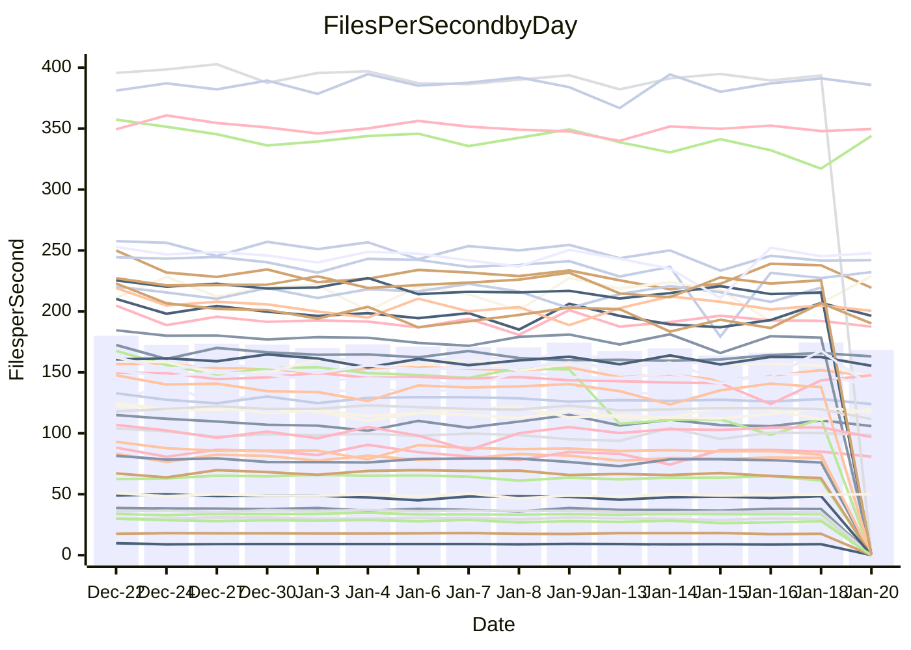

<!---
# This file is auto-generated. Do not edit.
# cspell:disable
--->
# Performance Report

## Daily Performance

## Time to Process Files

| Repository                                      | Elapsed | Min/Avg/Max           |   SD | SD Graph                |
| ----------------------------------------------- | ------: | :-------------------: | ---: | ----------------------- |
| AdaDoom3/AdaDoom3                    |    3.06 | 3.0 /   3.1 /   3.2   | 0.06 | `     ┣━┻━━●━━┻━┫     ` |
| alexiosc/megistos                    |    7.31 | 6.9 /   7.3 /   8.1   | 0.29 | `    ┣━━┻━━●━━┻━━┫    ` |
| apollographql/apollo-server          |    2.36 | 2.2 /   2.3 /   2.8   | 0.12 | `    ┣━━┻━━╋●━┻━━┫    ` |
| aspnetboilerplate/aspnetboilerplate  |   10.24 | 9.0 /   9.8 /  10.4   | 0.33 | `    ┣━━┻━━╋━━┻━●┫    ` |
| aws-amplify/docs                     |   12.34 | 11.6 /  12.2 /  16.0  | 0.82 | `   ┣━━━┻━━╋●━┻━━━┫   ` |
| Azure/azure-rest-api-specs           |    0.01 | 14.4 /  17.5 /  24.9  | 2.84 | `●      ┣┻━╋━┻┫       ` |
| bitjson/typescript-starter           |    0.67 | 0.6 /   0.7 /   0.7   | 0.02 | `     ┣━━┻━╋●┻━━┫     ` |
| caddyserver/caddy                    |    3.45 | 3.1 /   3.4 /   3.8   | 0.17 | `    ┣━━┻━━╋━●┻━━┫    ` |
| canada-ca/open-source-logiciel-libre |    0.78 | 0.7 /   0.8 /   0.8   | 0.02 | `     ┣━━┻━╋●┻━━┫     ` |
| chef/chef                            |    5.26 | 5.2 /   5.6 /   6.6   | 0.34 | `    ┣━━●━━╋━━┻━━┫    ` |
| dart-lang/sdk                        |   61.81 | 58.1 /  61.3 /  67.3  | 1.90 | `  ┣━━━┻━━━╋●━━┻━━━┫  ` |
| django/django                        |   15.03 | 13.7 /  14.8 /  16.4  | 0.58 | `   ┣━━━┻━━╋━●┻━━━┫   ` |
| eslint/eslint                        |   10.39 | 9.7 /  10.3 /  11.2   | 0.37 | `    ┣━━┻━━●━━┻━━┫    ` |
| exonum/exonum                        |    3.17 | 2.9 /   3.2 /   3.5   | 0.12 | `    ┣━━┻━━●━━┻━━┫    ` |
| flutter/samples                      |   18.36 | 16.2 /  17.3 /  22.0  | 1.03 | `   ┣━━━┻━━╋━━●━━━┫   ` |
| gitbucket/gitbucket                  |    3.32 | 3.1 /   3.2 /   3.4   | 0.08 | `    ┣━━┻━━╋━━●━━┫    ` |
| googleapis/google-cloud-cpp          |  142.79 | 117.6 / 128.5 / 139.4 | 4.53 | `   ┣━━━┻━━╋━━┻━━━┫  ●` |
| graphql/express-graphql              |    0.74 | 0.7 /   0.7 /   0.8   | 0.02 | `     ┣━━┻━╋━┻●━┫     ` |
| graphql/graphql-js                   |    2.32 | 2.1 /   2.2 /   2.4   | 0.06 | `     ┣━┻━━╋━━●━┫     ` |
| graphql/graphql-relay-js             |    0.74 | 0.7 /   0.7 /   0.8   | 0.02 | `     ┣━━┻●╋━┻━━┫     ` |
| graphql/graphql-spec                 |    0.85 | 0.8 /   0.8 /   0.9   | 0.02 | `     ┣━━┻━╋━●━━┫     ` |
| iluwatar/java-design-patterns        |   11.99 | 10.8 /  11.5 /  12.2  | 0.32 | `    ┣━━┻━━╋━━┻●━┫    ` |
| ktaranov/sqlserver-kit               |    6.43 | 6.0 /   6.3 /   7.2   | 0.23 | `    ┣━━┻━━╋━●┻━━┫    ` |
| liriliri/licia                       |    3.64 | 3.6 /   3.7 /   3.9   | 0.08 | `    ┣━━┻━●╋━━┻━━┫    ` |
| MartinThoma/LaTeX-examples           |    6.54 | 6.2 /   6.5 /   6.8   | 0.16 | `    ┣━━┻━━╋●━┻━━┫    ` |
| mdx-js/mdx                           |    1.72 | 1.5 /   1.6 /   1.8   | 0.07 | `     ┣━┻━━╋━━●━┫     ` |
| microsoft/TypeScript-Website         |    5.14 | 4.9 /   5.2 /   6.1   | 0.22 | `    ┣━━┻━●╋━━┻━━┫    ` |
| MicrosoftDocs/PowerShell-Docs        |   23.04 | 17.6 /  19.2 /  21.5  | 0.85 | `     ┣━━┻━╋━┻━━┫    ●` |
| neovim/nvim-lspconfig                |    3.13 | 3.0 /   3.2 /   3.5   | 0.13 | `    ┣━━┻━●╋━━┻━━┫    ` |
| pagekit/pagekit                      |    3.38 | 3.1 /   3.4 /   3.8   | 0.16 | `    ┣━━┻━●╋━━┻━━┫    ` |
| php/php-src                          |   22.84 | 20.7 /  22.4 /  28.4  | 1.63 | `   ┣━━┻━━━╋●━━┻━━┫   ` |
| plasticrake/tplink-smarthome-api     |    0.98 | 0.9 /   0.9 /   1.0   | 0.03 | `     ┣━┻━━╋━━┻━●     ` |
| prettier/prettier                    |    6.42 | 6.1 /   6.5 /   7.2   | 0.21 | `    ┣━━┻━●╋━━┻━━┫    ` |
| pycontribs/jira                      |    1.31 | 1.2 /   1.3 /   1.3   | 0.04 | `     ┣━┻━━╋━━┻●┫     ` |
| RustPython/RustPython                |    4.45 | 4.1 /   4.3 /   5.1   | 0.20 | `    ┣━━┻━━╋━━●━━┫    ` |
| shoelace-style/shoelace              |    2.45 | 2.4 /   2.5 /   2.7   | 0.08 | `     ┣━┻━●╋━━┻━┫     ` |
| slint-ui/slint                       |   10.43 | 8.7 /   9.9 /  11.8   | 0.61 | `    ┣━━┻━━╋━━●━━┫    ` |
| SoftwareBrothers/admin-bro           |    2.20 | 2.0 /   2.2 /   2.3   | 0.08 | `     ┣━┻━━╋●━┻━┫     ` |
| sveltejs/svelte                      |   18.57 | 18.0 /  18.6 /  22.2  | 0.73 | `   ┣━━━┻━━●━━┻━━━┫   ` |
| TheAlgorithms/Python                 |    5.65 | 5.1 /   5.5 /   5.9   | 0.18 | `    ┣━━┻━━╋━━●━━┫    ` |
| twbs/bootstrap                       |    1.22 | 1.1 /   1.2 /   1.3   | 0.05 | `     ┣━┻━━●━━┻━┫     ` |
| typescript-cheatsheets/react         |    1.09 | 1.1 /   1.1 /   1.3   | 0.06 | `     ┣━┻━●╋━━┻━┫     ` |
| typescript-eslint/typescript-eslint  |    3.66 | 3.5 /   3.6 /   3.8   | 0.08 | `    ┣━━┻━━╋●━┻━━┫    ` |
| vitest-dev/vitest                    |    7.88 | 7.6 /   8.0 /   9.2   | 0.31 | `    ┣━━┻━●╋━━┻━━┫    ` |
| w3c/aria-practices                   |    2.94 | 2.7 /   3.0 /   3.3   | 0.14 | `    ┣━━┻━●╋━━┻━━┫    ` |
| w3c/specberus                        |    1.79 | 1.6 /   1.7 /   1.8   | 0.03 | `     ┣━┻━━╋━━┻━┫    ●` |
| webdeveric/webpack-assets-manifest   |    0.68 | 0.6 /   0.7 /   0.8   | 0.03 | `     ┣━━┻━●━┻━━┫     ` |
| webpack/webpack                      |    4.85 | 4.6 /   4.9 /   5.3   | 0.16 | `    ┣━━┻━●╋━━┻━━┫    ` |
| wireapp/wire-desktop                 |    0.86 | 0.8 /   0.9 /   1.0   | 0.03 | `     ┣━┻●━╋━━┻━┫     ` |
| wireapp/wire-webapp                  |    8.69 | 8.1 /   8.4 /   8.9   | 0.23 | `    ┣━━┻━━╋━━┻●━┫    ` |

Note:
- Elapsed time is in seconds.

## Files per Second over Time

| Repository                                      | Files |    Sec |    Fps |     Rel | Trend Fps              |    N |
| ----------------------------------------------- | ----: | -----: | -----: | ------: | ---------------------- | ---: |
| AdaDoom3/AdaDoom3                    |   103 |   3.06 |  33.62 |   0.08% | `▆▇▇▆█▅▇▆▆▇▅▇▇▇▅▆▇▇▇▆` |   27 |
| alexiosc/megistos                    |   583 |   7.31 |  79.79 |  -0.02% | `▆▃▅█▇▅▆▆▆▇█▇▇▄▇▆▆▆▆▆` |   27 |
| apollographql/apollo-server          |   250 |   2.36 | 105.90 |  -2.13% | `▇▅▇▆█▇▃█▇▇█▇▇▄▇▇▆▆▇▆` |   30 |
| aspnetboilerplate/aspnetboilerplate  |  2246 |  10.24 | 219.38 |  -4.86% | `▇▄▅▆▆█▇▆▇▅█▇▇▅▅▄▅██▅` |   28 |
| aws-amplify/docs                     |  2867 |  12.34 | 232.25 |  -1.26% | `▇▇████▇████▇▇▅██▂▇▇▇` |   29 |
| Azure/azure-rest-api-specs           |     0 |   0.01 |   0.00 | -99.29% | `█▇▇▇▇▇▆████▃▄▃▂▃▃▂▃ ` |   30 |
| bitjson/typescript-starter           |    20 |   0.67 |  29.74 |  -1.67% | `█▆▇▆▇█▇▇█▆▄██▇▇▇▆▅▇▆` |   27 |
| caddyserver/caddy                    |   279 |   3.45 |  80.87 |  -3.09% | `▅█▆▅▇▅▃▆▄▄▆▇▆▇▄▃▇▇▆▅` |   30 |
| canada-ca/open-source-logiciel-libre |     7 |   0.78 |   8.99 |  -0.99% | `██▇█▇▇███▆▆▆█▇▇█▆▆▅▇` |   27 |
| chef/chef                            |  1204 |   5.26 | 229.01 |   6.05% | `▆█▅▆██▄▇▃▇█▆█▇▆▇▇▄▅█` |   29 |
| dart-lang/sdk                        | 10086 |  61.81 | 163.17 |  -0.56% | `▆▇▇▇▅█▇▇▇▆▆▇▆▆▄▆▆▇▇▆` |   30 |
| django/django                        |  2817 |  15.03 | 187.45 |  -1.98% | `▇▇▅▇▅█▆▇▆▄█▇▇▆▃▇▇▇▇▆` |   30 |
| eslint/eslint                        |  2041 |  10.39 | 196.43 |  -0.44% | `▅▇▅▆▇▅▇█▄▅█▇▇▇▅▅▅▆█▆` |   30 |
| exonum/exonum                        |   421 |   3.17 | 132.93 |  -0.68% | `▆▇▆▆█▇▆██▆███▇▇▆▆▅▆▆` |   27 |
| flutter/samples                      |  2690 |  18.36 | 146.52 |  -5.81% | `▇▇▆▇█▇▇█▇▅▇▇▇▆▆▇▇▇▇▅` |   30 |
| gitbucket/gitbucket                  |   412 |   3.32 | 123.93 |  -3.17% | `▅▇▆████▆▆█▆▆▅█▇▆▇▆▇▆` |   30 |
| googleapis/google-cloud-cpp          | 19773 | 142.79 | 138.47 | -10.01% | `▃▆▆▅▄▄▆▆▅▆▆▅▅▆▆▆▄▄█▃` |   30 |
| graphql/express-graphql              |    26 |   0.74 |  35.07 |  -3.11% | `▇▇▇██▇▇███▇█▇▇▇▅▆▇▆▆` |   27 |
| graphql/graphql-js                   |   340 |   2.32 | 146.83 |  -3.14% | `▇▄█▇▇█▇▇█▇▇█▅▆▆▆▅▆▇▆` |   28 |
| graphql/graphql-relay-js             |    28 |   0.74 |  37.95 |   0.66% | `█▇██▆▆█▅█▆▄▆██▅▆▆▆▇▇` |   27 |
| graphql/graphql-spec                 |    15 |   0.85 |  17.55 |  -1.93% | `▇▅▇█▆▆▇▇▇█▅▆▅▇▇▇▇▇▅▆` |   27 |
| iluwatar/java-design-patterns        |  1902 |  11.99 | 158.69 |  -1.60% | `▆▆▇▄█▆▇█▅██▇▆▆▇▆▆▆▇▆` |   30 |
| ktaranov/sqlserver-kit               |   489 |   6.43 |  76.03 |  -1.94% | `▆▇▆▆▆█▇█▇▇▇█▆▃▆▆▇▇▇▆` |   27 |
| liriliri/licia                       |  1434 |   3.64 | 393.53 |   0.63% | `████▆▇██▇▅▇▇█▇▅▇▇█▇█` |   28 |
| MartinThoma/LaTeX-examples           |  1409 |   6.54 | 215.48 |  -1.05% | `▇▆▇▇█▆▅▄▆▇▅▇▆▆▅▅▆▇▆▆` |   27 |
| mdx-js/mdx                           |   142 |   1.72 |  82.51 |  -4.88% | `█▅▆▄████▇▇▇▆▇▆▆▇▆▆▆▅` |   28 |
| microsoft/TypeScript-Website         |   758 |   5.14 | 147.59 |   1.88% | `█▇█▇▆▇▇▆▇█▇█▆▇▅▆▆▃▇▇` |   30 |
| MicrosoftDocs/PowerShell-Docs        |  2706 |  23.04 | 117.45 |   0.77% | `█▆▆▇▇▇▆▆▃█▇▇▃▆▇▆▆▇█▇` |   30 |
| neovim/nvim-lspconfig                |   377 |   3.13 | 120.28 |   1.94% | `▄▄▇▇▅▇▇▇▇█▅▇▆▄▆▅█▇▅▇` |   30 |
| pagekit/pagekit                      |   741 |   3.38 | 219.52 |   1.79% | `▅▃▇▅▆▆▆▇█▅▇▄▄▇▅▄▆▆▅▆` |   27 |
| php/php-src                          |  2213 |  22.84 |  96.90 |  -2.36% | `██▇▆▇▅▂▅▇▇█▆█▇▇████▆` |   30 |
| plasticrake/tplink-smarthome-api     |    62 |   0.98 |  63.23 |  -6.38% | `█▆▆▇▇█▇▇▇█▇█▆▅▇▇▆▇▆▅` |   27 |
| prettier/prettier                    |  2208 |   6.42 | 344.00 |   1.04% | `█████▆▇▆▇██▇▆▇▇▆▇▆▅█` |   30 |
| pycontribs/jira                      |    80 |   1.31 |  61.26 |  -4.35% | `▇█▇█▇█▆█▆▆▄▅▆▇▅▅▆▆▇▅` |   27 |
| RustPython/RustPython                |   620 |   4.45 | 139.36 |  -4.39% | `█▇██▅▇█▃██▇▇▇▆██▆█▇▆` |   30 |
| shoelace-style/shoelace              |   438 |   2.45 | 178.49 |   0.95% | `▆██▇▇▇▅▆▄▇█▇█▇▄▇█▄▇▇` |   28 |
| slint-ui/slint                       |  1982 |  10.43 | 190.09 |  -4.04% | `▅█▆█▃▅▅█▇▇█▇██▇▅▆▅█▆` |   30 |
| SoftwareBrothers/admin-bro           |   441 |   2.20 | 200.41 |  -1.80% | `▆▄▇▅█▇▆▄█▇▆▄▆▆▇█▇▆▇▆` |   28 |
| sveltejs/svelte                      |  7163 |  18.57 | 385.76 |   0.51% | `▇█▇▇▇█▇███▇▇▇▇▃█▇▇█▇` |   30 |
| TheAlgorithms/Python                 |  1369 |   5.65 | 242.10 |  -3.02% | `██▆▅▅▇▇▇▆▇▇▆▅▆▅▇▄▆▅▅` |   30 |
| twbs/bootstrap                       |   120 |   1.22 |  98.43 |  -0.19% | `▄▆▆▄▇▇▆▆█▅▇▅▄▄▅█▅▇▇▆` |   29 |
| typescript-cheatsheets/react         |    53 |   1.09 |  48.44 |   1.36% | `███▇▃███▇█▇▇▃▆▇▇▇▇▇█` |   28 |
| typescript-eslint/typescript-eslint  |  1279 |   3.66 | 349.61 |  -0.15% | `▇▇▇██▆▇█▆▇▇▆▆▅▆▇▇▇▇▇` |   30 |
| vitest-dev/vitest                    |  1953 |   7.88 | 247.79 |   1.77% | `▆▇▇▇██▆▆▅▇█▇▇▇▇▆▃█▇▇` |   30 |
| w3c/aria-practices                   |   405 |   2.94 | 137.86 |   0.95% | `█▇▇▄▄▇▇█▇▇▇▇█▅█▆▄▆█▇` |   27 |
| w3c/specberus                        |   200 |   1.79 | 111.61 |  -7.17% | `▅▇▇▇▆▆▆▇█▄▇▆▅▆▇▆▇▇▆▄` |   29 |
| webdeveric/webpack-assets-manifest   |    19 |   0.68 |  27.92 |  -0.69% | `█▇▆██▆▇██▇▇▃▇▅▄█▇▅▅▆` |   27 |
| webpack/webpack                      |  1095 |   4.85 | 225.57 |   1.31% | `▆█▆▆▅█▄▄▆▇▇▆▇▄▅▅▄▇▆▆` |   27 |
| wireapp/wire-desktop                 |    43 |   0.86 |  49.98 |   2.14% | `▇█▅▆███▇▄▇▆▆▆▆▇▇▇▇██` |   31 |
| wireapp/wire-webapp                  |  1350 |   8.69 | 155.39 |  -2.97% | `█▅▅██▅▅▇▇▆██▇▅▅█▆▇▇▆` |   30 |

## Data Throughput

| Repository                                      | Files |    Sec |     Kps |     Rel | Trend Kps              |    N |
| ----------------------------------------------- | ----: | -----: | ------: | ------: | ---------------------- | ---: |
| AdaDoom3/AdaDoom3                    |   103 |   3.06 |  714.40 |   0.08% | `▆▇▇▆█▅▇▆▆▇▅▇▇▇▅▆▇▇▇▆` |   27 |
| alexiosc/megistos                    |   583 |   7.31 |  626.99 |  -0.02% | `▆▃▅█▇▅▆▆▆▇█▇▇▄▇▆▆▆▆▆` |   27 |
| apollographql/apollo-server          |   250 |   2.36 |  847.63 |  -2.11% | `▇▅▇▆█▇▃█▇▇█▇▇▄▇▇▆▆▇▆` |   30 |
| aspnetboilerplate/aspnetboilerplate  |  2246 |  10.24 |  516.11 |  -4.86% | `▇▄▅▆▆█▇▆▇▅█▇▇▅▅▄▅██▅` |   28 |
| aws-amplify/docs                     |  2867 |  12.34 |  797.70 |  -1.05% | `▇▇████▇████▇▇▅██▂▇▇▇` |   29 |
| Azure/azure-rest-api-specs           |  2364 |  21.16 |  321.89 | -20.84% | `██▇▇▇▇▇▆██▇▇▃▃▃▁▃▃▂▃` |   29 |
| bitjson/typescript-starter           |    20 |   0.67 |  118.94 |  -1.67% | `█▆▇▆▇█▇▇█▆▄██▇▇▇▆▅▇▆` |   27 |
| caddyserver/caddy                    |   279 |   3.45 |  674.47 |  -2.95% | `▅█▆▅▇▅▃▆▄▄▆▇▆▇▄▃▇▇▆▅` |   30 |
| canada-ca/open-source-logiciel-libre |     7 |   0.78 |   74.52 |  -0.99% | `██▇█▇▇███▆▆▆█▇▇█▆▆▅▇` |   27 |
| chef/chef                            |  1204 |   5.26 | 1051.64 |   6.04% | `▆█▅▆██▄▇▃▇█▆█▇▆▇▇▄▅█` |   29 |
| dart-lang/sdk                        | 10086 |  61.81 | 1164.08 |  -0.56% | `▇▇▇▇▅█▇▇▇▆▆▇▇▆▄▆▆▇▇▆` |   30 |
| django/django                        |  2817 |  15.03 | 1159.14 |  -2.00% | `▇▇▅▇▅█▆▇▆▄█▇▇▆▃▇▇▇▇▆` |   30 |
| eslint/eslint                        |  2041 |  10.39 | 1607.36 |  -0.29% | `▅▇▅▆▇▅▇█▄▅█▇▇▇▅▅▅▆█▆` |   30 |
| exonum/exonum                        |   421 |   3.17 | 1271.51 |  -0.68% | `▆▇▆▆█▇▆██▆███▇▇▆▆▅▆▆` |   27 |
| flutter/samples                      |  2690 |  18.36 | 1186.77 |  -5.81% | `▇▇▆▇█▇▇█▇▅▇▇▇▆▆▇▇▇▇▅` |   30 |
| gitbucket/gitbucket                  |   412 |   3.32 |  560.40 |  -3.21% | `▅▇▆████▆▆█▆▆▅█▇▆▇▆▇▆` |   30 |
| googleapis/google-cloud-cpp          | 19773 | 142.79 | 1083.61 |  -9.83% | `▃▆▆▅▄▄▆▆▅▆▆▅▅▆▆▆▄▄█▃` |   30 |
| graphql/express-graphql              |    26 |   0.74 |  160.50 |  -3.11% | `▇▇▇██▇▇███▇█▇▇▇▅▆▇▆▆` |   27 |
| graphql/graphql-js                   |   340 |   2.32 |  831.75 |  -3.43% | `▇▄█▇▇█▇▇█▇▇█▅▆▆▆▅▆▇▆` |   28 |
| graphql/graphql-relay-js             |    28 |   0.74 |  149.09 |   0.66% | `█▇██▆▆█▅█▆▄▆██▅▆▆▆▇▇` |   27 |
| graphql/graphql-spec                 |    15 |   0.85 |  645.67 |  -1.93% | `▇▅▇█▆▆▇▇▇█▅▆▅▇▇▇▇▇▅▆` |   27 |
| iluwatar/java-design-patterns        |  1902 |  11.99 |  486.57 |  -2.01% | `▆▆▇▄█▆▇█▅██▇▆▆▇▆▆▆▇▆` |   30 |
| ktaranov/sqlserver-kit               |   489 |   6.43 | 1150.27 |  -1.94% | `▆▇▆▆▆█▇█▇▇▇█▆▃▆▆▇▇▇▆` |   27 |
| liriliri/licia                       |  1434 |   3.64 |  466.25 |   0.63% | `████▆▇██▇▅▇▇█▇▅▇▇█▇█` |   28 |
| MartinThoma/LaTeX-examples           |  1409 |   6.54 |  445.02 |  -1.05% | `▇▆▇▇█▆▅▄▆▇▅▇▆▆▅▅▆▇▆▆` |   27 |
| mdx-js/mdx                           |   142 |   1.72 |  381.74 |  -5.02% | `█▅▆▄████▇▇▇▆▇▆▆▇▆▆▆▅` |   28 |
| microsoft/TypeScript-Website         |   758 |   5.14 | 1009.39 |   1.74% | `█▇█▇▆▇▇▆▇█▇█▆▇▅▆▆▃▇▇` |   30 |
| MicrosoftDocs/PowerShell-Docs        |  2706 |  23.04 | 1204.53 |   3.49% | `█▆▆▇▇▇▆▆▃█▇▇▃▆▇▆▆▇██` |   30 |
| neovim/nvim-lspconfig                |   377 |   3.13 |  314.26 |   1.85% | `▄▄▇▇▅▇▇▇▇█▅▆▆▄▆▅▇▇▅▇` |   30 |
| pagekit/pagekit                      |   741 |   3.38 |  457.70 |   1.79% | `▅▃▇▅▆▆▆▇█▅▇▄▄▇▅▄▆▆▅▆` |   27 |
| php/php-src                          |  2213 |  22.84 | 1419.52 |  -2.32% | `██▇▆▇▅▂▅▇▇█▆█▇▇████▆` |   30 |
| plasticrake/tplink-smarthome-api     |    62 |   0.98 |  341.65 |  -6.38% | `█▆▆▇▇█▇▇▇█▇█▆▅▇▇▆▇▆▅` |   27 |
| prettier/prettier                    |  2208 |   6.42 |  485.46 |   1.01% | `█████▇▇▆▇██▇▆▇▇▆▇▆▅█` |   30 |
| pycontribs/jira                      |    80 |   1.31 |  421.90 |  -4.35% | `▇█▇█▇█▆█▆▆▄▅▆▇▅▅▆▆▇▅` |   27 |
| RustPython/RustPython                |   620 |   4.45 | 1031.95 |  -4.14% | `█▇██▅▇█▃██▇▇▇▆██▆██▆` |   30 |
| shoelace-style/shoelace              |   438 |   2.45 |  857.42 |   0.97% | `▆██▇▇▇▅▆▄▇█▇█▇▄▇█▄▇▇` |   28 |
| slint-ui/slint                       |  1982 |  10.43 |  979.02 |  -3.65% | `▅█▆█▃▅▅█▇▇████▇▅▆▅█▆` |   30 |
| SoftwareBrothers/admin-bro           |   441 |   2.20 |  441.73 |  -1.80% | `▆▄▇▅█▇▆▄█▇▆▄▆▆▇█▇▆▇▆` |   28 |
| sveltejs/svelte                      |  7163 |  18.57 |  255.97 |   1.24% | `▇█▇▇▇█▇███▇▇▇█▃█▇███` |   30 |
| TheAlgorithms/Python                 |  1369 |   5.65 |  615.05 |  -2.96% | `██▆▅▅▇▇▇▆▇▇▆▅▆▅▇▄▆▅▅` |   30 |
| twbs/bootstrap                       |   120 |   1.22 |  789.93 |  -0.19% | `▄▆▆▄▇▇▆▆█▅▇▅▄▄▅█▅▇▇▆` |   29 |
| typescript-cheatsheets/react         |    53 |   1.09 |  354.62 |   1.36% | `███▇▃███▇█▇▇▃▆▇▇▇▇▇█` |   28 |
| typescript-eslint/typescript-eslint  |  1279 |   3.66 | 1694.74 |   0.82% | `▇▇▇██▆▇█▆▇▇▆▆▆▆▇▇▇▇▇` |   30 |
| vitest-dev/vitest                    |  1953 |   7.88 |  518.93 |   3.29% | `▆█▇▇██▆▆▅▇█▇▇▇▇▆▃█▇█` |   30 |
| w3c/aria-practices                   |   405 |   2.94 | 1280.25 |   0.95% | `█▇▇▄▄▇▇█▇▇▇▇█▅█▆▄▆█▇` |   27 |
| w3c/specberus                        |   200 |   1.79 |  356.03 |  -7.17% | `▅▇▇▇▆▆▆▇█▄▇▆▅▆▇▆▇▇▆▄` |   29 |
| webdeveric/webpack-assets-manifest   |    19 |   0.68 |  149.88 |  -0.69% | `█▇▆██▆▇██▇▇▃▇▅▄█▇▅▅▆` |   27 |
| webpack/webpack                      |  1095 |   4.85 |  995.17 |   1.31% | `▆█▆▆▅█▄▄▆▇▇▆▇▄▅▅▄▇▆▆` |   27 |
| wireapp/wire-desktop                 |    43 |   0.86 |  220.86 |   2.14% | `▇█▅▆███▇▄▇▆▆▆▆▇▇▇▇██` |   31 |
| wireapp/wire-webapp                  |  1350 |   8.69 |  628.71 |  -2.95% | `█▅▅██▅▅▇▇▆█▇▇▅▄█▆▇▇▆` |   30 |

