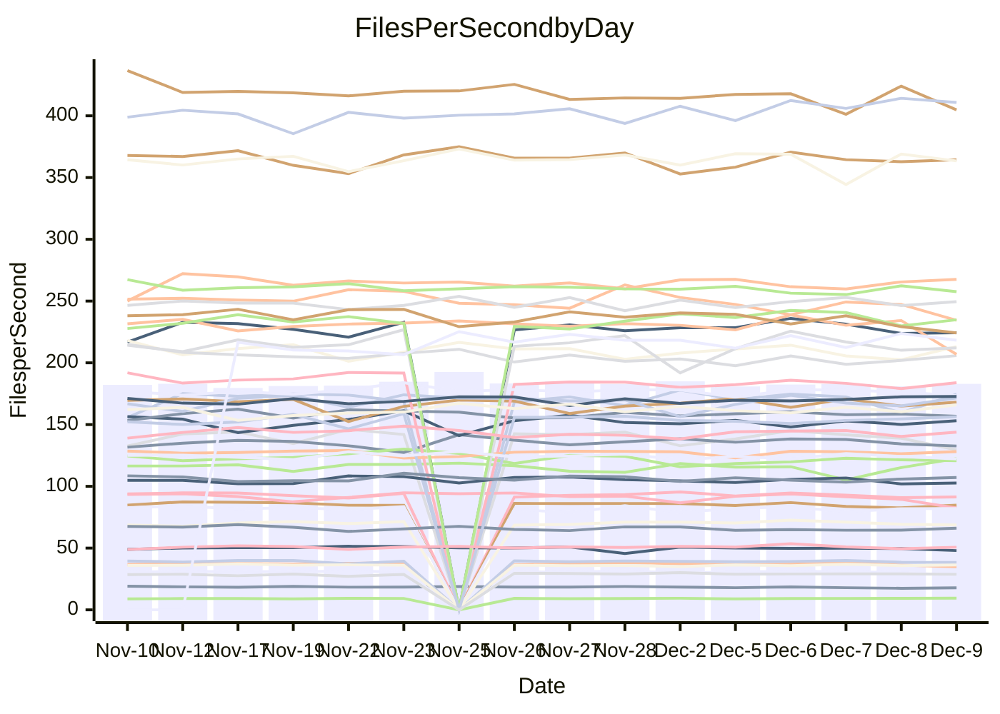

<!---
# This file is auto-generated. Do not edit.
# cspell:disable
--->
# Performance Report

## Daily Performance

## Time to Process Files

| Repository                                      | Elapsed | Min/Avg/Max           |   SD | SD Graph                |
| ----------------------------------------------- | ------: | :-------------------: | ---: | ----------------------- |
| AdaDoom3/AdaDoom3                    |    2.84 | 2.6 /   2.8 /   3.1   | 0.08 | `     ┣━┻━━●━━┻━┫     ` |
| alexiosc/megistos                    |    6.88 | 6.4 /   6.8 /   7.5   | 0.24 | `    ┣━━┻━━╋●━┻━━┫    ` |
| apollographql/apollo-server          |    2.05 | 2.1 /   2.2 /   2.5   | 0.08 | `     ┣●┻━━╋━━┻━┫     ` |
| aspnetboilerplate/aspnetboilerplate  |    9.58 | 8.5 /   9.0 /   9.8   | 0.27 | `    ┣━━┻━━╋━━┻━━┫●   ` |
| aws-amplify/docs                     |   11.48 | 11.0 /  11.5 /  12.3  | 0.27 | `    ┣━━┻━●╋━━┻━━┫    ` |
| Azure/azure-rest-api-specs           |   14.05 | 13.9 /  14.5 /  16.5  | 0.54 | `    ┣━━●━━╋━━┻━━┫    ` |
| bitjson/typescript-starter           |    0.72 | 0.6 /   0.6 /   0.7   | 0.02 | `     ┣━━┻━╋━┻━━┫    ●` |
| caddyserver/caddy                    |    3.38 | 2.9 /   3.0 /   3.3   | 0.11 | `    ┣━━┻━━╋━━┻━━┫  ● ` |
| canada-ca/open-source-logiciel-libre |    0.74 | 0.7 /   0.8 /   0.9   | 0.03 | `     ┣━●┻━╋━┻━━┫     ` |
| chef/chef                            |    5.82 | 5.0 /   5.2 /   5.6   | 0.14 | `     ┣━━┻━╋━┻━━┫    ●` |
| dart-lang/sdk                        |   57.74 | 53.8 /  56.3 /  59.4  | 1.31 | `   ┣━━┻━━━╋━━━●━━┫   ` |
| django/django                        |   13.67 | 13.0 /  13.8 /  15.5  | 0.52 | `    ┣━━┻━●╋━━┻━━┫    ` |
| eslint/eslint                        |    9.56 | 8.9 /   9.7 /  10.9   | 0.40 | `    ┣━━┻━●╋━━┻━━┫    ` |
| exonum/exonum                        |    3.25 | 2.9 /   3.0 /   3.4   | 0.12 | `    ┣━━┻━━╋━━┻━━●    ` |
| flutter/samples                      |   16.00 | 15.0 /  16.3 /  19.1  | 0.73 | `   ┣━━━┻━●╋━━┻━━━┫   ` |
| gitbucket/gitbucket                  |    3.10 | 2.9 /   3.0 /   3.2   | 0.08 | `     ┣━┻━━╋━●┻━┫     ` |
| googleapis/google-cloud-cpp          |  118.95 | 117.0 / 122.8 / 160.5 | 7.09 | `  ┣━━━┻━●━╋━━━┻━━━┫  ` |
| graphql/express-graphql              |    0.74 | 0.7 /   0.7 /   0.7   | 0.02 | `     ┣━━┻━╋━┻━━┫●    ` |
| graphql/graphql-js                   |    2.16 | 2.1 /   2.1 /   2.3   | 0.07 | `     ┣━┻━━╋●━┻━┫     ` |
| graphql/graphql-relay-js             |    0.73 | 0.7 /   0.7 /   0.8   | 0.02 | `     ┣━━┻━╋━●━━┫     ` |
| graphql/graphql-spec                 |    0.84 | 0.8 /   0.8 /   0.9   | 0.03 | `     ┣━━┻━╋━●━━┫     ` |
| iluwatar/java-design-patterns        |   10.59 | 10.3 /  10.9 /  13.6  | 0.59 | `    ┣━━┻━●╋━━┻━━┫    ` |
| ktaranov/sqlserver-kit               |    5.96 | 5.7 /   6.0 /   6.5   | 0.18 | `    ┣━━┻━━●━━┻━━┫    ` |
| liriliri/licia                       |    3.54 | 3.2 /   3.4 /   3.6   | 0.09 | `     ┣━┻━━╋━━┻●┫     ` |
| MartinThoma/LaTeX-examples           |    6.28 | 6.0 /   6.2 /   6.5   | 0.15 | `    ┣━━┻━━╋━●┻━━┫    ` |
| mdx-js/mdx                           |    1.55 | 1.5 /   1.5 /   1.6   | 0.04 | `     ┣━┻━━╋●━┻━┫     ` |
| microsoft/TypeScript-Website         |    4.94 | 4.7 /   5.0 /   6.4   | 0.28 | `    ┣━━┻━●╋━━┻━━┫    ` |
| MicrosoftDocs/PowerShell-Docs        |   18.46 | 17.1 /  18.5 /  21.6  | 0.84 | `   ┣━━━┻━━●━━┻━━━┫   ` |
| neovim/nvim-lspconfig                |    2.89 | 2.8 /   2.9 /   3.2   | 0.07 | `     ┣━┻━●╋━━┻━┫     ` |
| pagekit/pagekit                      |    3.16 | 2.9 /   3.2 /   3.6   | 0.13 | `    ┣━━┻━━●━━┻━━┫    ` |
| php/php-src                          |   20.63 | 19.9 /  20.9 /  23.1  | 0.69 | `   ┣━━━┻━●╋━━┻━━━┫   ` |
| plasticrake/tplink-smarthome-api     |    0.90 | 0.8 /   0.9 /   0.9   | 0.02 | `     ┣━━┻━╋━●━━┫     ` |
| prettier/prettier                    |    5.99 | 5.9 /   6.0 /   6.4   | 0.14 | `    ┣━━┻━●╋━━┻━━┫    ` |
| pycontribs/jira                      |    1.21 | 1.1 /   1.2 /   1.4   | 0.05 | `     ┣━┻━━●━━┻━┫     ` |
| RustPython/RustPython                |    3.97 | 3.9 /   4.0 /   4.4   | 0.13 | `    ┣━━┻━●╋━━┻━━┫    ` |
| shoelace-style/shoelace              |    2.38 | 2.3 /   2.4 /   2.5   | 0.07 | `     ┣━┻━━●━━┻━┫     ` |
| slint-ui/slint                       |    8.89 | 8.4 /   8.9 /   9.9   | 0.37 | `    ┣━━┻━━●━━┻━━┫    ` |
| SoftwareBrothers/admin-bro           |    2.08 | 1.9 /   2.1 /   2.3   | 0.09 | `     ┣━┻━━●━━┻━┫     ` |
| sveltejs/svelte                      |   17.38 | 16.9 /  18.7 /  20.9  | 0.94 | `   ┣━●━┻━━╋━━┻━━━┫   ` |
| TheAlgorithms/Python                 |    5.09 | 4.9 /   5.1 /   5.5   | 0.14 | `    ┣━━┻━●╋━━┻━━┫    ` |
| twbs/bootstrap                       |    1.17 | 1.1 /   1.1 /   1.3   | 0.05 | `     ┣━┻━━╋●━┻━┫     ` |
| typescript-cheatsheets/react         |    1.10 | 1.0 /   1.1 /   1.2   | 0.04 | `     ┣━┻━━╋━━●━┫     ` |
| typescript-eslint/typescript-eslint  |    3.50 | 3.4 /   3.5 /   3.7   | 0.07 | `     ┣━┻━━╋●━┻━┫     ` |
| vitest-dev/vitest                    |    7.33 | 6.9 /   7.2 /   7.7   | 0.18 | `    ┣━━┻━━╋━━●━━┫    ` |
| w3c/aria-practices                   |    2.80 | 2.7 /   2.8 /   3.2   | 0.09 | `     ┣━┻━●╋━━┻━┫     ` |
| w3c/specberus                        |    1.64 | 1.6 /   1.6 /   1.8   | 0.04 | `     ┣━┻━━╋━●┻━┫     ` |
| webdeveric/webpack-assets-manifest   |    0.66 | 0.6 /   0.7 /   0.7   | 0.02 | `     ┣━━┻━●━┻━━┫     ` |
| webpack/webpack                      |    4.88 | 4.4 /   4.6 /   5.3   | 0.15 | `    ┣━━┻━━╋━━┻━●┫    ` |
| wireapp/wire-desktop                 |    0.85 | 0.8 /   0.8 /   1.0   | 0.03 | `     ┣━━┻━●━┻━━┫     ` |
| wireapp/wire-webapp                  |    7.59 | 7.3 /   7.6 /   8.2   | 0.21 | `    ┣━━┻━━●━━┻━━┫    ` |

Note:
- Elapsed time is in seconds.

## Files per Second over Time

| Repository                                      | Files |    Sec |    Fps |     Rel | Trend Fps              |    N |
| ----------------------------------------------- | ----: | -----: | -----: | ------: | ---------------------- | ---: |
| AdaDoom3/AdaDoom3                    |   103 |   2.84 |  36.33 |   0.36% | `▇█▇▆▆█▆█▆███▄█▆█▇▆▇▇` |   35 |
| alexiosc/megistos                    |   583 |   6.88 |  84.79 |  -1.05% | `█▇▅█▆▇▇▇▇▇▇▇▆▄▇▆▆▇▄▇` |   35 |
| apollographql/apollo-server          |   251 |   2.05 | 122.48 |   6.31% | `▇▇▅▇▅▅▆▇▇▇▆▆▇▆▇▄▆▇▆█` |   37 |
| aspnetboilerplate/aspnetboilerplate  |  2246 |   9.58 | 234.36 |  -6.15% | `▇▅▆▇▆▃▇█▆▆▇▄▆▆▅▆▅▅▆▄` |   36 |
| aws-amplify/docs                     |  2863 |  11.48 | 249.46 |   0.76% | `▆▇█▇█▄█▇██▅▆▆▇▇█▇▆▇▇` |   37 |
| Azure/azure-rest-api-specs           |  2410 |  14.05 | 171.54 |   2.01% | `▆██▇▆▇█▅▅█▇▆▆▇█▇▆▆▇█` |   37 |
| bitjson/typescript-starter           |    20 |   0.72 |  27.90 |  -9.43% | `▇▇▆▆▄█▆█▅▇▆▄▆▇▇▆▄▇▅▂` |   35 |
| caddyserver/caddy                    |   279 |   3.38 |  82.46 | -10.02% | `███▆▆▇▆▅▄▆▇▆▆█▇▇▆▅▆▃` |   37 |
| canada-ca/open-source-logiciel-libre |     7 |   0.74 |   9.47 |   3.97% | `█▇▇▆▇▇▆██▆▆▆▇▅▇▇████` |   35 |
| chef/chef                            |  1204 |   5.82 | 206.87 | -10.29% | `▆▇▇▅▇▅█▆▇▇▆▅▄▇█▆▆█▇▃` |   37 |
| dart-lang/sdk                        | 10013 |  57.74 | 173.41 |  -1.63% | `█▇▅█▇▇▇█▇▅▅▇▇▅▇▇▇▇▆▆` |   37 |
| django/django                        |  2813 |  13.67 | 205.78 |   1.01% | `█▄▇██▆▇▆█▇▇▃▆▇▇▆█▆▇█` |   37 |
| eslint/eslint                        |  2038 |   9.56 | 213.14 |   1.57% | `▆▇▆▇▇▆▅▅▇█▆▇▇▆▇▆▇▆▃▇` |   37 |
| exonum/exonum                        |   421 |   3.25 | 129.58 |  -7.76% | `▇██▆██▇█▅█▇▅█▅█▇▅█▇▅` |   35 |
| flutter/samples                      |  2690 |  16.00 | 168.12 |   0.39% | `▆▆▇▃▆▅▇▇▆█▆▇▇▇▆▇▆▅▇▇` |   37 |
| gitbucket/gitbucket                  |   411 |   3.10 | 132.66 |  -2.37% | `█▅▇▇▅█▆█▇█▇▆▆▇███▆▆▆` |   37 |
| googleapis/google-cloud-cpp          | 19746 | 118.95 | 166.00 |   3.07% | `▇████▇▇█▇█▇▇▇▆▇█▆▇▇█` |   37 |
| graphql/express-graphql              |    26 |   0.74 |  34.90 |  -5.84% | `▅█▄▆█▆██▇▆▅▄█▆▆█▅▆▆▄` |   35 |
| graphql/graphql-js                   |   339 |   2.16 | 156.72 |  -0.87% | `▅█▇▆█▄▇▇▆█▅█▇▆▇▇▆▇▇▆` |   36 |
| graphql/graphql-relay-js             |    28 |   0.73 |  38.36 |  -2.36% | `▆▇█▇▇▆█▇▇█▅██▇▇█▇▇▅▆` |   35 |
| graphql/graphql-spec                 |    15 |   0.84 |  17.89 |  -2.63% | `▆▇▇▆█▇██▇▆▆▅▆▇▇▆▇▅▄▆` |   36 |
| iluwatar/java-design-patterns        |  1849 |  10.59 | 174.62 |   2.43% | `▇█▇▇▇▅▇██▇▇▇▆██▇▇▂▇█` |   36 |
| ktaranov/sqlserver-kit               |   489 |   5.96 |  82.06 |   0.16% | `▇█▄▇▅▄▇█▅▆▇▆█▇▇▆▆▇▇▇` |   35 |
| liriliri/licia                       |  1434 |   3.54 | 404.78 |  -3.40% | `▅█▄▆▆▆▅▆▄▆▆▅▆▄▅▄▅▅█▄` |   37 |
| MartinThoma/LaTeX-examples           |  1409 |   6.28 | 224.38 |  -1.72% | `▅▆█▇▆█▅█▇▇▇▆▇▇█▇▇▅▆▆` |   35 |
| mdx-js/mdx                           |   142 |   1.55 |  91.43 |  -1.50% | `▅▆▇▇█▆▇▇██▄▆▇██▇▆▆▇▆` |   35 |
| microsoft/TypeScript-Website         |   757 |   4.94 | 153.13 |   1.00% | `▇▇▇▇▇█▇▆▆▇█▆▇▅▆▇▆▇▆▇` |   36 |
| MicrosoftDocs/PowerShell-Docs        |  2229 |  18.46 | 120.76 |  -0.70% | `▄▅███▇█▄▆▇█▄▅▅▆▇▆▇▇▇` |   37 |
| neovim/nvim-lspconfig                |   370 |   2.89 | 128.11 |   0.96% | `█▇▇▇██▇▇▇▆▇▄▆▆▇▇▆▇▇▇` |   37 |
| pagekit/pagekit                      |   741 |   3.16 | 234.86 |   0.56% | `▃▇▅▆▄▆▅▇▇▆▅▇█▇▇▇▅▅█▆` |   35 |
| php/php-src                          |  2212 |  20.63 | 107.21 |   1.15% | `██▇▇▇▇▇▆▆▇▆▆▆█▆▆▆▆▇▇` |   37 |
| plasticrake/tplink-smarthome-api     |    62 |   0.90 |  68.69 |  -1.76% | `▅▅▅▆▅▆▆▇▆█▅▆▅▅▇▆▅▆▅▅` |   35 |
| prettier/prettier                    |  2184 |   5.99 | 364.44 |   0.04% | `▇▇▇▇▇██▅▇██▇▄▅█▇▇▇▇▇` |   37 |
| pycontribs/jira                      |    80 |   1.21 |  66.15 |   0.32% | `▆▆▅▃█▇▇▇▆▆▆▆▄▆▆▆▅▇▅▆` |   37 |
| RustPython/RustPython                |   621 |   3.97 | 156.25 |   1.40% | `▇▆▇▆█▇█▆▇█▇▇▄▆▆▇█▆▆▇` |   36 |
| shoelace-style/shoelace              |   438 |   2.38 | 183.86 |  -0.20% | `▆▇▆▇▇▇▆▆▅▅█▇▇▄▇▇▇▆▅▇` |   36 |
| slint-ui/slint                       |  1941 |   8.89 | 218.34 |   0.91% | `▆▄▆▇▇▅█▅▇▄▅▅▇▇▇▆▆▇█▆` |   32 |
| SoftwareBrothers/admin-bro           |   441 |   2.08 | 212.06 |  -0.89% | `▃█▆█▇▅▇█▃▇▆▆▅▅█▇▆▆▆▆` |   35 |
| sveltejs/svelte                      |  7139 |  17.38 | 410.80 |   2.48% | `▇▇▇▇▇▆▆█▆▇▆▆▇▄█▇███▇` |   37 |
| TheAlgorithms/Python                 |  1361 |   5.09 | 267.60 |   0.96% | `▆█▇▇▆▅▇█▆▇▇▇▆█▆▆▆█▆▇` |   37 |
| twbs/bootstrap                       |   120 |   1.17 | 102.69 |  -1.77% | `█▇▆█▆█▇▆▆▆▅▅█▇▇▇▅▇▅▆` |   36 |
| typescript-cheatsheets/react         |    53 |   1.10 |  47.97 |  -4.02% | `▆▇▇▇██▆▃▇█▆▇▆▇▇▇▇▅▇▆` |   36 |
| typescript-eslint/typescript-eslint  |  1271 |   3.50 | 363.46 |  -0.41% | `██▇▇▇▇█▆▇▇█████▅█▇█▇` |   37 |
| vitest-dev/vitest                    |  1888 |   7.33 | 257.60 |  -1.27% | `▆▅▆▆▇▅▇▅▇██▄▆▆▆▅▇▇▆▆` |   37 |
| w3c/aria-practices                   |   403 |   2.80 | 143.82 |   0.51% | `▇▇▇▇▇▆▆▇▆▇▇▇█▇▇▇▅▇▇▇` |   36 |
| w3c/specberus                        |   200 |   1.64 | 122.14 |  -1.59% | `▆▇█▇▆█▆█▄▆█▆▇▇▆▇▇▆▇▆` |   37 |
| webdeveric/webpack-assets-manifest   |    19 |   0.66 |  28.75 |  -0.50% | `▇█▇▇▇█▇▇█▇▇▆▆▇▇▇▇▇▇▇` |   35 |
| webpack/webpack                      |  1095 |   4.88 | 224.19 |  -5.53% | `▆▅▇█▇▇▇▆█▇▆▇▇▇▆▇▃▆█▅` |   37 |
| wireapp/wire-desktop                 |    43 |   0.85 |  50.73 |  -0.10% | `▃▇▅▇█▆▆▇▇▅▇▇▇▇█▇▇▄▆▆` |   37 |
| wireapp/wire-webapp                  |  1312 |   7.59 | 172.82 |   1.97% | `██▆▇▄▆▇▄█▆▇▆▆█▆▇▇█▇▇` |   37 |

## Data Throughput

| Repository                                      | Files |    Sec |     Kps |     Rel | Trend Kps              |    N |
| ----------------------------------------------- | ----: | -----: | ------: | ------: | ---------------------- | ---: |
| AdaDoom3/AdaDoom3                    |   103 |   2.84 |  772.13 |   0.36% | `▇█▇▆▆█▆█▆███▄█▆█▇▆▇▇` |   35 |
| alexiosc/megistos                    |   583 |   6.88 |  666.27 |  -1.05% | `█▇▅█▆▇▇▇▇▇▇▇▆▄▇▆▆▇▄▇` |   35 |
| apollographql/apollo-server          |   251 |   2.05 |  976.94 |   6.32% | `▇▇▅▇▅▅▆▇▇▇▆▆▇▆▇▄▆▇▆█` |   37 |
| aspnetboilerplate/aspnetboilerplate  |  2246 |   9.58 |  551.36 |  -6.15% | `▇▅▆▇▆▃▇█▆▆▇▄▆▆▅▆▅▅▆▄` |   36 |
| aws-amplify/docs                     |  2863 |  11.48 |  853.29 |   1.84% | `▆▇█▇█▄█▇██▆▆▆▇▇█▇▆▇█` |   37 |
| Azure/azure-rest-api-specs           |  2410 |  14.05 |  494.06 |   2.53% | `▇██▇▆▇█▅▅█▇▆▆▇█▇▆▆▇█` |   37 |
| bitjson/typescript-starter           |    20 |   0.72 |  111.61 |  -9.43% | `▇▇▆▆▄█▆█▅▇▆▄▆▇▇▆▄▇▅▂` |   35 |
| caddyserver/caddy                    |   279 |   3.38 |  684.82 |  -9.94% | `███▆▆▇▆▅▄▆▇▆▆█▇▇▆▅▆▃` |   37 |
| canada-ca/open-source-logiciel-libre |     7 |   0.74 |   78.48 |   3.97% | `█▇▇▆▇▇▆██▆▆▆▇▅▇▇████` |   35 |
| chef/chef                            |  1204 |   5.82 |  950.16 | -10.29% | `▆▇▇▅▇▅█▆▇▇▆▅▄▇█▆▆█▇▃` |   37 |
| dart-lang/sdk                        | 10013 |  57.74 | 1234.89 |  -2.28% | `█▇▅█▇▇▇▇▇▅▅▇▇▅▇▇▇▇▆▆` |   37 |
| django/django                        |  2813 |  13.67 | 1270.64 |   1.33% | `█▃▇██▆▇▆█▇▇▃▆▇▇▆█▆▇█` |   37 |
| eslint/eslint                        |  2038 |   9.56 | 1733.04 |   1.24% | `▆▇▆▇▇▆▅▅▇█▆▇▇▆▇▆▇▆▃▇` |   37 |
| exonum/exonum                        |   421 |   3.25 | 1239.46 |  -7.76% | `▇██▆██▇█▅█▇▅█▅█▇▅█▇▅` |   35 |
| flutter/samples                      |  2690 |  16.00 | 1361.75 |   1.38% | `▆▆▇▃▆▅▇▇▆█▆▇▇▇▆▇▆▅▇▇` |   37 |
| gitbucket/gitbucket                  |   411 |   3.10 |  600.68 |  -2.17% | `█▅▇▇▄█▆█▇█▇▆▆▇███▆▆▆` |   37 |
| googleapis/google-cloud-cpp          | 19746 | 118.95 | 1296.75 |   3.29% | `▇████▇▇█▇█▇▇▇▆▇█▆▇▇█` |   37 |
| graphql/express-graphql              |    26 |   0.74 |  159.75 |  -5.84% | `▅█▄▆█▆██▇▆▅▄█▆▆█▅▆▆▄` |   35 |
| graphql/graphql-js                   |   339 |   2.16 |  890.41 |  -0.97% | `▅█▇▆█▄▇▇▆█▅█▇▆▇▇▆▇▇▆` |   36 |
| graphql/graphql-relay-js             |    28 |   0.73 |  150.70 |  -2.36% | `▆▇█▇▇▆█▇▇█▅██▇▇█▇▇▅▆` |   35 |
| graphql/graphql-spec                 |    15 |   0.84 |  658.42 |  -2.45% | `▆▇▇▆█▇██▇▆▆▅▆▇▇▆▇▅▄▆` |   36 |
| iluwatar/java-design-patterns        |  1849 |  10.59 |  538.03 |   2.46% | `▇█▇▇▇▅▇██▇▇▇▆██▇▇▂▇█` |   36 |
| ktaranov/sqlserver-kit               |   489 |   5.96 | 1241.67 |   0.16% | `▇█▄▇▅▄▇█▅▆▇▆█▇▇▆▆▇▇▇` |   35 |
| liriliri/licia                       |  1434 |   3.54 |  479.59 |  -3.23% | `▅█▄▆▆▆▅▆▄▆▆▅▆▄▅▄▅▅█▄` |   37 |
| MartinThoma/LaTeX-examples           |  1409 |   6.28 |  463.41 |  -1.72% | `▅▆█▇▆█▅█▇▇▇▆▇▇█▇▇▅▆▆` |   35 |
| mdx-js/mdx                           |   142 |   1.55 |  424.32 |  -1.50% | `▅▆▇▇█▆▇▇██▄▆▇██▇▆▆▇▆` |   35 |
| microsoft/TypeScript-Website         |   757 |   4.94 | 1048.64 |   1.01% | `▇▇▇▇▇█▇▆▆▇█▆▇▅▆▇▆▇▆▇` |   36 |
| MicrosoftDocs/PowerShell-Docs        |  2229 |  18.46 | 1204.16 |  -0.74% | `▄▅███▇█▄▆▇█▄▅▅▆▇▆▇▇▇` |   37 |
| neovim/nvim-lspconfig                |   370 |   2.89 |  332.41 |   0.97% | `█▇▇▇██▇▇▇▆▇▃▆▆▇▇▆▇▇▇` |   37 |
| pagekit/pagekit                      |   741 |   3.16 |  489.68 |   0.56% | `▃▇▅▆▄▆▅▇▇▆▅▇█▇▇▇▅▅█▆` |   35 |
| php/php-src                          |  2212 |  20.63 | 1568.86 |   1.12% | `██▇▇▇▇▇▆▆▇▆▆▆█▆▆▆▆▇▇` |   37 |
| plasticrake/tplink-smarthome-api     |    62 |   0.90 |  371.15 |  -1.76% | `▅▅▅▆▅▆▆▇▆█▅▆▅▅▇▆▅▆▅▅` |   35 |
| prettier/prettier                    |  2184 |   5.99 |  516.62 |   1.19% | `▇▇▇▆▇▇▇▅▇██▇▄▅█▇▇▇▇▇` |   37 |
| pycontribs/jira                      |    80 |   1.21 |  455.60 |   0.32% | `▆▆▅▃█▇▇▇▆▆▆▆▄▆▆▆▅▇▅▆` |   37 |
| RustPython/RustPython                |   621 |   3.97 | 1153.16 |   1.66% | `▇▆▇▆█▇█▆▇█▇▇▄▆▆▇█▆▆▇` |   36 |
| shoelace-style/shoelace              |   438 |   2.38 |  882.76 |   0.00% | `▆▇▆▇▇▇▆▆▅▅█▇▇▄▇▇▇▆▅▇` |   36 |
| slint-ui/slint                       |  1941 |   8.89 | 1113.08 |   1.53% | `▆▅▆▇▇▅█▆█▄▆▅▇▇▇▆▇▇█▇` |   32 |
| SoftwareBrothers/admin-bro           |   441 |   2.08 |  467.40 |  -0.89% | `▃█▆█▇▅▇█▃▇▆▆▅▅█▇▆▆▆▆` |   35 |
| sveltejs/svelte                      |  7139 |  17.38 |  275.29 |  -1.24% | `█▇███▇▇▇▅▆▅▅▆▃▆▆▆▆▆▆` |   37 |
| TheAlgorithms/Python                 |  1361 |   5.09 |  677.75 |   1.02% | `▆█▇▇▆▅▇█▆▇▇▇▆█▆▆▆█▆▇` |   37 |
| twbs/bootstrap                       |   120 |   1.17 |  824.12 |  -1.73% | `█▇▆█▆█▇▆▆▆▅▅█▇▇▇▅▇▅▆` |   36 |
| typescript-cheatsheets/react         |    53 |   1.10 |  351.18 |  -4.02% | `▆▇▇▇██▆▃▇█▆▇▆▇▇▇▇▅▇▆` |   36 |
| typescript-eslint/typescript-eslint  |  1271 |   3.50 | 1725.80 |  -0.33% | `██▇▇▇▇▇▆▇▇█████▅█▇█▇` |   37 |
| vitest-dev/vitest                    |  1888 |   7.33 |  527.34 |  -0.91% | `▆▆▆▆▇▅▇▅▇██▄▆▆▆▅▇▇▆▆` |   37 |
| w3c/aria-practices                   |   403 |   2.80 | 1341.16 |   0.52% | `▇▇▇▇▇▆▆▇▆▇▇▇█▇▇▇▅▇▇▇` |   36 |
| w3c/specberus                        |   200 |   1.64 |  389.63 |  -1.59% | `▆▇█▇▆█▆█▄▆█▆▇▇▆▇▇▆▇▆` |   37 |
| webdeveric/webpack-assets-manifest   |    19 |   0.66 |  154.32 |  -0.50% | `▇█▇▇▇█▇▇█▇▇▆▆▇▇▇▇▇▇▇` |   35 |
| webpack/webpack                      |  1095 |   4.88 |  988.68 |  -5.55% | `▆▅▇█▇▇▇▆█▇▆▇▇▇▆▇▃▆█▅` |   37 |
| wireapp/wire-desktop                 |    43 |   0.85 |  224.14 |   0.42% | `▃▇▅▇█▆▆▇▇▅▇▇▇▇█▇▇▄▆▇` |   37 |
| wireapp/wire-webapp                  |  1312 |   7.59 |  704.73 |   1.41% | `██▆▇▄▇▇▄█▆▇▆▆█▆▇▇█▇▇` |   37 |

