<!---
# This file is auto-generated. Do not edit.
# cspell:disable
--->
# Performance Report

## Daily Performance

```mermaid
xychart-beta
    title Files Per Second by Day
    y-axis Files per Second
    x-axis Date [Jul-28, Jul-29, Jul-30, Jul-31, Aug-1, Aug-2, Aug-4, Aug-5, Aug-6, Aug-8, Aug-12, Aug-13, Aug-16, Aug-17, Aug-18, Aug-19, Aug-20, Aug-21, Aug-22, Aug-23, Aug-26, Aug-27]
    bar [62.19, 65.99, 119.41, 176.56, 184.20, 186.93, 190.59, 192.54, 190.31, 191.20, 180.70, 178.15, 177.36, 180.37, 181.58, 178.25, 178.21, 176.48, 177.31, 178.59, 176.65, 175.34]
    line [111.91, 0.00, 210.28, 260.92, 285.21, 289.16, 278.10, 291.72, 291.23, 287.52, 260.47, 256.60, 250.90, 257.82, 260.83, 265.11, 241.69, 253.34, 256.92, 209.05, 254.71, 263.18]
    line [28.15, 0.00, 35.47, 43.82, 43.53, 45.91, 45.13, 44.18, 44.67, 44.79, 42.03, 41.23, 43.84, 44.17, 43.94, 0.00, 42.21, 42.40, 45.26, 41.26, 43.81, 40.27]
    line [6.78, 0.00, 8.58, 9.59, 10.14, 9.83, 9.72, 9.85, 9.44, 9.50, 9.79, 10.01, 9.93, 9.56, 9.98, 0.00, 10.21, 9.57, 9.67, 10.21, 9.79, 8.96]
    line [41.34, 42.39, 74.35, 101.66, 102.10, 101.86, 102.94, 98.59, 101.98, 102.16, 100.25, 96.34, 100.85, 99.70, 100.11, 0.00, 95.31, 98.34, 100.20, 98.20, 97.14, 95.15]
    line [25.25, 0.00, 35.54, 41.12, 40.79, 42.70, 43.09, 42.44, 41.97, 42.95, 41.33, 40.92, 39.81, 41.51, 41.02, 0.00, 41.64, 40.90, 36.56, 37.81, 40.07, 40.16]
    line [21.08, 0.00, 28.05, 33.97, 33.41, 33.88, 33.91, 34.47, 34.14, 34.20, 33.20, 34.57, 31.78, 34.11, 35.97, 0.00, 34.29, 33.06, 35.20, 33.44, 33.88, 34.28]
    line [7.70, 0.00, 15.35, 20.52, 20.02, 21.02, 20.56, 20.41, 20.21, 21.19, 20.25, 20.06, 19.64, 20.70, 20.41, 0.00, 20.37, 19.78, 16.65, 19.78, 19.77, 19.75]
    line [60.13, 0.00, 136.93, 181.56, 189.65, 195.02, 194.05, 193.40, 189.46, 188.48, 161.32, 170.45, 169.12, 163.90, 175.25, 0.00, 174.12, 168.12, 168.81, 160.53, 165.45, 157.28]
    line [30.05, 31.96, 64.46, 87.66, 89.40, 91.61, 93.99, 88.14, 91.02, 91.26, 90.11, 84.85, 88.54, 87.18, 78.69, 87.97, 81.21, 83.61, 95.38, 96.21, 93.90, 98.97]
    line [37.47, 0.00, 86.83, 145.57, 147.18, 152.61, 139.36, 148.78, 146.56, 150.53, 148.96, 145.17, 146.97, 147.53, 146.24, 0.00, 148.33, 142.38, 151.12, 148.79, 140.03, 146.17]
    line [32.69, 36.28, 67.26, 104.48, 107.51, 113.43, 113.03, 112.93, 114.12, 108.73, 114.61, 115.03, 111.20, 115.68, 117.57, 108.01, 110.94, 111.36, 109.59, 114.15, 106.99, 110.60]
    line [32.26, 0.00, 55.02, 70.82, 70.14, 70.65, 71.76, 72.59, 71.65, 69.76, 72.23, 70.49, 71.73, 71.73, 69.94, 0.00, 72.13, 70.80, 70.95, 67.44, 70.02, 70.97]
    line [39.16, 40.78, 81.67, 125.88, 127.23, 122.52, 127.67, 132.91, 132.93, 128.73, 120.46, 121.08, 119.97, 118.94, 123.21, 122.05, 125.45, 120.85, 116.37, 122.78, 117.70, 119.12]
    line [14.23, 0.00, 25.77, 32.08, 37.76, 37.97, 39.70, 39.42, 39.41, 39.34, 38.23, 38.39, 37.87, 38.23, 38.08, 0.00, 38.14, 38.85, 37.70, 37.19, 34.46, 37.13]
    line [63.13, 60.18, 114.35, 151.18, 156.08, 157.09, 160.72, 160.91, 159.40, 154.37, 143.15, 144.69, 142.97, 147.08, 148.37, 144.42, 139.84, 136.44, 133.06, 147.23, 141.82, 144.43]
    line [58.22, 63.36, 102.80, 129.76, 133.12, 137.52, 130.49, 132.80, 126.71, 134.56, 137.20, 131.68, 136.01, 136.33, 135.27, 137.39, 135.24, 132.55, 135.80, 124.86, 135.53, 135.15]
    line [47.27, 52.96, 112.26, 166.38, 174.81, 178.59, 173.53, 175.86, 170.50, 175.00, 154.73, 157.53, 156.69, 160.04, 149.26, 160.96, 156.07, 157.97, 160.09, 159.80, 156.02, 151.31]
    line [95.54, 0.00, 194.86, 268.91, 261.76, 261.47, 263.34, 260.92, 262.66, 269.21, 249.55, 240.04, 237.83, 228.68, 245.41, 242.22, 244.96, 234.22, 246.89, 237.83, 238.28, 231.51]
    line [164.03, 169.28, 297.61, 407.69, 399.58, 397.95, 401.80, 410.52, 401.88, 409.97, 380.61, 375.07, 385.96, 389.59, 387.36, 368.74, 381.05, 377.05, 388.53, 370.41, 373.49, 378.95]
    line [102.83, 0.00, 197.16, 244.74, 257.08, 255.46, 264.48, 262.64, 256.46, 267.50, 243.48, 245.74, 247.26, 247.95, 246.01, 0.00, 245.63, 244.19, 237.32, 241.48, 235.19, 238.66]
    line [60.02, 65.20, 147.38, 203.75, 210.55, 211.70, 215.99, 214.65, 218.75, 213.12, 199.30, 201.86, 197.88, 205.41, 206.29, 0.00, 206.95, 195.89, 198.81, 198.92, 201.94, 200.15]
    line [105.78, 0.00, 185.16, 201.37, 231.04, 236.65, 230.99, 220.82, 226.74, 227.33, 235.28, 233.55, 229.09, 233.43, 243.19, 0.00, 239.03, 235.84, 242.13, 231.92, 216.52, 227.39]
    line [26.24, 26.64, 41.74, 53.95, 54.92, 55.94, 55.08, 54.71, 53.08, 55.19, 53.89, 53.76, 54.05, 51.77, 52.47, 0.00, 51.98, 49.75, 49.50, 52.81, 53.66, 48.74]
    line [24.27, 0.00, 53.52, 73.42, 79.00, 75.87, 80.18, 81.35, 79.97, 79.56, 80.20, 83.75, 83.15, 84.93, 85.14, 0.00, 84.39, 80.69, 82.01, 80.62, 81.99, 84.93]
    line [39.60, 0.00, 64.51, 68.10, 80.32, 82.04, 81.68, 82.05, 80.44, 80.98, 74.91, 76.50, 76.38, 77.71, 75.62, 0.00, 77.72, 74.04, 70.35, 73.82, 76.46, 74.01]
    line [49.32, 53.93, 111.43, 155.80, 153.95, 159.44, 152.22, 155.53, 156.29, 161.10, 149.57, 152.42, 154.99, 156.52, 151.19, 149.78, 152.30, 148.37, 152.77, 157.05, 152.12, 144.60]
    line [179.41, 185.01, 355.40, 423.85, 475.59, 469.38, 432.41, 466.82, 461.84, 477.15, 462.92, 457.77, 453.39, 461.99, 463.36, 0.00, 463.20, 452.00, 439.43, 448.11, 442.87, 446.82]
    line [92.36, 97.95, 188.50, 247.30, 265.75, 277.90, 279.14, 276.47, 277.53, 272.63, 271.36, 278.18, 281.29, 276.84, 282.85, 281.73, 278.23, 265.94, 284.38, 284.39, 265.58, 259.03]
    line [121.39, 128.96, 224.88, 287.65, 265.54, 309.80, 305.59, 302.93, 302.86, 299.77, 259.20, 260.53, 258.00, 260.49, 259.27, 261.07, 258.95, 254.28, 252.45, 254.96, 251.52, 256.47]
    line [68.91, 72.89, 112.18, 139.96, 140.96, 144.35, 144.89, 141.11, 140.08, 142.93, 132.02, 134.29, 131.31, 134.38, 103.66, 133.22, 133.90, 133.21, 135.84, 133.85, 134.48, 128.45]
    line [56.98, 58.70, 123.04, 170.92, 180.50, 169.87, 176.46, 171.25, 178.78, 173.61, 176.29, 177.61, 180.65, 178.25, 170.32, 0.00, 179.55, 173.37, 159.94, 179.71, 169.02, 169.12]
    line [63.66, 69.19, 158.17, 225.66, 231.72, 240.39, 241.50, 241.08, 235.56, 237.21, 229.02, 218.58, 221.35, 221.21, 218.06, 224.66, 224.81, 219.16, 211.20, 220.63, 218.66, 210.78]
    line [25.50, 0.00, 56.46, 72.50, 74.86, 78.82, 78.78, 85.02, 87.13, 85.35, 82.25, 84.75, 81.36, 85.27, 80.18, 0.00, 84.11, 82.91, 84.94, 84.37, 83.76, 83.84]
    line [20.95, 0.00, 27.59, 33.12, 30.06, 32.38, 33.03, 32.12, 32.58, 32.58, 32.53, 30.92, 31.50, 32.70, 32.97, 0.00, 32.06, 31.30, 30.41, 32.21, 31.61, 31.00]
    line [179.17, 177.49, 309.36, 360.68, 378.77, 376.76, 381.06, 376.89, 380.84, 375.47, 377.78, 381.67, 375.65, 377.00, 374.45, 380.47, 380.68, 375.26, 397.02, 370.26, 374.39, 363.66]
    line [59.86, 0.00, 129.84, 225.47, 230.05, 229.96, 242.74, 229.48, 222.58, 224.07, 225.73, 230.84, 231.20, 230.56, 226.49, 220.96, 218.62, 223.21, 235.78, 218.52, 223.39, 232.83]
    line [30.84, 32.94, 46.53, 60.67, 58.92, 56.98, 58.43, 59.66, 58.88, 58.58, 56.63, 54.55, 56.37, 56.24, 56.95, 55.01, 51.81, 55.08, 55.43, 57.37, 55.42, 55.44]
    line [42.11, 47.48, 108.63, 156.47, 156.31, 159.77, 165.84, 157.27, 161.17, 163.25, 158.60, 153.54, 148.56, 144.51, 138.29, 159.59, 153.49, 152.84, 151.42, 150.33, 145.56, 148.61]
    line [79.98, 84.57, 187.23, 248.71, 282.27, 276.16, 287.06, 280.91, 282.25, 284.31, 268.87, 259.91, 264.09, 263.50, 252.27, 247.59, 259.11, 258.43, 251.09, 261.73, 254.45, 247.25]
    line [193.16, 212.35, 321.42, 399.10, 407.64, 405.57, 411.93, 403.91, 413.52, 405.10, 413.56, 404.76, 403.76, 404.07, 431.05, 409.21, 405.37, 402.28, 402.99, 406.75, 400.52, 392.20]
    line [92.38, 99.53, 205.61, 287.62, 300.04, 307.66, 316.30, 310.88, 313.17, 303.64, 278.53, 253.81, 258.44, 269.09, 265.67, 263.14, 256.57, 256.22, 262.68, 265.85, 254.87, 246.75]
    line [63.92, 65.92, 149.04, 211.09, 211.74, 220.59, 213.68, 216.07, 216.46, 217.96, 220.64, 214.63, 212.14, 214.39, 207.70, 220.70, 210.90, 214.69, 206.22, 205.16, 204.73, 205.50]
    line [78.88, 86.02, 139.21, 173.22, 177.60, 175.37, 180.04, 184.53, 180.79, 188.21, 179.85, 184.92, 184.34, 182.55, 194.62, 173.87, 185.52, 175.53, 184.67, 182.24, 173.51, 182.05]
    line [61.72, 67.47, 139.62, 205.65, 208.16, 209.05, 209.34, 196.08, 209.34, 209.91, 187.02, 173.84, 174.43, 177.08, 175.87, 164.73, 177.91, 172.41, 171.41, 172.78, 171.71, 167.41]
    line [31.63, 35.72, 84.37, 125.89, 130.82, 138.60, 138.80, 137.73, 133.56, 136.25, 131.30, 125.82, 127.16, 126.21, 130.73, 126.16, 124.30, 123.93, 127.92, 119.73, 122.40, 121.04]
    line [24.06, 26.34, 62.00, 84.22, 89.16, 89.79, 90.02, 93.31, 91.21, 92.10, 91.06, 89.72, 89.04, 89.39, 90.78, 90.42, 89.47, 89.22, 86.73, 90.81, 90.69, 90.61]
    line [54.23, 54.18, 111.37, 145.93, 153.71, 155.61, 162.84, 164.63, 162.06, 162.85, 147.34, 145.33, 143.10, 148.69, 150.98, 137.75, 145.27, 144.73, 145.80, 149.65, 145.04, 143.72]
```

## Time to Process Files

| Repository                                      | Elapsed | Min/Avg/Max           |    SD | SD Graph                |
| ----------------------------------------------- | ------: | :-------------------: | ----: | ----------------------- |
| AdaDoom3/AdaDoom3                    |    2.79 | 2.5 /   3.1 /   7.6   |  1.16 | `    ┣━━┻━●╋━━┻━━┫    ` |
| alexiosc/megistos                    |    6.99 | 6.6 /   8.6 /  24.3   |  4.28 | `    ┣━━┻━●╋━━┻━━┫    ` |
| apollographql/apollo-server          |    2.12 | 1.8 /   2.4 /   6.3   |  1.17 | `     ┣━┻━●╋━━┻━┫     ` |
| aspnetboilerplate/aspnetboilerplate  |   10.51 | 8.7 /  11.3 /  22.9   |  3.43 | `    ┣━━┻━●╋━━┻━━┫    ` |
| aws-amplify/docs                     |   10.99 | 9.7 /  12.8 /  35.9   |  6.55 | `    ┣━━┻━●╋━━┻━━┫    ` |
| Azure/azure-rest-api-specs           |   13.16 | 12.4 /  14.9 /  30.9  |  4.45 | `    ┣━━┻━●╋━━┻━━┫    ` |
| bitjson/typescript-starter           |    0.59 | 0.6 /   0.6 /   1.0   |  0.10 | `     ┣━━┻●╋━┻━━┫     ` |
| caddyserver/caddy                    |    2.83 | 2.8 /   3.7 /   9.3   |  1.62 | `    ┣━━┻━●╋━━┻━━┫    ` |
| canada-ca/open-source-logiciel-libre |    0.84 | 0.7 /   0.7 /   1.0   |  0.09 | `     ┣━━┻━╋━●━━┫     ` |
| chef/chef                            |    5.20 | 4.8 /   6.4 /  20.0   |  3.60 | `    ┣━━┻━●╋━━┻━━┫    ` |
| django/django                        |   13.49 | 12.3 /  15.8 /  45.0  |  8.05 | `   ┣━━━┻━●╋━━┻━━━┫   ` |
| eslint/eslint                        |    9.71 | 7.9 /  10.6 /  30.7   |  5.73 | `    ┣━━┻━━●━━┻━━┫    ` |
| exonum/exonum                        |    2.88 | 2.7 /   3.6 /  11.3   |  2.12 | `    ┣━━┻━●╋━━┻━━┫    ` |
| gitbucket/gitbucket                  |    2.81 | 2.5 /   3.1 /   6.8   |  1.02 | `     ┣━┻━●╋━━┻━┫     ` |
| googleapis/google-cloud-cpp          |  134.17 | 116.7 / 150.8 / 365.7 | 62.15 | `  ┣━━━┻━━●╋━━━┻━━━┫  ` |
| graphql/express-graphql              |    0.64 | 0.6 /   0.7 /   1.2   |  0.11 | `     ┣━━┻●╋━┻━━┫     ` |
| graphql/graphql-js                   |    2.22 | 1.7 /   2.2 /   5.7   |  0.90 | `     ┣━┻━━●━━┻━┫     ` |
| graphql/graphql-relay-js             |    0.66 | 0.6 /   0.7 /   1.0   |  0.10 | `     ┣━━┻●╋━┻━━┫     ` |
| graphql/graphql-spec                 |    0.78 | 0.7 /   0.8 /   2.0   |  0.30 | `     ┣━━┻●╋━┻━━┫     ` |
| iluwatar/java-design-patterns        |   10.59 | 10.0 /  12.6 /  32.3  |  5.90 | `    ┣━━┻━●╋━━┻━━┫    ` |
| ktaranov/sqlserver-kit               |    5.64 | 5.5 /   7.0 /  19.3   |  3.35 | `    ┣━━┻━●╋━━┻━━┫    ` |
| liriliri/licia                       |    3.23 | 2.9 /   3.5 /   8.1   |  1.29 | `    ┣━━┻━●╋━━┻━━┫    ` |
| MartinThoma/LaTeX-examples           |    6.61 | 5.8 /   6.7 /  14.1   |  1.84 | `    ┣━━┻━━●━━┻━━┫    ` |
| mdx-js/mdx                           |    1.52 | 1.4 /   1.7 /   3.5   |  0.56 | `     ┣━┻━●╋━━┻━┫     ` |
| microsoft/TypeScript-Website         |    4.90 | 4.1 /   5.6 /  17.3   |  2.95 | `    ┣━━┻━●╋━━┻━━┫    ` |
| MicrosoftDocs/PowerShell-Docs        |   21.66 | 18.5 /  26.4 /  93.2  | 16.66 | `   ┣━━━┻━●╋━━┻━━━┫   ` |
| neovim/nvim-lspconfig                |    2.65 | 2.4 /   2.9 /   6.3   |  0.88 | `     ┣━┻━●╋━━┻━┫     ` |
| pagekit/pagekit                      |    3.08 | 2.7 /   3.3 /   7.5   |  1.07 | `    ┣━━┻━●╋━━┻━━┫    ` |
| php/php-src                          |   24.19 | 23.1 /  30.2 /  92.6  | 17.34 | `   ┣━━┻━━●╋━━━┻━━┫   ` |
| plasticrake/tplink-smarthome-api     |    0.82 | 0.7 /   0.9 /   1.6   |  0.20 | `     ┣━━┻●╋━┻━━┫     ` |
| prettier/prettier                    |    5.86 | 5.3 /   6.3 /  13.8   |  2.04 | `    ┣━━┻━●╋━━┻━━┫    ` |
| pycontribs/jira                      |    1.13 | 1.1 /   1.2 /   2.5   |  0.33 | `     ┣━┻━●╋━━┻━┫     ` |
| RustPython/RustPython                |    4.14 | 3.7 /   4.8 /  12.6   |  2.20 | `    ┣━━┻━●╋━━┻━━┫    ` |
| shoelace-style/shoelace              |    2.20 | 2.0 /   2.6 /   7.5   |  1.35 | `    ┣━━┻━●╋━━┻━━┫    ` |
| SoftwareBrothers/admin-bro           |    1.96 | 1.6 /   2.0 /   4.7   |  0.69 | `     ┣━┻━━●━━┻━┫     ` |
| sveltejs/svelte                      |   18.89 | 16.7 /  19.4 /  36.9  |  4.85 | `    ┣━━┻━━●━━┻━━┫    ` |
| TheAlgorithms/Python                 |    5.51 | 4.5 /   5.8 /  14.6   |  2.57 | `    ┣━━┻━━●━━┻━━┫    ` |
| twbs/bootstrap                       |    1.04 | 1.0 /   1.3 /   3.9   |  0.69 | `     ┣━┻━●╋━━┻━┫     ` |
| typescript-cheatsheets/react         |    1.06 | 0.9 /   1.1 /   2.0   |  0.29 | `     ┣━━┻━●━┻━━┫     ` |
| typescript-eslint/typescript-eslint  |    3.55 | 3.1 /   3.6 /   7.1   |  1.00 | `    ┣━━┻━━●━━┻━━┫    ` |
| vitest-dev/vitest                    |    6.49 | 5.5 /   7.2 /  14.8   |  2.32 | `    ┣━━┻━●╋━━┻━━┫    ` |
| w3c/aria-practices                   |    2.75 | 2.4 /   3.2 /  10.0   |  1.78 | `    ┣━━┻━●╋━━┻━━┫    ` |
| w3c/specberus                        |    1.50 | 1.4 /   1.6 /   3.0   |  0.40 | `     ┣━┻━●╋━━┻━┫     ` |
| webdeveric/webpack-assets-manifest   |    0.61 | 0.6 /   0.6 /   0.9   |  0.09 | `     ┣━━┻━●━┻━━┫     ` |
| webpack/webpack                      |    4.38 | 3.4 /   4.6 /  11.9   |  2.08 | `    ┣━━┻━━●━━┻━━┫    ` |
| wireapp/wire-desktop                 |    0.76 | 0.7 /   0.8 /   1.5   |  0.17 | `     ┣━━┻●╋━┻━━┫     ` |
| wireapp/wire-webapp                  |    7.01 | 5.5 /   7.6 /  19.9   |  3.38 | `    ┣━━┻━●╋━━┻━━┫    ` |

Note:
- Elapsed time is in seconds.

## Files per Second over Time

| Repository                                      | Files |    Sec |    Fps |     Rel | Trend Fps              |    N |
| ----------------------------------------------- | ----: | -----: | -----: | ------: | ---------------------- | ---: |
| AdaDoom3/AdaDoom3                    |   103 |   2.79 |  36.93 |   3.93% | `▇████████████▇▇▇▆▇▇▇` |   57 |
| alexiosc/megistos                    |   583 |   6.99 |  83.45 |  10.67% | `███████▇▇█▇██▇▇█▇███` |   57 |
| apollographql/apollo-server          |   250 |   2.12 | 117.69 |   3.60% | `█▇▇██▇█▇▇▇▇█▇██▇█▇▇▇` |   60 |
| aspnetboilerplate/aspnetboilerplate  |  2739 |  10.51 | 260.69 |   1.55% | `█████████▇██████▇▇██` |   60 |
| aws-amplify/docs                     |  2830 |  10.99 | 257.57 |   4.31% | `███▇███████▇██▇███▇█` |   62 |
| Azure/azure-rest-api-specs           |  2416 |  13.16 | 183.55 |   7.68% | `███▇█▇▇▇▇▆▇█▇▇▆▇▇█▇▇` |   62 |
| bitjson/typescript-starter           |    20 |   0.59 |  33.88 |   4.14% | `▅█▇▇██▇██▇▇▅█▇▇▇▇▇█▇` |   57 |
| caddyserver/caddy                    |   277 |   2.83 |  98.01 |  18.32% | `▇▇▆▇▆▆▇▆▇▆▆█████▇▇██` |   62 |
| canada-ca/open-source-logiciel-libre |     7 |   0.84 |   8.36 | -12.00% | `██▄█▇██▆▇▇▇▇▇██▇▇▇▇▅` |   57 |
| chef/chef                            |  1180 |   5.20 | 226.98 |   8.47% | `███▇▇▇█▇▇███▇▇█▆████` |   60 |
| django/django                        |  2794 |  13.49 | 207.14 |   4.68% | `██▇████████▇█▇█▇▇▇▇▇` |   62 |
| eslint/eslint                        |  1983 |   9.71 | 204.19 |  -2.53% | `███████▇██▇▇███████▇` |   62 |
| exonum/exonum                        |   421 |   2.88 | 146.14 |   8.69% | `██▇█████▆█▇████▇▇▇██` |   57 |
| gitbucket/gitbucket                  |   411 |   2.81 | 146.09 |   5.06% | `████▇█▇█▇▆▇▇████▇▇██` |   62 |
| googleapis/google-cloud-cpp          | 19596 | 134.17 | 146.06 |   3.96% | `███▇▇█▇██████████▇▇█` |   62 |
| graphql/express-graphql              |    26 |   0.64 |  40.94 |   3.20% | `▇█▇███▇▇█▇█▇▆▇▆▇▇▇▇▇` |   57 |
| graphql/graphql-js                   |   333 |   2.22 | 149.86 |  -9.43% | `██▇▇████▇█▇██▆██▇█▇▇` |   58 |
| graphql/graphql-relay-js             |    28 |   0.66 |  42.36 |   1.59% | `▇▇██▇▇▇▇▇▆█▇██▅▇▇█▅▇` |   57 |
| graphql/graphql-spec                 |    15 |   0.78 |  19.29 |   1.45% | `▆██████▇▆█▇█▆▇▇█▇▇█▇` |   58 |
| iluwatar/java-design-patterns        |  1838 |  10.59 | 173.60 |   7.24% | `████▇███▇▇█▇▇██▇▇▇▇█` |   59 |
| ktaranov/sqlserver-kit               |   489 |   5.64 |  86.67 |  12.33% | `███▇███▇▇████▇█▇██▇█` |   58 |
| liriliri/licia                       |  1415 |   3.23 | 437.89 |   2.32% | `█████████▇█▇▇██▇▇▇█▇` |   58 |
| MartinThoma/LaTeX-examples           |  1407 |   6.61 | 212.98 |  -3.00% | `█▇███████████▇█▆▆██▇` |   57 |
| mdx-js/mdx                           |   144 |   1.52 |  94.97 |   2.22% | `█▇████▇██▇▇██▇██▇▇▇▇` |   58 |
| microsoft/TypeScript-Website         |   754 |   4.90 | 153.88 |   2.22% | `██▇██▇██████████▇▇▇█` |   61 |
| MicrosoftDocs/PowerShell-Docs        |  2685 |  21.66 | 123.98 |   4.71% | `███████▇█████▇█▇▇█▇█` |   62 |
| neovim/nvim-lspconfig                |   352 |   2.65 | 132.83 |   5.64% | `██████▇█▇███▇▇██████` |   62 |
| pagekit/pagekit                      |   741 |   3.08 | 240.80 |   1.99% | `█▇▇█▇▇█▇▇▇▇▇▇▇▇▇▆▇▇▇` |   57 |
| php/php-src                          |  2205 |  24.19 |  91.17 |   9.59% | `▇███▇███▇▇▇▇████████` |   62 |
| plasticrake/tplink-smarthome-api     |    62 |   0.82 |  75.63 |   2.25% | `█▇██▇███▇▇▆█▆▇█▆██▇▇` |   57 |
| prettier/prettier                    |  2190 |   5.86 | 373.49 |   2.38% | `███▇████▆███▇▇███▇█▇` |   62 |
| pycontribs/jira                      |    79 |   1.13 |  69.85 |   3.82% | `██████▇██████▇█▇█▇██` |   58 |
| RustPython/RustPython                |   621 |   4.14 | 150.00 |   5.12% | `███████▇▇█▇███████▇█` |   61 |
| shoelace-style/shoelace              |   437 |   2.20 | 198.60 |   4.53% | `███████▇█▇▇█████████` |   60 |
| SoftwareBrothers/admin-bro           |   440 |   1.96 | 224.13 |  -4.63% | `▆██████▇███▆█▇██▇██▇` |   60 |
| sveltejs/svelte                      |  7295 |  18.89 | 386.21 |   0.42% | `▇▇█▇▇▇▇▇▇▇▇▇▇▇█▇▇▇▇▇` |   62 |
| TheAlgorithms/Python                 |  1336 |   5.51 | 242.26 |  -4.85% | `██████▇█▇█▇████▇▇▇█▆` |   62 |
| twbs/bootstrap                       |   120 |   1.04 | 115.22 |  12.37% | `████▇▇█▇█▇▇▇▇█▇█▆▇▇█` |   61 |
| typescript-cheatsheets/react         |    53 |   1.06 |  50.06 |  -0.20% | `███▆▇▇██▄███▇█████▆▇` |   58 |
| typescript-eslint/typescript-eslint  |  1244 |   3.55 | 350.84 |  -2.02% | `▇█▇█▇██▇▇█▇█▇▇██▇▇▇▇` |   62 |
| vitest-dev/vitest                    |  1767 |   6.49 | 272.31 |   9.28% | `▇███▆▇▇▇▇▇█▇▇▄▇▇▇▇▇█` |   62 |
| w3c/aria-practices                   |   400 |   2.75 | 145.56 |   2.00% | `█▇▇▇████▇████▇██▇▇█▇` |   61 |
| w3c/specberus                        |   200 |   1.50 | 133.62 |   3.62% | `██▅████▇█████▇████▇█` |   61 |
| webdeveric/webpack-assets-manifest   |    19 |   0.61 |  31.32 |   1.54% | `▇▇███▇█▇▇▇▇▇▇███▇▇▇▇` |   57 |
| webpack/webpack                      |  1086 |   4.38 | 248.02 |  -3.95% | `████▇██▇▆█████▇▇▇▇▇▇` |   62 |
| wireapp/wire-desktop                 |    43 |   0.76 |  56.40 |   4.50% | `█▇█▇▆▇▇█▇▇█▇██▇█▇▇▇█` |   62 |
| wireapp/wire-webapp                  |  1207 |   7.01 | 172.21 |  -0.76% | `███▇███▇██████████▇█` |   62 |

## Data Throughput

| Repository                                      | Files |    Sec |     Kps |     Rel | Trend Kps              |    N |
| ----------------------------------------------- | ----: | -----: | ------: | ------: | ---------------------- | ---: |
| AdaDoom3/AdaDoom3                    |   103 |   2.79 |  784.79 |   3.93% | `▇████████████▇▇▇▆▇▇▇` |   57 |
| alexiosc/megistos                    |   583 |   6.99 |  655.70 |  10.67% | `███████▇▇█▇██▇▇█▇███` |   57 |
| apollographql/apollo-server          |   250 |   2.12 |  932.60 |   3.20% | `█▇▇██▇█▇▇▇▇█▇██▆█▇▇▇` |   60 |
| aspnetboilerplate/aspnetboilerplate  |  2739 |  10.51 |  618.84 |   1.62% | `█████████▇██████▇▇██` |   60 |
| aws-amplify/docs                     |  2830 |  10.99 |  853.90 |   4.49% | `███▇███████▇██▇███▇█` |   62 |
| Azure/azure-rest-api-specs           |  2416 |  13.16 |  521.02 |   7.84% | `███▇██▇▇▇▆▇█▇▇▆▇▇█▇▇` |   62 |
| bitjson/typescript-starter           |    20 |   0.59 |  135.53 |   4.14% | `▅█▇▇██▇██▇▇▅█▇▇▇▇▇█▇` |   57 |
| caddyserver/caddy                    |   277 |   2.83 |  790.46 |  17.99% | `▇▇▆▇▆▆▇▆▇▆▆█████▇▇██` |   62 |
| canada-ca/open-source-logiciel-libre |     7 |   0.84 |   69.30 | -12.00% | `██▄█▇██▆▇▇▇▇▇██▇▇▇▇▅` |   57 |
| chef/chef                            |  1180 |   5.20 | 1050.26 |   8.44% | `███▇▇▇█▇▇███▇▇█▆████` |   60 |
| django/django                        |  2794 |  13.49 | 1263.90 |   4.82% | `██▇████████▇█▇█▇▇▇▇▇` |   62 |
| eslint/eslint                        |  1983 |   9.71 | 1656.26 |  -3.10% | `███████▇██▇▇███████▇` |   62 |
| exonum/exonum                        |   421 |   2.88 | 1397.83 |   8.69% | `██▇█████▆█▇████▇▇▇██` |   57 |
| gitbucket/gitbucket                  |   411 |   2.81 |  660.07 |   5.06% | `████▇█▇█▇▆▇▇████▇▇██` |   62 |
| googleapis/google-cloud-cpp          | 19596 | 134.17 | 1043.64 |   4.03% | `███▇██▇██████████▇▇█` |   62 |
| graphql/express-graphql              |    26 |   0.64 |  187.39 |   3.20% | `▇█▇███▇▇█▇█▇▆▇▆▇▇▇▇▇` |   57 |
| graphql/graphql-js                   |   333 |   2.22 |  852.82 |  -9.43% | `██▇▇████▇█▇██▆██▇█▇▇` |   58 |
| graphql/graphql-relay-js             |    28 |   0.66 |  166.41 |   1.59% | `▇▇██▇▇▇▇▇▆█▇██▅▇▇█▅▇` |   57 |
| graphql/graphql-spec                 |    15 |   0.78 |  708.65 |   1.45% | `▆██████▇▆█▇█▆▇▇█▇▇█▇` |   58 |
| iluwatar/java-design-patterns        |  1838 |  10.59 |  534.22 |   7.24% | `████▇███▇▇█▇▇██▇▇▇▇█` |   59 |
| ktaranov/sqlserver-kit               |   489 |   5.64 | 1310.89 |  12.33% | `███▇███▇▇████▇█▇██▇█` |   58 |
| liriliri/licia                       |  1415 |   3.23 |  515.57 |   2.32% | `█████████▇█▇▇██▇▇▇█▇` |   58 |
| MartinThoma/LaTeX-examples           |  1407 |   6.61 |  440.19 |  -3.00% | `█▇███████████▇█▆▆██▇` |   57 |
| mdx-js/mdx                           |   144 |   1.52 |  433.30 |   2.23% | `█▇████▇██▇▇██▇██▇▇▇▇` |   58 |
| microsoft/TypeScript-Website         |   754 |   4.90 | 1055.71 |   2.23% | `██▇██▇██████████▇▇▇█` |   61 |
| MicrosoftDocs/PowerShell-Docs        |  2685 |  21.66 | 1266.44 |   4.72% | `███████▇█████▇█▇▇█▇█` |   62 |
| neovim/nvim-lspconfig                |   352 |   2.65 |  350.58 |   6.16% | `██████▇█▇███▇▇██████` |   62 |
| pagekit/pagekit                      |   741 |   3.08 |  502.07 |   1.99% | `█▇▇█▇▇█▇▇▇▇▇▇▇▇▇▆▇▇▇` |   57 |
| php/php-src                          |  2205 |  24.19 | 1329.02 |   9.63% | `▇███▇███▇▇▇▇████████` |   62 |
| plasticrake/tplink-smarthome-api     |    62 |   0.82 |  408.67 |   2.25% | `█▇██▇███▇▇▆█▆▇█▆██▇▇` |   57 |
| prettier/prettier                    |  2190 |   5.86 |  520.33 |   2.34% | `███▇████▆███▇▇███▇█▇` |   62 |
| pycontribs/jira                      |    79 |   1.13 |  483.66 |   2.96% | `██████▇██████▇█▇█▇█▇` |   58 |
| RustPython/RustPython                |   621 |   4.14 | 1100.50 |   4.57% | `███████▇▇█▇███████▇█` |   61 |
| shoelace-style/shoelace              |   437 |   2.20 |  935.27 |   4.65% | `███████▇█▇▇█████████` |   60 |
| SoftwareBrothers/admin-bro           |   440 |   1.96 |  494.62 |  -4.59% | `▆██████▇███▆█▇██▇██▇` |   60 |
| sveltejs/svelte                      |  7295 |  18.89 |  280.80 |  -0.32% | `▇▇█▇▇▇▇▇▇▇▇▇▇▇█▇▇▇▇▇` |   62 |
| TheAlgorithms/Python                 |  1336 |   5.51 |  616.35 |  -4.81% | `██████▇█▇█▇████▇▇▇█▆` |   62 |
| twbs/bootstrap                       |   120 |   1.04 |  922.73 |  12.37% | `████▇▇█▇█▇▇▇▇█▇█▆▇▇█` |   61 |
| typescript-cheatsheets/react         |    53 |   1.06 |  365.52 |  -0.20% | `███▆▇▇██▄███▇█████▆▇` |   58 |
| typescript-eslint/typescript-eslint  |  1244 |   3.55 | 1613.75 |  -3.68% | `▇█▇█▇█▇▇▇█▇█▇▇██▇▇█▇` |   62 |
| vitest-dev/vitest                    |  1767 |   6.49 |  558.33 |   7.84% | `▇███▇▇█▇▇███▇▄▇▇▇▇▇█` |   62 |
| w3c/aria-practices                   |   400 |   2.75 | 1350.05 |   1.95% | `█▇▇▇████▇████▇██▇▇█▇` |   61 |
| w3c/specberus                        |   200 |   1.50 |  426.26 |   3.62% | `██▅████▇█████▇████▇█` |   61 |
| webdeveric/webpack-assets-manifest   |    19 |   0.61 |  168.14 |   1.54% | `▇▇███▇█▇▇▇▇▇▇███▇▇▇▇` |   57 |
| webpack/webpack                      |  1086 |   4.38 | 1076.79 |  -3.11% | `████▇██▇▆█████▇▇▇▇▇▇` |   62 |
| wireapp/wire-desktop                 |    43 |   0.76 |  246.61 |   4.50% | `█▇█▇▆▇▇█▇▇█▇██▇█▇▇▇█` |   62 |
| wireapp/wire-webapp                  |  1207 |   7.01 |  731.34 |  -0.97% | `███▇███▇██████████▇█` |   62 |

