<!---
# This file is auto-generated. Do not edit.
# cspell:disable
--->
# Performance Report

## Daily Performance

```mermaid
xychart-beta
    title Files Per Second by Day
    y-axis Files per Second
    x-axis Date [Jul-4, Jul-5, Jul-6, Jul-8, Jul-9, Jul-10, Jul-12, Jul-13, Jul-15, Jul-17, Jul-18, Jul-19, Jul-20, Jul-22, Jul-23, Jul-26, Jul-27, Jul-28, Jul-29, Jul-30, Aug-3]
    bar [164.38, 164.27, 162.48, 164.83, 163.05, 164.68, 163.19, 162.43, 162.24, 160.81, 162.11, 161.80, 162.84, 161.83, 163.82, 164.32, 165.56, 162.55, 163.67, 162.66, 162.42]
    line [53.98, 52.25, 52.09, 53.03, 50.88, 50.01, 53.83, 52.41, 53.08, 52.40, 51.77, 52.01, 53.58, 51.27, 46.96, 53.48, 52.00, 51.65, 49.61, 53.65, 44.73]
    line [171.75, 180.95, 169.97, 174.21, 168.28, 176.77, 172.02, 178.72, 162.59, 171.56, 160.94, 175.73, 180.87, 179.86, 173.49, 175.22, 181.17, 166.29, 176.78, 179.24, 162.30]
    line [21.13, 21.43, 22.00, 22.72, 21.87, 21.57, 21.20, 21.36, 21.51, 20.58, 21.30, 22.19, 22.10, 21.88, 20.15, 20.04, 21.91, 21.31, 20.80, 22.35, 21.72]
    line [108.43, 108.27, 103.96, 110.20, 105.06, 103.60, 109.02, 107.38, 104.33, 107.04, 105.42, 107.07, 111.31, 108.98, 109.47, 108.84, 109.00, 95.94, 106.70, 91.83, 102.88]
    line [51.40, 51.86, 50.10, 51.21, 51.39, 53.37, 51.98, 49.24, 50.53, 52.10, 52.76, 51.07, 51.44, 50.43, 43.97, 51.67, 52.73, 46.52, 53.63, 45.66, 48.27]
    line [152.23, 157.47, 160.32, 147.14, 152.12, 154.25, 157.55, 157.57, 157.54, 152.05, 156.89, 159.37, 154.51, 154.84, 151.75, 154.10, 154.75, 150.75, 157.93, 147.43, 158.79]
    line [115.07, 115.63, 114.45, 106.87, 117.37, 116.66, 116.21, 118.14, 111.02, 114.16, 117.75, 114.86, 117.38, 110.16, 107.68, 105.10, 115.28, 117.30, 115.27, 112.83, 117.78]
    line [29.48, 28.36, 28.34, 27.98, 28.10, 28.43, 28.38, 28.02, 28.20, 27.23, 28.58, 28.56, 28.51, 28.41, 26.08, 28.71, 28.53, 28.56, 28.21, 28.32, 27.98]
    line [130.87, 135.23, 135.13, 126.22, 133.87, 131.35, 131.34, 131.95, 134.40, 126.35, 129.62, 126.47, 133.10, 134.27, 132.41, 128.75, 133.45, 135.04, 127.98, 132.62, 137.05]
    line [7.36, 6.99, 7.61, 7.24, 7.01, 7.27, 7.49, 7.49, 6.93, 7.35, 7.41, 7.13, 7.42, 7.37, 6.94, 7.34, 7.37, 6.62, 7.52, 6.92, 6.91]
    line [38.99, 36.38, 39.71, 37.09, 38.73, 39.43, 38.35, 38.90, 37.77, 38.11, 36.22, 38.46, 39.54, 38.13, 38.75, 38.94, 38.82, 39.51, 39.23, 37.37, 39.03]
    line [74.35, 77.62, 75.07, 74.46, 78.13, 73.01, 75.98, 75.26, 74.39, 74.57, 72.87, 76.84, 75.79, 76.25, 77.55, 75.81, 77.91, 68.05, 77.31, 74.56, 75.13]
    line [26.11, 26.06, 26.52, 23.76, 25.86, 26.61, 27.13, 26.83, 25.90, 26.40, 26.69, 26.50, 26.68, 26.34, 25.46, 26.08, 26.71, 26.98, 26.19, 26.72, 24.58]
    line [121.73, 124.30, 123.97, 119.80, 118.70, 125.49, 121.97, 119.76, 124.17, 123.39, 123.52, 123.46, 121.92, 119.72, 124.69, 119.65, 127.83, 120.71, 118.86, 118.39, 116.67]
    line [17.30, 18.64, 18.07, 17.45, 17.16, 17.77, 17.48, 17.96, 17.52, 15.60, 17.77, 17.44, 17.98, 17.51, 17.20, 17.96, 18.17, 17.67, 18.43, 18.02, 17.45]
    line [49.22, 52.34, 53.26, 50.86, 50.66, 52.36, 51.79, 53.82, 49.25, 50.85, 53.53, 52.69, 53.02, 51.19, 53.86, 50.78, 43.58, 47.06, 54.57, 52.43, 53.03]
    line [99.55, 90.07, 101.41, 98.21, 94.52, 98.50, 97.78, 96.17, 94.33, 97.04, 97.24, 95.75, 98.78, 99.06, 97.00, 99.07, 98.61, 97.42, 91.49, 92.79, 89.32]
    line [88.59, 85.26, 74.62, 86.80, 88.24, 86.00, 84.39, 79.74, 83.17, 86.61, 84.55, 85.67, 84.70, 86.32, 83.67, 87.12, 83.64, 82.58, 83.71, 79.08, 83.62]
    line [359.03, 353.22, 355.88, 358.26, 350.93, 354.34, 355.82, 344.62, 353.27, 340.52, 356.06, 341.72, 349.11, 334.55, 350.21, 337.72, 352.09, 361.09, 347.33, 342.33, 341.03]
    line [316.35, 315.20, 318.22, 310.11, 308.24, 315.35, 312.26, 316.54, 311.74, 310.63, 315.98, 317.85, 311.01, 317.69, 306.96, 309.97, 300.54, 300.28, 316.56, 309.78, 307.09]
    line [121.09, 119.06, 122.86, 112.77, 117.49, 120.30, 120.41, 118.48, 111.84, 112.66, 103.82, 121.72, 123.96, 116.30, 121.57, 112.16, 111.54, 116.14, 122.06, 116.65, 117.60]
    line [238.97, 235.75, 235.89, 238.48, 229.00, 230.57, 227.85, 230.59, 218.19, 235.84, 238.63, 231.13, 236.94, 230.60, 225.84, 222.04, 240.74, 232.71, 223.95, 236.98, 238.93]
    line [217.94, 219.88, 213.33, 214.36, 206.61, 219.33, 214.62, 210.58, 216.81, 214.69, 207.39, 210.58, 210.83, 219.91, 218.25, 211.67, 213.25, 185.65, 222.45, 210.28, 204.15]
    line [231.28, 247.94, 235.03, 240.95, 229.51, 226.18, 233.66, 229.73, 238.10, 228.16, 232.72, 230.57, 231.48, 227.16, 226.70, 229.01, 239.01, 232.02, 223.69, 237.66, 221.63]
    line [133.73, 131.56, 129.78, 135.18, 134.44, 136.88, 131.27, 132.43, 131.04, 131.83, 130.19, 128.92, 127.23, 131.88, 120.40, 132.81, 129.34, 133.97, 130.74, 135.91, 126.83]
    line [72.40, 75.76, 67.72, 74.05, 71.58, 72.37, 72.08, 72.80, 70.30, 71.38, 70.52, 71.04, 71.91, 72.70, 69.86, 70.37, 73.91, 70.30, 66.36, 70.57, 74.92]
    line [205.29, 202.49, 204.26, 203.31, 188.55, 199.47, 196.87, 207.15, 195.83, 198.09, 197.68, 202.31, 195.34, 188.56, 195.30, 203.49, 200.63, 204.54, 191.76, 201.55, 202.60]
    line [76.79, 71.21, 73.99, 79.33, 75.23, 76.27, 76.63, 75.41, 72.48, 75.77, 73.22, 74.96, 75.84, 73.04, 75.74, 77.07, 71.05, 77.49, 68.74, 76.65, 76.34]
    line [152.56, 149.61, 151.37, 153.34, 151.79, 153.10, 150.91, 149.71, 136.98, 153.14, 154.96, 149.05, 154.95, 153.94, 155.48, 143.79, 152.94, 153.75, 148.60, 152.63, 153.39]
    line [192.90, 211.35, 185.93, 207.58, 205.87, 207.35, 202.66, 199.84, 188.27, 193.42, 194.63, 190.82, 194.01, 187.89, 193.41, 192.42, 195.47, 187.19, 193.79, 191.90, 194.07]
    line [191.18, 188.53, 186.82, 188.38, 183.25, 189.14, 186.31, 182.67, 186.39, 179.31, 182.07, 181.92, 182.11, 183.75, 180.78, 184.81, 182.65, 188.37, 181.75, 185.70, 188.91]
    line [29.62, 29.89, 30.35, 29.68, 29.34, 30.24, 30.35, 30.53, 29.15, 29.59, 30.29, 29.57, 30.13, 31.01, 27.77, 29.48, 29.26, 29.06, 30.88, 29.94, 29.48]
    line [194.67, 190.86, 195.33, 197.97, 203.94, 205.22, 203.61, 197.40, 200.74, 200.72, 202.94, 201.36, 202.08, 200.55, 197.73, 195.25, 206.51, 204.03, 201.53, 197.81, 198.32]
    line [173.54, 179.14, 185.15, 186.71, 181.92, 187.82, 179.82, 180.43, 176.01, 174.98, 183.26, 182.49, 185.76, 184.64, 175.39, 183.80, 178.20, 177.82, 176.95, 183.37, 187.31]
    line [194.85, 205.89, 207.36, 203.52, 207.94, 208.03, 207.20, 205.62, 202.48, 205.11, 209.83, 198.16, 198.05, 204.69, 200.38, 204.18, 172.00, 190.59, 211.20, 199.37, 206.67]
    line [216.06, 207.77, 218.95, 227.80, 218.56, 219.23, 220.42, 224.78, 223.29, 222.43, 207.49, 215.75, 219.62, 220.62, 217.24, 221.48, 226.19, 223.44, 219.34, 210.97, 220.37]
    line [149.73, 144.88, 148.36, 148.23, 146.43, 140.41, 147.84, 149.86, 141.85, 143.07, 141.02, 142.51, 144.87, 145.54, 138.82, 146.01, 144.90, 140.82, 142.51, 147.27, 145.58]
    line [375.27, 367.85, 365.20, 370.59, 365.59, 369.56, 369.35, 363.79, 365.39, 364.51, 354.54, 367.49, 364.21, 365.97, 356.16, 367.24, 369.57, 363.41, 359.37, 369.40, 357.63]
    line [182.90, 182.10, 170.31, 176.15, 181.65, 170.98, 179.72, 179.37, 178.07, 178.35, 166.36, 178.14, 177.77, 166.91, 179.23, 177.92, 175.97, 161.59, 176.09, 174.17, 181.77]
    line [110.37, 111.97, 110.64, 106.95, 114.12, 113.53, 110.15, 112.38, 110.43, 112.10, 103.78, 114.93, 115.08, 104.93, 111.58, 112.75, 113.47, 109.84, 109.80, 112.55, 113.19]
    line [257.67, 250.47, 259.54, 257.07, 247.35, 255.25, 253.55, 251.59, 253.64, 246.87, 251.37, 244.82, 253.83, 256.85, 255.68, 251.95, 256.48, 257.08, 259.44, 255.93, 249.24]
    line [86.69, 85.83, 89.91, 85.41, 81.93, 84.31, 79.99, 86.85, 82.81, 78.74, 86.89, 84.13, 85.63, 87.55, 88.29, 86.90, 87.47, 84.26, 79.87, 88.81, 81.39]
    line [76.09, 78.08, 72.78, 70.79, 75.77, 69.10, 74.66, 73.66, 75.08, 77.97, 77.53, 74.65, 70.42, 69.35, 79.56, 76.05, 68.90, 73.77, 75.65, 74.99, 75.71]
    line [128.52, 136.97, 123.97, 124.67, 133.15, 137.66, 135.26, 135.39, 131.25, 137.83, 130.35, 133.37, 136.93, 134.10, 136.61, 135.79, 138.26, 135.57, 135.43, 135.66, 135.43]
    line [47.03, 45.86, 46.70, 44.23, 47.36, 46.58, 46.27, 47.99, 46.18, 45.89, 46.88, 47.09, 45.82, 46.71, 46.24, 45.49, 45.13, 45.94, 46.54, 43.06, 46.57]
    line [314.56, 303.69, 317.11, 300.01, 308.91, 315.76, 310.85, 309.84, 312.53, 315.03, 314.69, 310.30, 312.46, 311.42, 307.91, 317.83, 314.26, 289.97, 313.11, 312.72, 310.96]
    line [159.82, 169.05, 166.75, 165.64, 167.61, 164.48, 163.07, 165.84, 153.93, 161.48, 163.65, 163.25, 166.55, 162.82, 167.25, 160.14, 165.42, 161.19, 158.31, 161.70, 164.91]
    line [182.17, 182.82, 182.50, 172.62, 169.88, 184.28, 175.71, 183.39, 178.90, 178.60, 191.51, 185.47, 186.89, 174.56, 188.32, 179.58, 184.08, 186.53, 177.20, 179.37, 187.46]
    line [163.02, 160.27, 163.84, 166.09, 162.99, 161.12, 163.50, 159.47, 157.31, 155.54, 162.49, 157.44, 160.47, 161.66, 162.86, 164.94, 160.13, 159.49, 164.72, 159.99, 159.02]
    line [146.88, 147.38, 139.67, 147.61, 146.15, 148.02, 145.81, 141.78, 149.87, 144.29, 144.20, 143.50, 142.28, 141.37, 147.86, 147.77, 151.94, 147.31, 150.10, 142.92, 143.82]
```

## Time to Process Files

| Repository                                      | Elapsed | Min/Avg/Max           |   SD | SD Graph                |
| ----------------------------------------------- | ------: | :-------------------: | ---: | ----------------------- |
| AdaDoom3/AdaDoom3                    |    3.49 | 3.3 /   3.5 /   3.7   | 0.09 | `    ┣━━┻━━╋●━┻━━┫    ` |
| alexiosc/megistos                    |    7.64 | 7.3 /   7.8 /   8.5   | 0.26 | `    ┣━━┻━●╋━━┻━━┫    ` |
| apollographql/apollo-server          |    2.82 | 2.5 /   2.6 /   2.8   | 0.08 | `     ┣━┻━━╋━━┻━┫ ●   ` |
| aspnetboilerplate/aspnetboilerplate  |   11.20 | 10.2 /  10.6 /  12.2  | 0.37 | `    ┣━━┻━━╋━━┻━●┫    ` |
| aws-amplify/docs                     |   13.03 | 12.6 /  13.1 /  14.2  | 0.40 | `    ┣━━┻━●╋━━┻━━┫    ` |
| Azure/azure-rest-api-specs           |    9.77 | 9.1 /   9.6 /  10.5   | 0.28 | `    ┣━━┻━━╋━●┻━━┫    ` |
| bitjson/typescript-starter           |    0.92 | 0.9 /   0.9 /   1.1   | 0.04 | `     ┣━┻━●╋━━┻━┫     ` |
| caddyserver/caddy                    |    3.76 | 3.5 /   3.8 /   4.5   | 0.21 | `    ┣━━┻━●╋━━┻━━┫    ` |
| canada-ca/open-source-logiciel-libre |    1.01 | 0.9 /   1.0 /   1.1   | 0.05 | `     ┣━┻━━╋━●┻━┫     ` |
| chef/chef                            |    6.22 | 5.6 /   6.2 /   6.8   | 0.27 | `    ┣━━┻━━╋●━┻━━┫    ` |
| dart-lang/sdk                        |   67.39 | 61.1 /  66.7 /  72.1  | 2.14 | `  ┣━━━┻━━━╋●━━┻━━━┫  ` |
| django/django                        |   15.21 | 15.2 /  15.8 /  17.7  | 0.52 | `   ┣━━━●━━╋━━┻━━━┫   ` |
| eslint/eslint                        |   11.01 | 10.9 /  11.3 /  12.7  | 0.34 | `    ┣━━●━━╋━━┻━━┫    ` |
| exonum/exonum                        |    3.58 | 3.4 /   3.6 /   4.2   | 0.21 | `    ┣━━┻━━●━━┻━━┫    ` |
| flutter/samples                      |   16.84 | 16.5 /  17.5 /  19.2  | 0.61 | `   ┣━━●┻━━╋━━┻━━━┫   ` |
| gitbucket/gitbucket                  |    3.50 | 3.3 /   3.6 /   3.9   | 0.14 | `    ┣━━┻●━╋━━┻━━┫    ` |
| googleapis/google-cloud-cpp          |  143.04 | 135.4 / 141.4 / 150.8 | 4.31 | `  ┣━━━┻━━━╋━●━┻━━━┫  ` |
| graphql/express-graphql              |    1.06 | 0.9 /   1.0 /   1.1   | 0.03 | `     ┣━┻━━╋━━┻━┫●    ` |
| graphql/graphql-js                   |    2.69 | 2.6 /   2.7 /   2.9   | 0.08 | `     ┣━┻━●╋━━┻━┫     ` |
| graphql/graphql-relay-js             |    1.00 | 0.9 /   1.0 /   1.1   | 0.03 | `     ┣━┻━━╋●━┻━┫     ` |
| graphql/graphql-spec                 |    0.92 | 0.9 /   0.9 /   1.0   | 0.04 | `     ┣━┻━━●━━┻━┫     ` |
| iluwatar/java-design-patterns        |   12.99 | 12.8 /  13.3 /  16.5  | 0.65 | `   ┣━━━┻━●╋━━┻━━━┫   ` |
| ktaranov/sqlserver-kit               |    6.53 | 6.5 /   6.8 /   7.4   | 0.22 | `    ┣━●┻━━╋━━┻━━┫    ` |
| liriliri/licia                       |    4.21 | 3.9 /   4.1 /   4.6   | 0.14 | `    ┣━━┻━━╋━●┻━━┫    ` |
| MartinThoma/LaTeX-examples           |    6.95 | 6.6 /   7.1 /   7.5   | 0.23 | `    ┣━━┻●━╋━━┻━━┫    ` |
| mdx-js/mdx                           |    1.88 | 1.8 /   1.9 /   2.1   | 0.06 | `     ┣━┻━━●━━┻━┫     ` |
| microsoft/TypeScript-Website         |    5.55 | 5.6 /   5.8 /   6.3   | 0.19 | `    ┣━●┻━━╋━━┻━━┫    ` |
| MicrosoftDocs/PowerShell-Docs        |   23.92 | 22.9 /  24.2 /  26.1  | 0.67 | `   ┣━━━┻●━╋━━┻━━━┫   ` |
| neovim/nvim-lspconfig                |    4.62 | 4.1 /   4.3 /   4.9   | 0.16 | `    ┣━━┻━━╋━━┻━●┫    ` |
| pagekit/pagekit                      |    3.74 | 3.6 /   3.7 /   4.0   | 0.10 | `    ┣━━┻━━╋●━┻━━┫    ` |
| php/php-src                          |   28.18 | 25.3 /  27.1 /  30.3  | 1.36 | `   ┣━━┻━━━╋━━●┻━━┫   ` |
| plasticrake/tplink-smarthome-api     |    1.39 | 1.1 /   1.2 /   1.3   | 0.04 | `      ┣━┻━╋━┻━┫     ●` |
| prettier/prettier                    |    7.41 | 7.1 /   7.3 /   7.6   | 0.14 | `    ┣━━┻━━╋━━●━━┫    ` |
| pycontribs/jira                      |    1.64 | 1.5 /   1.6 /   1.8   | 0.07 | `     ┣━┻━━╋━━●━┫     ` |
| RustPython/RustPython                |    5.38 | 4.9 /   5.2 /   5.7   | 0.16 | `    ┣━━┻━━╋━━●━━┫    ` |
| shoelace-style/shoelace              |    2.76 | 2.7 /   2.8 /   3.3   | 0.11 | `    ┣━━┻●━╋━━┻━━┫    ` |
| slint-ui/slint                       |   11.81 | 11.4 /  12.2 /  13.5  | 0.48 | `    ┣━━┻●━╋━━┻━━┫    ` |
| SoftwareBrothers/admin-bro           |    2.43 | 2.4 /   2.5 /   2.7   | 0.07 | `     ┣━●━━╋━━┻━┫     ` |
| sveltejs/svelte                      |   21.72 | 19.5 /  20.8 /  21.7  | 0.50 | `   ┣━━━┻━━╋━━┻━━●┫   ` |
| TheAlgorithms/Python                 |    6.27 | 5.6 /   6.0 /   6.3   | 0.17 | `    ┣━━┻━━╋━━┻━●┫    ` |
| twbs/bootstrap                       |    1.41 | 1.3 /   1.4 /   1.6   | 0.07 | `     ┣━┻━━●━━┻━┫     ` |
| typescript-cheatsheets/react         |    1.36 | 1.3 /   1.4 /   1.5   | 0.04 | `     ┣━┻━●╋━━┻━┫     ` |
| typescript-eslint/typescript-eslint  |    4.10 | 4.0 /   4.1 /   4.4   | 0.09 | `    ┣━━┻━━●━━┻━━┫    ` |
| vitest-dev/vitest                    |    9.04 | 8.9 /   9.3 /  10.2   | 0.35 | `    ┣━━┻●━╋━━┻━━┫    ` |
| w3c/aria-practices                   |    3.51 | 3.1 /   3.3 /   3.8   | 0.13 | `    ┣━━┻━━╋━━┻●━┫    ` |
| w3c/specberus                        |    1.97 | 1.8 /   1.9 /   2.6   | 0.13 | `    ┣━━┻━━╋●━┻━━┫    ` |
| webdeveric/webpack-assets-manifest   |    1.02 | 1.0 /   1.0 /   1.2   | 0.05 | `     ┣━┻━●╋━━┻━┫     ` |
| webpack/webpack                      |    5.37 | 5.1 /   5.5 /   6.5   | 0.25 | `    ┣━━┻━●╋━━┻━━┫    ` |
| wireapp/wire-desktop                 |    0.92 | 0.9 /   0.9 /   1.1   | 0.04 | `     ┣━┻━━●━━┻━┫     ` |
| wireapp/wire-webapp                  |   10.99 | 10.5 /  11.1 /  12.2  | 0.34 | `    ┣━━┻━●╋━━┻━━┫    ` |

Note:
- Elapsed time is in seconds.

## Files per Second over Time

| Repository                                      | Files |    Sec |    Fps |     Rel | Trend Fps              |    N |
| ----------------------------------------------- | ----: | -----: | -----: | ------: | ---------------------- | ---: |
| AdaDoom3/AdaDoom3                    |   103 |   3.49 |  29.48 |  -1.19% | `▅█▇▅▇▇▇▅█▆█▄▅▇▆▆█▇▇▆` |   38 |
| alexiosc/megistos                    |   583 |   7.64 |  76.34 |   1.45% | `█▆▆▅▆█▇▆▇▇▆▇▇█▅█▄▆█▇` |   38 |
| apollographql/apollo-server          |   252 |   2.82 |  89.32 |  -7.65% | `▇█▇██▅▅▇███▇███▇▅▅▆▄` |   38 |
| aspnetboilerplate/aspnetboilerplate  |  2286 |  11.20 | 204.15 |  -4.09% | `▇▆▆▇▇▆▅▇▆▇██▇▇▇▃█▇▆▆` |   38 |
| aws-amplify/docs                     |  2871 |  13.03 | 220.37 |   0.54% | `▇█▅▄▄▇▇█▆█▇▇▇▇██▇▄▇▇` |   38 |
| Azure/azure-rest-api-specs           |  2436 |   9.77 | 249.24 |  -1.23% | `█▆▇▄▆▆██▇███▇▇███▇█▇` |   38 |
| bitjson/typescript-starter           |    20 |   0.92 |  21.72 |   1.12% | `▇▅▆▇▆███▇▇▇▅▆▃▇▆▆▇█▇` |   38 |
| caddyserver/caddy                    |   285 |   3.76 |  75.71 |   1.73% | `█▇▇▇▅▇▆▆▅▅▅█▇▇▄▆▇▆▇▇` |   38 |
| canada-ca/open-source-logiciel-libre |     7 |   1.01 |   6.91 |  -4.72% | `▇▆▇▇█▆█▃▇▇▇▆▇▇▇▄█▆▅▅` |   38 |
| chef/chef                            |  1207 |   6.22 | 194.07 |  -0.97% | `▇▇▆▆▄▆▆▆▅▇▅▆█▄▆▅▆▆▆▆` |   38 |
| dart-lang/sdk                        | 10716 |  67.39 | 159.02 |  -1.06% | `█▅▇▇▆▄▇▇▇▆▇▇█▇▇▆█▇▆▆` |   38 |
| django/django                        |  2849 |  15.21 | 187.31 |   3.61% | `▃▇▇▇▇▇▇▇███▆█▇▆▆▆▇██` |   38 |
| eslint/eslint                        |  2080 |  11.01 | 188.91 |   2.42% | `▆▆▇▃▆███▇▆▇▆█▆▇█▇█▇█` |   38 |
| exonum/exonum                        |   421 |   3.58 | 117.60 |  -0.18% | `▄█▃█▇▇▇███▆▇▄▇▅▆▇▅█▆` |   38 |
| flutter/samples                      |  2452 |  16.84 | 145.58 |   0.38% | `▆█▆▇▆▆▅▇▇▇▇▅█▇▇▆▆▇█▇` |   38 |
| gitbucket/gitbucket                  |   412 |   3.50 | 117.78 |   2.95% | `▇████▆▆▆▇█▅▅▄▄▇█▇▅▇█` |   38 |
| googleapis/google-cloud-cpp          | 20572 | 143.04 | 143.82 |  -1.07% | `▇▄▆▄▇▆▇▅▄▇▅▇█▆█▇█▅▇▆` |   38 |
| graphql/express-graphql              |    26 |   1.06 |  24.58 |  -6.93% | `▆████▇█▆██▇▆▇▇██▇▇█▅` |   38 |
| graphql/graphql-js                   |   364 |   2.69 | 135.43 |   0.88% | `██▆▆█▇▆▇██▇██▇█▇▇▇▇▇` |   38 |
| graphql/graphql-relay-js             |    28 |   1.00 |  27.98 |  -1.06% | `▄▆▇▇▇▇▆▆▆▇▆▄█▅▇▇▆▇▆▆` |   38 |
| graphql/graphql-spec                 |    16 |   0.92 |  17.45 |  -0.48% | `▃▄▇▇▆█▅▇▇▇▇▆█▇█▇██▇▆` |   38 |
| iluwatar/java-design-patterns        |  1992 |  12.99 | 153.39 |   1.85% | `▇███▆▆█▇████▇▅██▇███` |   38 |
| ktaranov/sqlserver-kit               |   489 |   6.53 |  74.92 |   4.81% | `▇▇▆▇▆▇▆▄▇▇▇▆▄▇█▆▄▅▇█` |   38 |
| liriliri/licia                       |  1437 |   4.21 | 341.03 |  -2.19% | `▄▇█▅▇▆▇▆█▆▅▇▅▆▇█▇█▅▆` |   38 |
| MartinThoma/LaTeX-examples           |  1409 |   6.95 | 202.60 |   1.54% | `█▇▆▆▇▇█▇▆▆▄▆▇▇▇▇▅▇▇▇` |   38 |
| mdx-js/mdx                           |   141 |   1.88 |  75.13 |  -0.41% | `█▇▆█▇▇███▇▇█▇▇█▄█▆▇▇` |   38 |
| microsoft/TypeScript-Website         |   760 |   5.55 | 137.05 |   4.75% | `▆▆▆▅▄▅▄█▇▇▇▇▆▅▇█▆▇▇█` |   38 |
| MicrosoftDocs/PowerShell-Docs        |  2708 |  23.92 | 113.19 |   1.22% | `▇▇▄████▇██▄▆▆▇▇▆▆▆█▇` |   38 |
| neovim/nvim-lspconfig                |   750 |   4.62 | 162.30 |  -6.71% | `▇▅▄▇▇▆▇▇███▇▇▇█▅▇██▅` |   38 |
| pagekit/pagekit                      |   741 |   3.74 | 198.32 |  -1.00% | `▇▅▇▅███▇▇▇▇▆▇▄██▇▇▆▆` |   38 |
| php/php-src                          |  2294 |  28.18 |  81.39 |  -3.56% | `▆▃▇▇▇▄▇▆█▆▇██▆▇▆▅▇█▅` |   38 |
| plasticrake/tplink-smarthome-api     |    62 |   1.39 |  44.73 | -14.48% | `█▇▇▇▆▆▆██▇▆▃▇█▇▆▅██▂` |   38 |
| prettier/prettier                    |  2276 |   7.41 | 307.09 |  -1.82% | `▅▇▇███▇▇▆▇█▆█▅▅▅▇▆▆▆` |   38 |
| pycontribs/jira                      |    79 |   1.64 |  48.27 |  -5.04% | `▇██▆▆▇▇▇▇▇▆▃█▇█▄█▄▄▅` |   38 |
| RustPython/RustPython                |   682 |   5.38 | 126.83 |  -3.60% | `▇▇▆▆█▄▅▆▆▅▇▄▇▇▆▇▆██▅` |   38 |
| shoelace-style/shoelace              |   439 |   2.76 | 158.79 |   2.41% | `▆▆▇███▇██▅▇▆▆▇▇▆▇█▃█` |   38 |
| slint-ui/slint                       |  2213 |  11.81 | 187.46 |   3.56% | `▅▅█▇▆█▆█▇▇▅▇▇▅▇▇▆▇▅▇` |   38 |
| SoftwareBrothers/admin-bro           |   441 |   2.43 | 181.77 |   2.72% | `█▇▅█▇█▇▇▇█▅█▇█▇▄▇▇▆█` |   38 |
| sveltejs/svelte                      |  7768 |  21.72 | 357.63 |  -2.41% | `█▆▆█▇█▆▇▇▇▇▆▇▇█▇▆▇█▆` |   38 |
| TheAlgorithms/Python                 |  1390 |   6.27 | 221.63 |  -4.43% | `▇▄▆▅▆▇▅▇▆▆▅▅▅▆▇▆▅█▆▅` |   38 |
| twbs/bootstrap                       |   118 |   1.41 |  83.62 |  -1.01% | `▇█▇▇█▆▆█▆▇▇▆█▇▆▆▆▅▄▆` |   38 |
| typescript-cheatsheets/react         |    53 |   1.36 |  39.03 |   1.44% | `▇▄▄▆▅▆▇▇█▆▆▇▇▇▇▇▇▃▇▇` |   38 |
| typescript-eslint/typescript-eslint  |  1276 |   4.10 | 310.96 |  -0.12% | `▇██▅▇▇▇██▆▇▇███▄▇▇▇▇` |   38 |
| vitest-dev/vitest                    |  2159 |   9.04 | 238.93 |   3.24% | `███▇▄█▇▇█▇▇▆▇▄█▇▆▇▇█` |   38 |
| w3c/aria-practices                   |   409 |   3.51 | 116.67 |  -4.41% | `▆█▇▇█▇▅██▆▆▇▆▆█▆▆▅▇▅` |   38 |
| w3c/specberus                        |   203 |   1.97 | 102.88 |  -3.22% | `█▇▇▅▇██████████▅▇▇▂▆` |   38 |
| webdeveric/webpack-assets-manifest   |    54 |   1.02 |  53.03 |   2.79% | `▅▇█▇█▇▇▇▇█▆█▅▇▃▄█▇▇▇` |   38 |
| webpack/webpack                      |  1110 |   5.37 | 206.67 |   2.16% | `█▇█▇▆▇▄█▆▆▇▇▇▇▃▅█▅██` |   38 |
| wireapp/wire-desktop                 |    43 |   0.92 |  46.57 |   0.57% | `▇▇███▇██▆██▇▇▇▇▇█▃██` |   38 |
| wireapp/wire-webapp                  |  1813 |  10.99 | 164.91 |   1.09% | `▆▆▇▇▇▆█▆██▇█▇▆▇▇▆▆▇▇` |   38 |

## Data Throughput

| Repository                                      | Files |    Sec |     Kps |     Rel | Trend Kps              |    N |
| ----------------------------------------------- | ----: | -----: | ------: | ------: | ---------------------- | ---: |
| AdaDoom3/AdaDoom3                    |   103 |   3.49 |  626.46 |  -1.19% | `▅█▇▅▇▇▇▅█▆█▄▅▇▆▆█▇▇▆` |   38 |
| alexiosc/megistos                    |   583 |   7.64 |  599.85 |   1.45% | `█▆▆▅▆█▇▆▇▇▆▇▇█▅█▄▆█▇` |   38 |
| apollographql/apollo-server          |   252 |   2.82 |  718.45 |  -7.38% | `▇█▇██▅▅▇███▇███▇▅▅▆▄` |   38 |
| aspnetboilerplate/aspnetboilerplate  |  2286 |  11.20 |  496.71 |  -1.11% | `▇▅▅▇▆▆▅▆▆▆▇▇▆▆▆▃█▇▆▆` |   38 |
| aws-amplify/docs                     |  2871 |  13.03 |  769.10 |   0.75% | `▇█▅▄▄▇▇█▆█▇▇▇▇██▇▄▇▇` |   38 |
| Azure/azure-rest-api-specs           |  2436 |   9.77 |  664.64 |  -3.51% | `█▆▇▄▆▆██▇█▇▇▆▆▇▇▇▇▇▆` |   38 |
| bitjson/typescript-starter           |    20 |   0.92 |   86.88 |   1.12% | `▇▅▆▇▆███▇▇▇▅▆▃▇▆▆▇█▇` |   38 |
| caddyserver/caddy                    |   285 |   3.76 |  643.70 |   1.87% | `▇▇▇▇▅▇▆▆▅▅▅█▇▇▄▆▇▆▇▇` |   38 |
| canada-ca/open-source-logiciel-libre |     7 |   1.01 |   57.28 |  -4.72% | `▇▆▇▇█▆█▃▇▇▇▆▇▇▇▄█▆▅▅` |   38 |
| chef/chef                            |  1207 |   6.22 |  896.07 |  -0.69% | `▇▇▆▆▃▆▆▆▅▇▅▆█▄▆▅▆▆▆▆` |   38 |
| dart-lang/sdk                        | 10716 |  67.39 | 1080.23 |  -1.16% | `█▅▇▇▆▄▇▇▇▆▇▇█▇▇▆█▇▆▆` |   38 |
| django/django                        |  2849 |  15.21 | 1170.86 |   4.06% | `▃▇▇▇▇▇▇▇███▆█▇▆▆▆▇██` |   38 |
| eslint/eslint                        |  2080 |  11.01 | 1369.99 |   2.67% | `▆▆▇▃▆███▇▆▇▆█▆▇█▇█▇█` |   38 |
| exonum/exonum                        |   421 |   3.58 | 1124.89 |  -0.18% | `▄█▃█▇▇▇███▆▇▄▇▅▆▇▅█▆` |   38 |
| flutter/samples                      |  2452 |  16.84 | 1279.32 |   3.09% | `▇█▆▇▇▇▅▇▇▇▇▆█▇▇▆▇██▇` |   38 |
| gitbucket/gitbucket                  |   412 |   3.50 |  533.15 |   3.00% | `▇████▆▆▆▇█▅▅▄▄▇█▇▅▇█` |   38 |
| googleapis/google-cloud-cpp          | 20572 | 143.04 | 1153.38 |  -0.81% | `▇▄▆▄▇▆▇▅▄▇▅▇█▆█▇█▅▇▆` |   38 |
| graphql/express-graphql              |    26 |   1.06 |  112.48 |  -6.93% | `▆████▇█▆██▇▆▇▇██▇▇█▅` |   38 |
| graphql/graphql-js                   |   364 |   2.69 |  778.38 |   0.86% | `██▆▆█▇▆▇██▇██▇█▇▇▇▇▇` |   38 |
| graphql/graphql-relay-js             |    28 |   1.00 |  109.91 |  -1.06% | `▄▆▇▇▇▇▆▆▆▇▆▄█▅▇▇▆▇▆▆` |   38 |
| graphql/graphql-spec                 |    16 |   0.92 |  632.40 |  -0.34% | `▃▄▇▇▆█▅▇▇▇▇▆█▇█▇██▇▆` |   38 |
| iluwatar/java-design-patterns        |  1992 |  12.99 |  474.12 |   1.85% | `▇███▆▆█▇████▇▅██▇███` |   38 |
| ktaranov/sqlserver-kit               |   489 |   6.53 | 1134.02 |   4.81% | `▇▇▆▇▆▇▆▄▇▇▇▆▄▇█▆▄▅▇█` |   38 |
| liriliri/licia                       |  1437 |   4.21 |  406.30 |  -2.19% | `▄▇█▅▇▆▇▆█▆▅▇▅▆▇█▇█▅▆` |   38 |
| MartinThoma/LaTeX-examples           |  1409 |   6.95 |  418.42 |   1.54% | `█▇▆▆▇▇█▇▆▆▄▆▇▇▇▇▅▇▇▇` |   38 |
| mdx-js/mdx                           |   141 |   1.88 |  349.02 |  -0.41% | `█▇▆█▇▇███▇▇█▇▇█▄█▆▇▇` |   38 |
| microsoft/TypeScript-Website         |   760 |   5.55 |  946.55 |   4.75% | `▆▆▆▅▄▅▄█▇▇▇▇▆▅▇█▆▇▇█` |   38 |
| MicrosoftDocs/PowerShell-Docs        |  2708 |  23.92 | 1163.36 |   1.25% | `▇▇▄████▇██▄▆▆▇▇▆▆▆█▇` |   38 |
| neovim/nvim-lspconfig                |   750 |   4.62 |  261.19 |  -6.53% | `▇▅▄▇▇▆▇▇███▇▇▇█▅▇██▅` |   38 |
| pagekit/pagekit                      |   741 |   3.74 |  413.50 |  -1.00% | `▇▅▇▅███▇▇▇▇▆▇▄██▇▇▆▆` |   38 |
| php/php-src                          |  2294 |  28.18 | 1408.70 |  -3.99% | `▆▃▇▇▇▄▇▆█▆▇██▇▇▆▅▇█▅` |   38 |
| plasticrake/tplink-smarthome-api     |    62 |   1.39 |  241.71 | -14.48% | `█▇▇▇▆▆▆██▇▆▃▇█▇▆▅██▂` |   38 |
| prettier/prettier                    |  2276 |   7.41 |  436.34 |  -1.89% | `▅▇▇███▇▇▆▇▇▆█▅▅▅▇▆▆▆` |   38 |
| pycontribs/jira                      |    79 |   1.64 |  343.36 |  -5.04% | `▇██▆▆▇▇▇▇▇▆▃█▇█▄█▄▄▅` |   38 |
| RustPython/RustPython                |   682 |   5.38 |  994.58 |  -2.84% | `▆▇▆▆█▄▅▆▆▅▇▄▇▇▆▇▆██▅` |   38 |
| shoelace-style/shoelace              |   439 |   2.76 |  767.20 |   2.41% | `▆▆▇███▇██▅▇▆▆▇▇▆▇█▃█` |   38 |
| slint-ui/slint                       |  2213 |  11.81 | 1216.84 |   3.67% | `▅▅█▇▆█▆█▇▇▅▇▇▅▇▇▆▇▅▇` |   38 |
| SoftwareBrothers/admin-bro           |   441 |   2.43 |  400.63 |   2.72% | `█▇▅█▇█▇▇▇█▅█▇█▇▄▇▇▆█` |   38 |
| sveltejs/svelte                      |  7768 |  21.72 |  239.45 |  -1.82% | `▇▆▅█▇█▆▇▇▆▇▆▇██▇▆▇█▆` |   38 |
| TheAlgorithms/Python                 |  1390 |   6.27 |  562.53 |  -4.44% | `▇▄▆▅▆▇▅▇▆▆▅▅▅▆▇▆▅█▆▅` |   38 |
| twbs/bootstrap                       |   118 |   1.41 |  686.65 |  -1.01% | `▇█▇▇█▆▆█▆▇▇▆█▇▆▆▆▅▄▆` |   38 |
| typescript-cheatsheets/react         |    53 |   1.36 |  284.99 |   1.44% | `▇▄▄▆▅▆▇▇█▆▆▇▇▇▇▇▇▃▇▇` |   38 |
| typescript-eslint/typescript-eslint  |  1276 |   4.10 | 1586.25 |  -0.14% | `▇██▆█▇▇██▇▇▇██▇▄▇▇▇▇` |   38 |
| vitest-dev/vitest                    |  2159 |   9.04 |  526.78 |   4.37% | `███▇▄█▇▇█▇▆▆▇▄█▇▆███` |   38 |
| w3c/aria-practices                   |   409 |   3.51 | 1085.42 |  -4.35% | `▆█▇▇█▇▅██▆▆▇▆▆█▆▆▅▇▅` |   38 |
| w3c/specberus                        |   203 |   1.97 |  320.29 |  -3.33% | `█▇▇▅▇██████████▅▇▇▂▆` |   38 |
| webdeveric/webpack-assets-manifest   |    54 |   1.02 |  123.73 |   2.79% | `▅▇█▇█▇▇▇▇█▆█▅▇▃▄█▇▇▇` |   38 |
| webpack/webpack                      |  1110 |   5.37 |  935.21 |   2.34% | `█▇█▇▆▇▄█▆▆▇▇▇▇▃▅█▅██` |   38 |
| wireapp/wire-desktop                 |    43 |   0.92 |  205.76 |   0.57% | `▇▇███▇██▆██▇▇▇▇▇█▃██` |   38 |
| wireapp/wire-webapp                  |  1813 |  10.99 |  588.14 |   1.20% | `▆▆▇▇▇▆█▆██▇█▇▆▇▇▆▆▇▇` |   38 |

